# Arquitectura típica
- 1 nodo primario
- m nodos réplica

## Escrituras
El **nodo primario** acepta todas las operaciones:
- `INSERT`
- `UPDATE`
- `DELETE`
- `SELECT`

Luego de ejecutar la transacción, el nodo escribe en **su** disco y replica el cambio a los nodos secundarios

## Lecturas
Pueden ir al nodo primario como también distribuirse entre réplicas

### Caídas de nodos
- Si se cae un nodo secundario --> no sucede nada grave
- Si se cae el nodo primario --> se tiene que hacer un *failover*, es decir, un proceso para elegir el nuevo nodo primario

## Balanceadores de carga
Pueden ser de dos tipos. Pueden coexistir.

```mermaid
flowchart TD
    %% Elementos superiores
    users([users]) --> alb[application load balancer]

    %% Subgrafo de la Aplicación
    subgraph application [application]
        direction LR
        server1(server 1)
        server2(server 2)
        dots[...]
        servern(server n)
    end

    alb --> server1
    alb --> server2
    alb --> servern

    %% Balanceador de Base de Datos
    db_lb[db load balancer]

    %% Conexiones desde la aplicación hacia la base de datos
    application -->|INSERT,<br>UPDATE,<br>DELETE| cpu1
    application -->|SELECT| db_lb

    %% Subgrafo Nodo Primario
    subgraph primary [Primary Node]
        cpu1(cpu)
        ram1(ram)
        storage1(storage)
    end

    %% Subgrafo Secundario 2
    subgraph sec2 [Secondary Node 2]
        cpu2(cpu)
        ram2(ram)
        storage2(storage)
    end

    %% Subgrafo Secundario 3
    subgraph sec3 [Secondary Node 3]
        cpu3(cpu)
        ram3(ram)
        storage3(storage)
    end

    %% Subgrafo Secundario M
    subgraph secm [Secondary Node m]
        cpum(cpu)
        ramm(ram)
        storagem(storage)
    end

    %% Conexiones de lectura desde el balanceador DB
    db_lb -->|SELECT| cpu2
    db_lb -->|SELECT| cpu3
    db_lb -->|SELECT| cpum

    %% Flujo de Replicación Horizontal entre Nodos de BD (Corregido)
    primary -->|replication| sec2
    sec2 -->|replication| sec3
    sec3 -->|replication| secm

    %% Estilos visuales
    classDef default fill:#111,stroke:#fff,stroke-width:1px,color:#fff;
    classDef usersStyle fill:#4a3b1a,stroke:#d4af37,stroke-width:1.5px,color:#fff;
    
    class users usersStyle;
    style application fill:#0d3c61,stroke:#b0c4de,stroke-width:1px;
    style primary fill:#422222,stroke:#b22222,stroke-width:1px;
    style sec2 fill:#093009,stroke:#228b22,stroke-width:1px;
    style sec3 fill:#093009,stroke:#228b22,stroke-width:1px;
    style secm fill:#093009,stroke:#228b22,stroke-width:1px;
```

![[Pasted image 20260622030424.png]]

### 1. Balanceador de aplicación
Su función es repartir peticiones HTTP entre múltiples **instancias de la aplicación**. Es el más común.

### 2. Balanceador de la Base de Datos
Su función es distribuir las lecturas entre las réplicas y evitar que el nodo primario reciba lecturas. 

- **Con:** las lecturas van a alguna de las réplicas. Nunca llegan al nodo primario.
	- PROS: esto ocasiona que se libere el nodo primario
	- CONS: 
		- los datos leídos pueden no estar actualizados
		- Aparece otro SPOF: si se cae el bd load balancer nadie llega a la base de datos. Una estrategia de mitigacion es añadir un load balancer secundario que toma el lugar del primero si éste se cae.

- **Sin:** el nodo primario puede recibir las 4 operaciones y las réplicas reciben únicamente lecturas -> esto ocasiona que se sobrecargue el nodo primario.
	- PROS: los datos leídos pueden estar actualizados
	- CONS: Se sobrecarga el nodo primario
