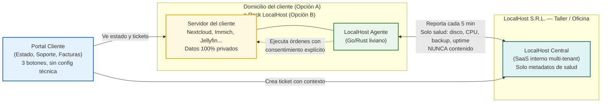
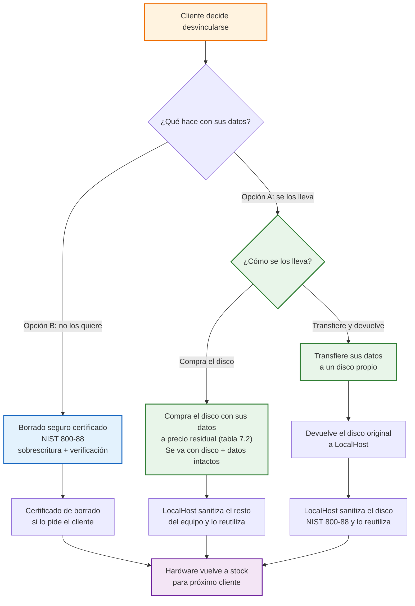
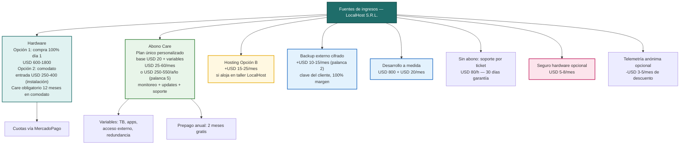

# LocalHost S.R.L. — Documento Integrado: Definición, Solución y Modelo de Negocio

**Empresa:** LocalHost S.R.L. — *Tu nube, en tu casa*  
**Plataforma a desarrollar:** LocalHost Nexus — Plataforma de Orquestación para Servidores Privados Personalizados (antes LocalHost Gestión / NodoGestión)  
**Nombre alternativo a votar:** LocalHost Hub — misma plataforma, nombre más claro de "centro conector" (votamos Nexus vs. Hub)
**Abono a votar:** LocalHost Care — plan único a medida (alternativa: Health — votamos Care vs. Health)  
**Fecha:** Octubre 2026  
**Equipo:** 5 estudiantes — Licenciatura en Sistemas, UNGS (Buenos Aires, AMBA)  
**Basado en:** Consignas de la materia + Business Model Canvas (Osterwalder, 2004) vía HubSpot  
**Archivos relacionados:** `localhost-business-model-canvas.html` · `cuestionario-feynman.md` · `consignas-para-definir-la-empresa.pdf`

> Si estás corto de tiempo, leé el Resumen y la guía de abajo.

---

## Resumen en 30 segundos

**LocalHost S.R.L. te instala tu nube privada en tu casa u oficina en 48 horas.** Te llevás un mini-servidor con las apps que elijas — fotos, archivos, películas, contraseñas — y dejás de pagar 4 a 7 suscripciones en dólares (Drive, Fotos, Netflix, 1Password, etc.).

- El hardware puede ser tuyo desde el día 1 (compra 100%) o quedar en comodato y lo comprás cuando quieras. En comodato, Care obligatorio mínimo 12 meses.
- Tus datos son siempre tuyos. LocalHost solo ve datos de salud del equipo para cuidarlo. Backup externo cifrado opcional +USD 10–15/mes con tu clave.
- Con abono Care tenés monitoreo y soporte proactivo. Sin abono, soporte por ticket. Care mensual USD 25–60 o anual USD 250–550 (2 meses gratis). Desarrollo a medida con mantenimiento mensual +USD 20. Foco 85–90% B2B.

**¿Para qué existe este documento en la materia?** LocalHost S.R.L. es la empresa ficticia que justifica el sistema **LocalHost Nexus**: baja la instalación de 8 horas a 90 minutos y permite cuidar 150 clientes sin sumar técnicos.

---

## Cómo leer este documento

Pensado para leer rápido, no para sufrirlo. Elegí cuánto tiempo tenés:

| Si tenés… | Leé esto |
| :--- | :--- |
| 2 minutos | Resumen de arriba + FAQ (sección 11) |
| 10 minutos | Resumen + sección 3 (Problema y objetivos) + diagramas Mermaid (6.1, 7.4, 10.1) + Canvas visual (10.3) |
| 30 minutos | Todo lineal. Las tablas y diagramas reemplazan párrafos largos |
| Para exponer | Sección 12 (guion de 5 minutos) + Canvas HTML impreso en A3 |

**Cómo está escrito:** cada sección arranca con la idea clave. Tablas para comparar, bullets cortos, diagramas para los flujos. Sin vueltas.

---

## Índice

1. [Industria](#1-industria-a-la-que-brinda-servicio-la-solución)
2. [La empresa LocalHost S.R.L.](#2-cómo-es-la-empresa-que-utilizará-la-solución)
3. [Problema, motivación y objetivos](#3-razón-que-motiva-el-desarrollo-necesidad-y-objetivos)
4. [Áreas que participan en la definición](#4-áreas-de-la-organización-que-participan-en-la-definición)
5. [Procesos donde interviene la solución](#5-procesos-donde-interviene-la-solución)
6. [LocalHost Nexus — Funciones y arquitectura](#6-localhost-nexus--funciones-y-arquitectura)
   - [6.1 Arquitectura en 3 piezas](#61-arquitectura-en-3-piezas)
   - [6.3 Packs 3+3](#63-catálogo-personalizado--packs-definidos-33)
7. [Modelo de propiedad y salida](#7-modelo-de-propiedad-y-salida)
   - [7.2 Las dos puertas y comodato](#72-las-dos-puertas-de-propiedad-y-comodato-con-opción-de-compra)
   - [7.6 Cómo se calcula el Care](#76-cómo-se-calcula-el-care--complejidad-del-servicio)
   - [7.4 Flujo de salida](#74-flujo-de-salida--desvinculación)
8. [Política de datos y privacidad](#8-política-de-datos-y-privacidad)
9. [Métricas anónimas](#9-métricas-anónimas-para-mejorar-el-producto)
10. [Modelo de ingresos y Canvas](#10-modelo-de-ingresos-y-business-model-canvas)
    - [10.1 Diagrama ingresos](#101-diagrama-de-modelo-de-ingresos)
    - [10.3 Lienzo A3](#103-lienzo-visual-resumen-imprimible-a3)
    - [10.5 Palancas de rentabilidad](#105-palancas-de-rentabilidad--cómo-ganar-más-plata)
11. [Preguntas frecuentes (FAQ)](#11-preguntas-frecuentes-faq--objeciones-reales-del-grupo)

- [Anexo A: Opciones de Naming](#anexo-a-opciones-de-naming-consideradas)
- [Anexo B: Refinamientos del Interrogatorio](#anexo-b-refinamientos-del-interrogatorio-intensivo-agosto-2026)

---

## 1. Industria a la que brinda servicio la solución

**Industria principal: Tecnología / Servicios Informáticos y Telecomunicaciones.**

LocalHost se para en la intersección de tres industrias de la consigna:

| Industria                             | Qué hace LocalHost ahí                                                       |
| :------------------------------------ | :--------------------------------------------------------------------------- |
| **Electrónica**                       | Entrega y ensambla hardware (mini-PC, NAS, discos, UPS) para hogar o negocio |
| **Telecomunicaciones**                | Conectividad y acceso remoto seguro (WireGuard / Tailscale), red local       |
| **Servicios Informáticos / Software** | Instala, configura y mantiene apps open source auto-alojadas                 |

**LocalHost Nexus** es un software vertical para **infraestructura privada y soberanía digital**. Le sirve a cualquier familia u organización que quiera dejar de depender de suscripciones en la nube (Google Drive, Dropbox, Netflix, Google Fotos, 1Password) con un servidor propio.

> Por qué nos sirve para la materia: es un problema real y actual — costo en dólares + desconfianza en las grandes plataformas — con procesos administrativos, comerciales, productivos y financieros bien claros para justificar un sistema a medida.

---

## 2. Cómo es la empresa que utilizará la solución

### 2.1 Ficha básica

| Campo                                       | Detalle                                                                                             |
| :------------------------------------------ | :-------------------------------------------------------------------------------------------------- |
| **Razón social**                            | LocalHost S.R.L. (ficticia) — nombre tomado de 127.0.0.1, transmite "tu nube, local, en tu casa"    |
| **Fundación**                               | 2026, Buenos Aires (AMBA) — idea de Ignacio Borlenghi                                               |
| **Tamaño**                                  | 5 personas, todas con perfil de desarrollo, repartidas en roles funcionales. Micro-PyME de 5 socios |
| **Facturación anual proyectada (12 meses)** | USD 160k–190k (40% instalaciones, 60% abonos) |
| **Forma jurídica**                          | S.R.L. de 5 socios — se mantiene S.R.L. por consigna                                                |

### 2.2 Áreas que la componen

Aunque somos 5, cubrimos 6 funciones. Así se reparte:

1. **Gerencia General / Producto** (1) — visión, roadmap de Nexus y catálogo de apps.
2. **Operaciones Técnicas e Instalaciones** (2) — ensamblan, preparan y dejan instalado en domicilio.
3. **Soporte y Monitoreo** (1, rotativo) — mira alertas, actualiza, atiende tickets.
4. **Comercial y Atención al Cliente** (1) — releva necesidades, presupuesta, atiende el portal.
5. **Administración y Finanzas** (rol compartido + contador externo) — compras, facturación AFIP, cobranzas.
6. **Desarrollo de Producto** (los 5) — todos construyen Nexus de forma transversal.

> Las 6 áreas son funcionales. Con 5 personas de perfil técnico las cubrimos bien y muestra versatilidad del equipo.

### 2.3 Instalaciones

- **Oficina / Taller central:** Buenos Aires (CABA/AMBA) — espacio de trabajo compartido del grupo (30–40 m², puede ser la casa de uno o un espacio de la facu) con banco de pruebas, stock inicial de 5 mini-PCs (Beelink, Intel N100), discos NAS y laboratorio para clonar imágenes. Sin alquiler comercial al inicio.
- **Depósito:** en el mismo taller, stock para 5 a 8 instalaciones iniciales.
- **Movilidad:** autos del grupo + mensajería. Instalaciones a domicilio en AMBA; interior (Córdoba, Rosario, Mendoza) con partner local o envío + instalación remota guiada.
- **Modelo de hardware:** ver sección 7. El cliente elige entre **comodato** (equipo nuestro, Care obligatorio 12 meses) o **compra 100%** (equipo suyo, Care opcional). Si ya tenés un NAS o mini-PC, lo auditamos (BYO — *Bring Your Own*, traé tu propio equipo — auditado, sección 7.3): si sirve, se reutiliza y baja el costo; si no, recomendamos reemplazo justificado. El servidor queda por defecto en tu casa u oficina (Opción A). Opción B: queda alojado en nuestro taller con fibra y energía 24/7 si no tenés lugar o condiciones.
- **Cómo trabajamos hoy (antes de Nexus):** Trello + Sheets para pedidos, WhatsApp Business, presupuestos en PDF hechos a mano, instalaciones 100% artesanales por SSH, sin monitoreo central y sin historial por cliente.

### 2.4 Mercados donde opera

- **Geográfico:** base en Buenos Aires (AMBA) y expansión a Córdoba, Rosario y Mendoza — ciudades con muchos profesionales independientes y pymes.
- **Segmento principal (85–90% del foco): Negocios y profesionales que dependen mucho de suscripciones (SaaS)** — no importa el rubro, importa cuánto duele la cuota en dólares. Ejemplos: estudios de fotografía con 4 TB en Google Fotos/Drive, estudios jurídicos/contables, productoras audiovisuales, agencias, consultorios. Todos pagan entre USD 40 y USD 400 por mes en servicios en la nube (caso testigo: Nate Gentile, creador español, ~EUR 33k en 2 años en Workspace, Slack, Notion, Adobe, Frame.io, etc.) y buscan tener el control de sus datos. Pymes de 3 a 30 personas.
- **Segmento secundario (10–15%): Hogares Prosumers** — familias con interés por tecnología que quieren tener sus fotos, películas y archivos bajo control sin volverse técnicas. Se mantiene como segmento testimonial, sin prospección activa.

### 2.5 Competencia y ventaja diferencial

| Tipo                                   | Quiénes son                                                                  | Qué hacen y qué les falta                                                                                                                          |
| :------------------------------------- | :--------------------------------------------------------------------------- | :------------------------------------------------------------------------------------------------------------------------------------------------- |
| **Directa (local)**                    | Revendedores de NAS Synology/QNAP (ej. Tanyx, Multitech), técnicos freelance | Venden el aparato pero no arman un stack open source completo ni garantizan privacidad total. Instalación suelta, sin estándar ni soporte continuo |
| **Indirecta (Big Tech)**               | Google Drive, Dropbox, Microsoft 365, Netflix, iCloud, 1Password             | Cómodas y conocidas, pero cuota mensual en dólares y sin control real de tus datos                                                                 |
| **Indirecta (DIY — hacelo vos mismo)** | Umbrel, Start9 Embassy, FreedomBox, CasaOS                                   | Productos para gente muy técnica, filosofía "comprá y hacelo vos", sin servicio humano local                                                       |
| **Indirecta (remota)**                 | Co-op Cloud, YunoHost, NebulaWing                                            | Cooperativas de Europa/EE. UU. que despliegan apps libres de forma remota, sin presencia física en Argentina                                       |

**Ventaja de LocalHost:** la única propuesta **llave en mano, local, humana y a medida**: "te instalo tu nube en tu casa en 48 h, con las apps que vos elijas, y me quedo cuidándola". Nadie en Argentina ofrece ese combo con hardware tuyo en tu domicilio.

---

## 3. Razón que motiva el desarrollo, necesidad y objetivos

### 3.1 Necesidad y problema a resolver

**Para el cliente final (hogar o negocio):**

- Paga entre 4 y 7 suscripciones por mes en dólares (Drive, Fotos, Netflix, Dropbox, gestor de contraseñas). Casos como Nate Gentile (EUR 33k en 2 años) o estudios con terabytes en Google Drive lo muestran claro.
- No tiene control real sobre sus datos.
- La alternativa de armar su propio servidor es muy técnica (Docker, puertos, certificados, copias de seguridad). Resultado: sigue pagando y resigna privacidad.

**Para LocalHost (la empresa que va a usar el sistema):**

- **Cada instalación es artesanal:** 6 a 10 horas por servidor armado a mano (Debian, Docker, Nextcloud, Jellyfin, etc.), sin lista de verificación estándar, sin forma de mirar 30 clientes a la vez y sin registro de versiones.

| Problema operativo  | Impacto                                                                   |
| :------------------ | :------------------------------------------------------------------------ |
| Cuello de botella   | Máximo 8 instalaciones por mes                                            |
| Errores y retrabajo | 25% de visitas de soporte por configs manuales distintas                  |
| Sin abono proactivo | Nos enteramos solo cuando el cliente llama porque ya se quedó sin espacio |
| Sin historial       | No hay base de conocimiento central                                       |

### 3.2 Razón que motiva el desarrollo

Estandarizar y automatizar es la única forma de pasar de taller artesanal a empresa de servicios. Sin plataforma, LocalHost no puede pasar de 30 a 150 clientes sin contratar 5 técnicos más. El sistema es lo que hace viable el negocio.

### 3.3 Objetivos

**Objetivo general:** bajar la instalación a medida de 8 horas a 90 minutos y poder monitorear 150 clientes en 12 meses. La plataforma debe cubrir relevamiento, presupuesto, preparación y soporte, dando a elegir entre hosting en domicilio (Opción A) o alojado en LocalHost (Opción B).

**Objetivos específicos:**

1. Catálogo de apps curadas con instalación en 1 clic (ver packs en 6.3).
2. Relevamiento guiado y presupuesto automático según lo que necesita el cliente.
3. **Preparación sin intervención:** grabar imagen base + inyectar el perfil del cliente.
4. Monitoreo central de salud (disco, copia de seguridad, disponibilidad, actualizaciones) con alertas.
5. Portal de soporte y facturación de abonos para el cliente final.

---

## 4. Áreas de la organización que participan en la definición

| Área                                     | Rol en la definición                                                    |
| :--------------------------------------- | :---------------------------------------------------------------------- |
| **Gerencia General**                     | Impulsa el proyecto, define alcance, packs y precios                    |
| **Comercial y Atención al Cliente**      | Dueña del relevamiento, define flujo de presupuesto y portal cliente    |
| **Operaciones Técnicas e Instalaciones** | Experta de dominio, valida checklist de instalación y la app del agente |
| **Soporte y Monitoreo**                  | Define alertas, guías de resolución y nivel de servicio del abono       |
| **Administración y Finanzas**            | Define facturación recurrente, compras y costo por instalación          |
| **Desarrollo de Producto**               | Traduce requerimientos a arquitectura (panel central + agente)          |

**Cómo lo definimos:** 2 talleres de descubrimiento con técnicos + 5 entrevistas a clientes reales (3 negocios, 2 hogares) para validar packs y dolores. Prototipo en Figma del panel central y del portal cliente.

---

## 5. Procesos donde interviene la solución

LocalHost Nexus es transversal. Es el sistema operativo de la empresa.

### 5.1 Procesos administrativos

- Alta de cliente y relevamiento (formulario guiado: usuarios, TB, apps, lugar de alojamiento A/B, si necesita redundancia RAID/UPS).
- Presupuesto y orden de trabajo automáticos (con hardware nuevo o BYO auditado).
- Gestión de stock de hardware y compras.
- Facturación puntual (instalación en 1 pago o en cuotas vía MercadoPago) y recurrente (abono Care — obligatorio en comodato, opcional en compra 100%) con integración AFIP.

### 5.2 Procesos comerciales

- **Cotización con simulador de ahorro:** "hoy pagás USD 85/mes, con LocalHost pagás USD 35/mes de abono + inversión inicial que recuperás en 8 meses", con desglose de hardware (compra 100% o comodato con entrada USD 250–400 de instalación — palanca 1) + abono a medida + add-ons opcionales (backup externo +USD 10–15/mes palanca 2, mantenimiento de mejoras +USD 20/mes palanca 4). El presupuestador ofrece pago mensual o anual prepago con 2 meses gratis (palanca 5).
- **Seguimiento de oportunidad:** lead → relevamiento → presupuesto → instalación. En comodato, **Care 12 meses es obligatorio (palanca 1)**; en compra 100% es opcional. Sin abono (solo compra 100%): entrega + 30 días de garantía y luego soporte por ticket; con Care, monitoreo y actualizaciones incluidas. Objetivo: 100% de comodatos con Care.
- Portal cliente para ver estado del servidor, tickets y facturas. Desde el portal se puede activar/desactivar telemetría, contratar backup externo y cambiar a prepago anual.
- **Venta de mejoras:** desarrollo a medida con modelo recurrente ("¿querés que tu Nextcloud hable con tu sistema de gestión?" — USD 800 + USD 20/mes de mantenimiento, palanca 4).

### 5.3 Procesos productivos y operativos

- **Armado de imagen:** elección de pack + personalización (incluye definir redundancia RAID/UPS si el cliente la quiere).
- **Preparación:** grabado de imagen base en taller + inyección de perfil. Si es Opción B, se prepara y queda en el rack del taller.
- **Instalación a domicilio (Opción A) o entrega en taller (Opción B):** checklist en app móvil, pruebas de conectividad, entrega con capacitación de 30 min.
- **Monitoreo post-instalación:** con abono Care, el agente reporta cada 5 min a LocalHost Central con alertas proactivas. Sin abono, no hay monitoreo proactivo.
- **Mantenimiento y SLA diferenciado:** **Con abono Care:** respuesta dentro de 24 h hábiles, reposición de hardware en 72 h con seguro o 5 días hábiles sin seguro, actualizaciones coordinadas, copias verificadas y reemplazo preventivo; con redundancia RAID1/UPS, continuidad inmediata ante fallo de un disco. **Sin abono:** *best effort* 72–96 h hábiles por ticket a USD 80/h, sin monitoreo proactivo y sin compromiso de reposición; aplica garantía de 30 días luego de la instalación, después solo soporte pago.

### 5.4 Procesos financieros

- Cálculo de costo por instalación (hardware + horas + licencias) y por hosting Opción B. En comodato el Care 12 meses es obligatorio; en compra 100% es opcional.
- Cálculo de margen por abono a medida (base + variables por TB/apps/acceso/redundancia) + **backup externo (+USD 10–15, palanca 2)** + **mantenimiento de mejoras (+USD 20, palanca 4)** y valor de vida del cliente (LTV). Con 5 palancas el mix pasa de 70/30 a 40/60 (HW/abono).
- Conciliación de cobranzas recurrentes (abono mensual **o anual prepago USD 250–550 con 2 meses gratis — palanca 5**) y control de morosidad. Sin abono, facturación por ticket/hora. Prepago anual financiado vía MercadoPago mejora caja para stock en comodato.

---

## 6. LocalHost Nexus — Funciones y arquitectura

### 6.1 Arquitectura en 3 piezas

La duda más común: "¿dónde vive cada cosa y quién ve qué?"



**Lectura rápida:**

| Pieza | Dónde vive | Quién la usa | Qué ve |
| :--- | :--- | :--- | :--- |
| **LocalHost Central** | En LocalHost (oficina) | Solo el equipo de LocalHost | Datos de salud y gestión. No tiene datos del cliente |
| **LocalHost Agente** | En cada servidor del cliente | Servicio automático | Reporta salud y ejecuta órdenes. Si se cae internet, el servidor sigue funcionando |
| **Portal Cliente** | Web/app simple | Cliente final | Ve estado, pide soporte, ve facturas. No configura el servidor |

> Regla de oro: Central nunca ve contenido. Ver sección 8 para garantías.

**Agente según propiedad y abono (comodato puro):** El Agente solo reporta si hay Care activo. **Compra 100% + con Care:** Agente instalado y reportando cada 5 min. **Compra 100% + sin Care:** Agente **se desinstala al entregar** — equipo 100% autónomo y privado, sin reporte. Si luego quiere Care, se reinstala con visita de re-alta. **Comodato (siempre con Care, ver 7.1):** Agente instalado y reportando cada 5 min. Sin Care el soporte es por ticket sin contexto del Agente (más lento, a USD 80/h).

### 6.2 Módulos funcionales

1. **Catálogo Curado de Aplicaciones:** elegís apps por pack. Cada app es un contenedor probado y versionado (Nextcloud, Immich, Jellyfin, Vaultwarden, Paperless-ngx, OnlyOffice, Home Assistant). Instalación en 1 clic desde Central.
2. **Relevamiento y Presupuestador:** formulario guiado que según tus respuestas (¿cuántos usuarios? ¿cuántos TB? ¿querés acceso fuera de casa?) sugiere pack y hardware, y genera un PDF con retorno de inversión vs. lo que pagás hoy en suscripciones.
3. **Orquestador de Preparación:** genera imagen base, inyecta perfil del cliente (usuarios, apps, almacenamiento), graba vía USB/PXE y deja el servidor listo para entregar.
4. **Monitoreo y Alertas:** panel central con semáforo por cliente (verde/amarillo/rojo) para disco, CPU, copia OK, certificado, disponibilidad. Alertas por Telegram/Email al técnico antes de que el cliente se entere.
5. **Gestión de Soporte (Tickets):** el cliente crea un ticket desde su portal ("no puedo entrar desde afuera"), se crea con contexto del servidor, se asigna y se resuelve. Base de conocimiento interna.
6. **Facturación y Abonos:** alta de abono mensual (Plan Care: monitoreo + actualizaciones + 2 h de soporte). Integración con MercadoPago/AFIP, recordatorios y aviso por mora.
7. **Módulo de Mejoras — Desarrollo a Medida (opcional, lo hace LocalHost):** cuando el servidor ya funciona, el comercial puede presupuestar integraciones a medida hechas por el equipo (ej. conectar Paperless con AFIP, bot de WhatsApp sobre Nextcloud, automatizaciones n8n, app de fotos para estudio). Nexus genera la orden de desarrollo. **Modelo:** modelo **USD 800 + USD 20/mes de mantenimiento** (compatibilidad con updates, soporte de la integración). Convierte ingreso puntual en recurrente y fideliza 12+ meses.

### 6.3 Catálogo personalizado — Packs definidos (3+3)

Todos los packs son base personalizable: podés pedir "Pack Negocio + Immich" o "Pack Hogar + Vaultwarden".

**Pack Negocio/Profesional — foco en confidencialidad y productividad:**

| App                        | Reemplaza a                                                    |
| :------------------------- | :------------------------------------------------------------- |
| **Nextcloud + OnlyOffice** | Google Drive / Dropbox / Microsoft 365                         |
| **Vaultwarden**            | 1Password / Bitwarden en la nube — contraseñas del equipo      |
| **Paperless-ngx**          | Escaneo y gestión de documentos en papel — ideal para estudios |

**Pack Hogar/Familia — foco en recuerdos y entretenimiento:**

| App           | Reemplaza a                                           |
| :------------ | :---------------------------------------------------- |
| **Immich**    | Google Fotos / iCloud Fotos — fotos con IA local      |
| **Jellyfin**  | Netflix / Plex — películas y series propias           |
| **Nextcloud** | Archivos familiares y copia de seguridad de celulares |

### 6.4 Características no funcionales

| Característica                        | Decisión                                                                                                                                                                                                                                         |
| :------------------------------------ | :----------------------------------------------------------------------------------------------------------------------------------------------------------------------------------------------------------------------------------------------- |
| **Seguridad y privacidad por diseño** | LocalHost no ve contenido, solo datos de salud. Acceso remoto solo con permiso explícito y auditado (WireGuard con aprobación del cliente). Vale para Opción A y Opción B (aunque esté en taller, el dato y el equipo siguen siendo del cliente) |
| **Funciona sin internet (Opción A)**  | El servidor anda 100% sin internet. El agente guarda reportes y sincroniza al volver. Opción B depende de la fibra del taller (99% disponibilidad)                                                                                               |
| **Escalabilidad**                     | Pensado para 500 nodos sin cambiar arquitectura. Preparación en paralelo                                                                                                                                                                         |
| **Usabilidad**                        | Panel central para técnicos: 2 clics por tarea. Portal cliente muy simple (3 botones: Estado, Soporte, Facturas)                                                                                                                                 |
| **Mantenibilidad**                    | Actualizaciones coordinadas y probadas en laboratorio antes de llegar a clientes                                                                                                                                                                 |

---

## 7. Modelo de propiedad y salida

### 7.1 Principio: el equipo es nuestro, los datos son del cliente

| Activo                              | De quién es                                             | Dónde está                                                                                                              |
| :---------------------------------- | :------------------------------------------------------ | :---------------------------------------------------------------------------------------------------------------------- |
| **Hardware** (mini-PC, discos, UPS) | De LocalHost mientras esté en comodato. Ver 7.2 para la compra | En casa/oficina del cliente (Opción A) o en taller LocalHost (Opción B), pero el título es nuestro hasta que lo compre |
| **Datos**                           | 100% del cliente, siempre                               | En su servidor. Nunca son nuestros, ni siquiera si nos deja el disco                                                    |

**Por qué importa:** baja el costo de entrada de ~USD 1.500 (compra directa) a ~USD 250–400 (instalación + puesta en marcha), porque el primer día el cliente no financia todo el equipo.

**La figura jurídica:** el hardware se presta en **comodato** (préstamo de uso gratuito) y el cliente paga por **servicios**, no por el equipo. Son dos contratos separados e independientes:

1. **Comodato** — gratuito. LocalHost presta el equipo y conserva el título de propiedad.
2. **Contrato de servicios Care** — oneroso. Monitoreo, actualizaciones y soporte, calculado por **complejidad del servicio** (ver §7.6), nunca por el valor del equipo.

> **Analogía (para la defensa):** es lo que hacen los proveedores de internet: el módem va en comodato y el cliente paga el servicio. El equipo no se alquila ni se compra en cuotas: se presta gratis y se compra aparte si el cliente lo decide (ver 7.2). El Care jamás amortiza el equipo — es pago por servicio, como el abono de internet.

**Regla de oro del comodato:** en comodato, **Care es obligatorio con compromiso mínimo de 12 meses**. Si el cliente no quiere pagar un servicio mensual, la única alternativa es la **compra 100% del día 1** (ver 7.2). No existe comodato sin Care: es lo que permite financiar el equipo sin inmovilizar capital sin retorno.

### 7.2 Las dos puertas de propiedad, y comodato con opción de compra

El cliente elige una de dos puertas:

| Puerta | Entrada | Mensual | ¿De quién es el equipo? |
| :--- | :--- | :--- | :--- |
| **A — Comodato** | USD 250–400 (instalación) | Care obligatorio (mín. 12 meses) | De LocalHost, hasta que lo compre |
| **B — Compra 100%** | USD 600–1.800 (todo el equipo) | Care opcional | Del cliente desde el día 1 |

**Puerta A — Comodato (dos condiciones, escritas en el contrato):**

1. **Entrada por instalación:** USD 250–400 según el equipo (relevamiento, preparación y puesta en marcha). Es un cobro por servicio, no un pago a cuenta del equipo.
2. **Care activo:** obligatorio durante todo el comodato, con compromiso mínimo de 12 meses desde la instalación. Al mes 13 puede seguir mensual o pasar a anual prepago (palanca 5).

El cliente puede comprar el equipo cuando quiera: día 1, a los 3 años, o el día que se desvincula. La compra es una **transacción aparte**: los pagos de Care **no acumulan propiedad ni se descuentan del precio**. El precio se calcula por depreciación lineal. El presupuesto detalla 2 precios base por separado — **Disco** (ej. USD 200) y **Resto del equipo** (mini-PC + UPS, ej. USD 600) — que suman el valor total del equipo (ej. USD 800). La tabla de porcentajes se aplica por componente:

| Momento | Valor residual | Ejemplo sobre USD 800 |
| :--- | :--- | :--- |
| Día 1 | 100% | USD 800 |
| 12 meses | 66% | USD 528 |
| 24 meses | 33% | USD 264 |
| 36+ meses | 10% simbólico (por reutilización) | USD 80 |

- El presupuesto real detalla los valores base por componente; los porcentajes de la tabla se aplican a cada componente por separado.
- La depreciación es lineal y está escrita en el contrato. Sin sorpresas.
- Si querés comprar el día 1, pagás 100% y sos dueño desde el inicio. Si esperás 3 años, pagás valor simbólico.
- **La entrada y el Care no se descuentan del valor residual.** La entrada es servicio de instalación y el Care es servicio consumido cada mes; lo único que baja el precio de compra es el tiempo transcurrido según la tabla.

> **Ejemplo concreto:** Si A1 compra solo el disco a 12 meses: 200 × 66% = USD 132. Si compra equipo completo a 12 meses: 800 × 66% = USD 528.

**Puerta B — Compra 100% (día 1):** el cliente paga el equipo completo (USD 600–1.800) y es dueño desde el inicio. Care es opcional: con Care, monitoreo y soporte proactivo; sin Care, entrega + 30 días de garantía y luego soporte por ticket a USD 80/h (ver §11.5).

### 7.3 BYO auditado — ¿y si el cliente ya tiene equipo?

Si el cliente ya tiene un NAS o mini-PC, lo auditamos mediante checklist técnico estricto:

| Criterio | Requisito mínimo | Método de verificación |
| :--- | :--- | :--- |
| **CPU** | Intel N100 o equivalente (4 núcleos, PassMark ≥ 5.500) | `lscpu` / ficha técnica |
| **RAM** | 8 GB para Pack Negocio; 16 GB para Pack Hogar con Immich | `free -h` / inspección física |
| **Disco del sistema** | SMART sin sectores reasignados ni pendientes, < 3 años o < 15.000 h, TBW < 70% | `smartctl -a` |
| **Disco de datos** | *Idem* anterior; si es HDD NAS, 5.400+ RPM y estado SMART limpio | `smartctl -a` |
| **Estado físico** | Sin daños, ventilación y puertos operativos, sin corrosión ni polvo crítico | Inspección visual |
| **Fuente de alimentación** | Original o certificada, potencia acorde al equipo, sin fluctuaciones | Prueba de carga |
| **Antigüedad del equipo** | < 4 años desde fabricación | N.º de serie / factura |

**Resultado de auditoría:**

| Resultado | Qué implica |
| :--- | :--- |
| **Apto** | Se reutiliza. Baja el presupuesto (no se cobra hardware nuevo). El equipo ya es del cliente (equivale a la Puerta B, compra 100%): esta cláusula de comodato/compra no aplica y el Care es opcional |
| **Apto con observaciones** | Se reutiliza con *disclaimer* escrito: sin garantía de rendimiento máximo ni de vida útil remanente; LocalHost no compromete SLA de hardware sobre equipo BYO |
| **No apto** | Recomendamos reemplazo justificado por escrito (ej. "CPU Celeron J3455 por debajo de N100; RAM 4 GB insuficiente para Immich con 3 usuarios; SMART con 12 sectores reasignados") |

BYO auditado reduce costo y es parte de las economías de escala del Canvas. La auditoría queda asentada en acta firmada por ambas partes.

**Intervención del cliente según propiedad (acuerdo del grupo 06/09/2026):** Si el hardware es de LocalHost (comodato), el cliente **no puede intervenir el equipo** (no abre, no cambia discos, no toca software por SSH). Si el hardware es del cliente (compra 100% día 1 o BYO apto), **sí puede intervenir**, pero si rompe algo pierde la garantía de 30 días y el SLA de hardware: LocalHost interviene igual pero factura ticket a USD 80/h + repuesto a precio de lista + visita. El abono Care sigue cubriendo software/monitoreo, no el fierro dañado por el cliente. Si el equipo es nuestro y el cliente intervino igual con daño intencional o negligencia grave, el seguro no cubre (ver §7.5) y paga reposición a precio residual + mano de obra. Todo queda asentado en acta.

### 7.4 Flujo de salida / desvinculación

Cuando el cliente decide irse, elige. No hay letra chica.



**Detalle de cada opción:**

| Opción                                  | Pasos                                                                                                                                           | Qué recibe el cliente                                         |
| :-------------------------------------- | :---------------------------------------------------------------------------------------------------------------------------------------------- | :------------------------------------------------------------ |
| **A1 — Compra el disco y se lo lleva**  | Paga precio residual del disco según tabla 7.2. Se lleva el disco con sus datos intactos. LocalHost sanitiza el resto del equipo y lo reutiliza | Su disco con sus datos + factura de compra residual           |
| **A2 — Transfiere y devuelve el disco** | Transfiere sus datos a un disco propio y devuelve el disco original a LocalHost. LocalHost lo sanitiza (NIST 800-88) y lo reutiliza             | Sus datos en su propio disco. Cero costo de hardware residual |
| **B — Borrado certificado**             | Borrado seguro según NIST 800-88 (sobrescritura + verificación). El equipo vuelve a stock                                                       | Certificado de borrado si lo pide. Cero datos remanentes      |

No existe la opción "nos quedamos con tus datos para revender". Ver sección 8 para el porqué.

### 7.5 Seguro del hardware (opcional del plan a medida)

Como el equipo es nuestro en comodato, ofrecer seguro cierra el modelo.

| Campo            | Detalle                                                               |
| :--------------- | :-------------------------------------------------------------------- |
| **Qué cubre**    | Falla eléctrica, sobretensión, daño por agua/polvo, robo con denuncia |
| **Qué no cubre** | Mal uso intencional                                                   |
| **Costo**        | +USD 5–8/mes como adicional del abono Care (o +USD 60/año prepago)    |
| **Sin seguro**   | Si se rompe, pagás reposición a precio residual + mano de obra        |
| **Con seguro**   | Reposición en 72 h sin costo                                          |
| **Combo ideal**  | Redundancia RAID1/UPS + seguro = "no te enterás que se rompió"        |

El seguro se contrata o no, a elección del cliente, como cualquier otro opcional (redundancia, hosting Opción B). Se factura junto al abono.

**Impacto en el Canvas (actualizado):**

| Bloque Canvas             | Cómo cambia con este modelo                                                                                      |
| :------------------------ | :--------------------------------------------------------------------------------------------------------------- |
| **Recursos Clave**        | El hardware pasa a ser activo de LocalHost (stock rotativo), no solo costo                                       |
| **Estructura de Costes**  | Amortización del equipo + gestión de stock + borrado seguro                                                      |
| **Fuentes de Ingresos**   | Abono Care + venta residual eventual + seguro opcional + descuento por telemetría anónima como palanca comercial |
| **Relación con Clientes** | Salida limpia y documentada genera confianza y boca a boca ("me fui y me dieron todo perfecto")                  |

---

### 7.6 Cómo se calcula el Care — complejidad del servicio

El Care no se cobra por el valor del equipo (eso sería un canon de alquiler/leasing), sino por **cuánto trabajo real genera cuidarlo por mes**. Es una escala medible, con 5 drivers objetivos:

| Driver | Unidad | Por qué cuesta más servicio |
| :--- | :--- | :--- |
| **Almacenamiento** | TB | Más discos que vigilar (SMART), más backup que verificar, restauraciones más lentas |
| **Redundancia (RAID + UPS)** | Sí/No | Array que monitorear, rebuilds, reemplazo en caliente, prueba de batería |
| **Apps activas** | Cantidad | Cada app es un contenedor que actualizar, testear y parchear |
| **Usuarios** | Cantidad | Más cuentas, permisos y tickets posibles; más carga |
| **Acceso externo** | Sí/No | Túneles, certificados, firewall y superficie de ataque que vigilar |

**Fórmula:**

```text
Care = Base (USD 15) + Σ drivers
```

Base cubre lo fijo: agente instalado + slot en Central + monitoreo mínimo. Tarifario ilustrativo: +USD 5/TB, +USD 8 redundancia, +USD 3/app extra, +USD 2/usuario extra, +USD 5 acceso externo.

**La prueba de que no es leasing:** las dos escalas (valor del equipo y complejidad del servicio) están correlacionadas pero no son la misma. Un server de USD 2.000 con 1 disco y 2 apps puede pagar ~USD 20/mes, mientras que uno de USD 800 con RAID y 6 apps puede pagar ~USD 40/mes. Si el Care fuera un alquiler del equipo, eso sería imposible — el más caro siempre pagaría más.

> **Para memorizar:** el valor del hardware responde "cuánto cuesta el fierro si hay que reponerlo" (va en la entrada, el residual y el comodato). La complejidad del servicio responde "cuánto laburo cuesta cuidarlo por mes" (va en el Care).

---

## 8. Política de datos y privacidad

### 8.1 Datos siempre del cliente

- Los datos (fotos, documentos, películas, contraseñas) viven en el servidor del cliente, en su domicilio (Opción A) o en su servidor alojado en nuestro taller (Opción B). En ambos casos, el cliente es dueño del dato y del equipo.
- LocalHost no copia, no indexa y no accede al contenido sin permiso explícito, auditado y temporal (WireGuard con aprobación del cliente, ver 8.3).

### 8.2 Descuento a cambio de datos personales: alternativa descartada

Se evaluó la variante de ofrecer descuento a cambio de acceso a datos personales del cliente (fotos, documentos, contenido). Se descarta por incompatibilidad con la propuesta de valor, el marco legal y el posicionamiento.

| Criterio | Evaluación |
| :--- | :--- |
| **Legal** | Implica cesión de datos personales bajo Ley 25.326. Para clientes profesionales (estudios jurídicos, consultorios) expone a responsabilidad y exige consentimiento explícito, informado y revocable, con contrato separado y auditoría |
| **Propuesta de valor** | Contradice el diferencial central — privacidad y control ("tu nube, privada, tuya") — y diluye el posicionamiento frente a incumbentes |
| **Confianza** | Erosiona la confianza, principal activo frente a soluciones de Big Tech |

**Alternativa adoptada:** descuento de **USD 3–5/mes** en el abono Care a cambio de **telemetría anónima y opcional** (ver sección 9). Métricas agregadas y anonimizadas en origen (ej. "62% de disco utilizado", "app más usada: Immich") — nunca contenido. Mismo efecto comercial (precio más bajo) sin comprometer privacidad.

**Decisión del documento:** **no se ofrece descuento por acceso a datos personales**. Sí se ofrece descuento por telemetría anónima opcional.

### 8.3 Garantías: ¿cómo sabe el cliente que no vemos sus datos?

| Garantía                           | Cómo funciona                                                                                                                                                                                                                                                                                                                                                                                                                                                                                                                                                         |
| :--------------------------------- | :-------------------------------------------------------------------------------------------------------------------------------------------------------------------------------------------------------------------------------------------------------------------------------------------------------------------------------------------------------------------------------------------------------------------------------------------------------------------------------------------------------------------------------------------------------------------- |
| **Arquitectura**                   | Central solo recibe datos de salud (disco, CPU, copia, disponibilidad). El agente no accede al contenido de Nextcloud/Immich/Jellyfin                                                                                                                                                                                                                                                                                                                                                                                                                                 |
| **Acceso remoto con permiso**      | Solo vía WireGuard/Tailscale, con aprobación explícita del cliente desde su Portal, temporal y auditado (queda registro de quién entró, cuándo y qué hizo)                                                                                                                                                                                                                                                                                                                                                                                                            |
| **Servidor que anda sin internet** | Si se cae internet, el servidor sigue funcionando. El agente guarda reportes. No dependés de nosotros para usar tus cosas                                                                                                                                                                                                                                                                                                                                                                                                                                             |
| **Opción B también es privada**    | Aunque el equipo esté en nuestro rack, el disco está cifrado y la clave es del cliente. Damos energía y fibra, no vemos contenido                                                                                                                                                                                                                                                                                                                                                                                                                                     |
| **Custodia de clave / Recovery**   | Disco cifrado (LUKS). LocalHost nunca retiene la clave en claro. **Por defecto:** el cliente es 100% responsable de su custodia — si pierde la clave, los datos son irrecuperables. **Opcional 1 — Sobre sellado:** copia en sobre lacrado en caja fuerte, solo se abre con autorización escrita del cliente y queda asentado en acta. **Opcional 2 — Shamir 2-de-3:** la clave se fragmenta en 3 partes (cliente / LocalHost / contacto de confianza del cliente); se requieren 2 fragmentos para reconstruir. Ambas opciones son opt-in, con consentimiento escrito |
| **Borrado certificado**            | Si te vas y no querés tus datos, borrado NIST 800-88 con certificado. Verificable                                                                                                                                                                                                                                                                                                                                                                                                                                                                                     |
| **Contrato**                       | Cláusula de privacidad y propiedad de datos en el contrato de comodato/abono                                                                                                                                                                                                                                                                                                                                                                                                                                                                                          |

---

## 9. Métricas anónimas para mejorar el producto

> Descuento de USD 3–5/mes en el abono Care si el cliente elige compartir telemetría anónima. Es opcional, revocable y nunca incluye contenido.

### 9.1 Qué telemetría anónima se recolecta (ejemplos reales)

| Categoría | Ejemplo de dato anónimo |
| :--- | :--- |
| **Uso de almacenamiento** | "62% del disco usado", "crecimiento 15 GB/mes" |
| **Apps y actividad** | "App más usada: Immich (45% del tiempo)", "3 usuarios activos este mes" |
| **Salud del sistema** | "Disponibilidad 99.2%", "copia OK 28/30 días", "1 alerta de disco lleno" |
| **Rendimiento** | "Tiempo promedio de carga de fotos: 1.2 s en red local" |
| **Entorno** | "Modelo mini-PC: Beelink N100, 16 GB RAM" (para compatibilidad) |

### 9.2 Qué nunca se recolecta

- Nombres de archivos, contenido de fotos/documentos, texto de chats, contraseñas, contenido de mails, títulos de películas con datos personales, ubicación precisa.
- Nada que permita reconstruir la vida del cliente. Si un dato puede identificar a una persona, no se recolecta.

### 9.3 Cómo se anonimiza

1. **Agregación en el agente:** el agente en el servidor del cliente suma y anonimiza localmente (ej. cuenta cuántos usuarios, no quiénes son).
2. **Sin identificadores personales:** se envía un ID anónimo rotativo por instalación, no nombre, email ni IP.
3. **Opt-in y revocable:** el cliente activa o desactiva la telemetría desde su Portal en 1 clic. Sin penalización.
4. **Retención corta:** métricas agregadas por mes, no historial personal. Se usan para mejorar el producto (ej. "el 70% usa Immich, prioricemos esa app"), no para perfilar.
5. **Transparencia:** lista pública de métricas en el contrato y en el Portal.

### 9.4 Incentivo

| Opción | Efecto en el abono |
| :--- | :--- |
| **Sin telemetría** | Abono Care a precio de lista (USD 25–60/mes según a medida) |
| **Con telemetría anónima opcional** | Descuento de **USD 3–5/mes** en el abono |

Es el mismo ahorro que buscaba la idea de "quedarse con datos", pero sin romper privacidad. Para LocalHost, esas métricas valen más que el descuento: permiten priorizar desarrollo y prevenir fallas.

---

## 10. Modelo de ingresos y Business Model Canvas

### 10.1 Diagrama de modelo de ingresos (5 palancas)



**Lectura:** el cliente elige cómo tener el equipo (compra 100% o comodato con entrada de instalación USD 250–400 y Care obligatorio 12 meses — palanca 1), elige Care mensual o anual prepago con 2 meses gratis (palanca 5), puede sumar backup externo cifrado +USD 10–15/mes (palanca 2), desarrollo a medida ahora con mantenimiento +USD 20/mes (palanca 4) y hosting/seguro/telemetría opcionales. Foco 85–90% B2B (palanca 3) duplica ARPU.

### 10.2 Tabla de ingresos detallada (con 5 palancas)

| Fuente | Modalidad | Rango | Cuándo se cobra |
| :--- | :--- | :--- | :--- | :--- |
| **Instalación llave en mano** (hardware + mano de obra) | 1 pago (compra 100%) o entrada de instalación | USD 600–1.800 (compra) / USD 250–400 (entrada comodato) | Al instalar. En comodato, la entrada es por instalación, no un pago a cuenta del equipo | **Comodato: Care obligatorio 12 meses (palanca 1)** |
| **Venta residual** (si compra después) | Según tabla 7.2 | USD 80–800 | Cuando el cliente ejerce opción de compra o se va con el disco | Sin cambio |
| **Abono Care** (a medida, no hay niveles) | Mensual **o anual prepago** | USD 25–60/mes (base ~USD 20 + variables por complejidad) **o USD 250–550/año** | Mensual o anual. **Obligatorio en comodato (mín. 12 meses — palanca 1)**. Opcional en compra 100% | **Palanca 1 + 5** |
| **Backup externo cifrado** | Mensual (add-on del Care) | **+USD 10–15/mes** | Mensual, con clave del cliente (LUKS). 100% margen | **NUEVO — palanca 2** |
| **Hosting Opción B** | Mensual | +USD 15–25/mes | Solo si elige alojar en taller | Sin cambio |
| **Seguro hardware** | Mensual o anual prepago | +USD 5–8/mes o USD 60/año | Opcional del Care | Sin cambio |
| **Desarrollo a medida** | Proyecto + mantenimiento | **USD 800 + USD 20/mes** (antes USD 500–3.000 una vez) | Proyecto al entregar + fee mensual por compatibilidad y soporte | **Palanca 4** |
| **Mantenimiento de mejoras** | Mensual | **+USD 20/mes por integración** | Mensual, por cada mejora activa | **NUEVO — palanca 4** |
| **Soporte por ticket** (sin abono) | Por hora | USD 80/h | Solo si no tiene Care, luego de 30 días de garantía | Sin cambio |
| **Descuento telemetría** | Mensual | -USD 3–5/mes | Si elige telemetría anónima | Sin cambio |

### 10.3 Lienzo visual (resumen imprimible A3)

> Ver `localHost-business-model-canvas.html` para la versión visual a color. Esta tabla es el respaldo imprimible en markdown.

| **8. Asociaciones Clave** | **7. Actividades Clave** | **2. Propuesta de Valor** | **4. Relaciones con Clientes** | **1. Segmentos de Clientes** |
| :--- | :--- | :--- | :--- | :--- |
| Proveedores hardware (Beelink, Seagate, APC) | Relevamiento y consultoría previa | **Para Negocios:** control de datos + ahorro 40–60% vs suscripciones en USD + privacidad legal | Asistencia personal (técnico a domicilio) | **Principal (85–90%):** Negocios/Profesionales 3–30 personas |
| Upstream open source (Nextcloud, Jellyfin, Immich) | Ensamblado y preparación automatizada | **Para Hogares:** tus fotos y pelis en tu casa, sin Big Tech, para siempre | Soporte proactivo (avisamos antes que llame) | Estudios, agencias, productoras, consultorios |
| Partners de conectividad (Tailscale/WireGuard) | Instalación llave en mano + capacitación | **Diferencial:** llave en mano + a medida + soporte local humano | Comunidad: grupo de usuarios LocalHost | **Secundario (30%):** Hogares Prosumers |
| MercadoPago / AFIP | Monitoreo y soporte post-venta | **Prueba:** demo en taller + simulador de ahorro | Autoservicio: Portal cliente | Familias con interés tech |
| Partners regionales (Rosario, CABA) para interior | Curaduría y testing de apps | **Garantía:** "Si no te adaptás en 30 días, te lo desinstalo" | Co-creación: feedback para nuevos packs | |
| **6. Recursos Clave** | | | **3. Canales** | |
| Físicos: Home-lab en Buenos Aires (grupo de 5), stock inicial, vehículos. *Con comodato: stock rotativo como activo.: storage para backup externo cifrado* | | | Directo: Web + Instagram + boca a boca **B2B (colegios profesionales) — palanca 3** | |
| Intelectuales: LocalHost Nexus, catálogo de imágenes, marca | | | Directo: visita de relevamiento a domicilio/empresa | |
| Humanos: 5 socios fundadores (todos devs, roles distribuidos) | | | Indirecto: partners regionales | |
| Financieros: capital de trabajo para stock | | | Digital: Portal cliente, WhatsApp Business | |
| | **9. Estructura de Costes** | | **5. Fuentes de Ingresos** | |
| | Fijos: honorarios equipo (5), servicios home-lab, seguros, rack para Opción B + storage backup externo | | Instalación llave en mano (compra 100% USD 600–1.800 o comodato con Care obligatorio 12m) + venta residual (tabla 7.2) | |
| | Variables: hardware por proyecto, combustible, comisiones, energía/fibra Opción B | | Abono Care — mensual USD 25–60 o anual USD 250–550 (2 meses gratis, palanca 5) — obligatorio en comodato 12m (palanca 1) | |
| | Inversión: desarrollo LocalHost Nexus | | Hosting Opción B (+USD 15–25/mes) + seguro (USD 5–8/mes) + **backup externo cifrado +USD 10–15/mes (palanca 2)** | |
| | Economía de escala: preparación automatizada baja horas de 8 a 1.5; BYO auditado reduce costo | | Mejoras: **USD 800 + USD 20/mes mantenimiento (palanca 4)** + soporte por ticket sin abono (USD 80/h) — descuento telemetría -USD 3–5 | |

### 10.4 Detalle por bloque

**1. Segmentos de Clientes (palanca 3)**

- *¿Cliente ideal?* Estudio contable de 8 personas que paga Dropbox Business + Google Workspace y quiere dejar de pagar en dólares y tener sus balances en su oficina. O familia con 2 TB de fotos en Google que quiere Immich local.
- *Tipo de mercado:* nicho B2B profesional (segmentado, **85–90% del foco**) + nicho prosumer hogareño (**10–15% testimonial**). Antes 70/30. Mercado diversificado pero con packs específicos. Con se duplica ARPU y se reduce soporte emocional.

**2. Propuesta de Valor**

- **Novedad:** nadie en Argentina ofrece servidor privado a medida llave en mano a domicilio con stack open source curado.
- **Rendimiento:** ahorro comprobable 40–60% anual vs suscripciones, acceso en red local 10x más rápido que la nube.
- **Personalización:** packs 3+3 combinables. No es talle único.
- **Marca:** "Tu nube, en tu casa. Privada, tuya, para siempre."
- **Diseño:** hardware silencioso y estético, no un rack ruidoso.
- **Precio:** inversión inicial que recuperás en 8–12 meses vs suscripciones.

**3. Canales (5 fases HubSpot)**

- **Información:** Instagram con antes/después, web con simulador de ahorro, charlas en colegios profesionales.
- **Evaluación:** visita de relevamiento gratuita + demo en taller.
- **Compra:** presupuesto PDF + seña 50%.
- **Entrega:** instalación a domicilio + capacitación + acta de entrega.
- **Post-venta:** monitoreo proactivo + visita trimestral + grupo de WhatsApp.

**4. Relaciones con Clientes**

- Asistencia personal (instalación humana), asistencia proactiva (avisamos antes que falle), comunidad (usuarios LocalHost comparten tips), co-creación (votan próximo pack).

**5. Fuentes de Ingresos (5 palancas)**

- Venta de activos (compra 100% o venta residual + comodato con **Care obligatorio 12 meses — palanca 1**), suscripción **mensual USD 25–60 o anual USD 250–550 con 2 meses gratis — palancas 1 y 5**, hosting opcional (Opción B), **backup externo cifrado +USD 10–15/mes — palanca 2**, proyecto + **mantenimiento +USD 20/mes por mejora — palanca 4** y ticket sin abono (solo compra 100%). Incluye seguro opcional y descuento por telemetría. Modelo híbrido que maximiza valor de vida del cliente (LTV). El mix objetivo es 40% HW / 60% abonos. El abono es único y a medida, sin niveles Basic/Pro.

**6. Actividades Clave**

- **Producción:** ensamblado y preparación.
- **Resolución de problemas:** consultoría de privacidad y soporte.
- **Plataforma:** LocalHost Nexus como red que orquesta todos los nodos.

**7. Recursos Clave**

- Físicos (home-lab compartido + stock rotativo en comodato),
- intelectuales (Nexus es el activo más valioso),
- humanos (5 socios devs de confianza que entran a tu casa/oficina),
- económicos.

**8. Asociaciones Clave**

- **Optimizar:** proveedores de hardware para buen precio.
- **Reducir riesgo:** upstream open source (no reinventar la rueda).
- **Escalar:** partners regionales.

**9. Estructura de Costes**

- **Fijos:** honorarios del equipo (5) y servicios del home-lab. Variables: hardware y viáticos. Economías de escala por automatización (de 8 h a 1.5 h por instalación) y por equipo técnico propio sin tercerizar todo. Con comodato: amortización y gestión de stock.

### 10.5 Palancas de rentabilidad: las 5 aplicadas

**La idea en una frase:** el negocio gana poco con el hardware y mucho con el abono mensual. Para ser más rentable hay que vender más abonos, no más equipos.

**Por qué:** el hardware casi no deja ganancia (se compra y se revende); el abono Care deja ~90% de ganancia, porque cuesta poco producirlo (monitoreo + horas).

**Estado:** las 5 decisiones están aplicadas en este documento.

1. **✅ APLICADA — Abono obligatorio en comodato.** En comodato, `Care 12 meses` es obligatorio (mínimo 12 meses); en compra 100% es opcional. → El abono llega al 100% de los comodatos. Impacta en §5.2, §5.4, §7.1, §7.2, §10.1, §10.2, §10.3 y §11.5. Es una regla estructural, no un incentivo comercial.

2. **✅ APLICADA — Cobrar la copia de seguridad externa.** Copia cifrada (clave del cliente, ver 8.3) en nuestro taller por **+USD 10–15/mes**. → Ingreso mensual nuevo, casi sin costo, 100% margen. Impacta en §10.1, §10.2, §10.3 y §11.5.

3. **✅ APLICADA — Venderle a empresas, no a particulares.** Foco pasa de 70/30 a **85–90% B2B / 10–15% hogares**. Un hogar paga USD 30 y discute el precio. Un estudio jurídico de 10 personas paga USD 400/mes hoy. → Menos clientes, más plata por cliente. Impacta en §2.4 y §10.4.

4. **✅ APLICADA — Cobrar mantenimiento por las mejoras.** En vez de cobrar una sola vez, se cobra `USD 800 + USD 20/mes` por mejora. → Plata todos los meses en vez de una sola vez. Impacta en §5.2, §6.2, §10.1 y §10.2.

5. **✅ APLICADA — Cobrar el abono por año.** `USD 25–60/mes → USD 250–550/año` (2 meses de regalo). → Plata por adelantado y el cliente se queda más tiempo. Impacta en §5.4, §10.1, §10.2 y §11.5.

**Resultado:** mix objetivo **40% HW / 60% abonos**, facturación proyectada **USD 160k–190k**, con **100% de comodatos con Care**.

---

## 11. Preguntas frecuentes (FAQ) — Objeciones reales del grupo

### 11.1 ¿Qué Es LocalHost Nexus? (explicación simple)

Es el sistema que usa el equipo de LocalHost para instalar y cuidar tu servidor sin hacerlo a mano. Vos no lo ves ni lo configurás. Para vos es: te instalan un aparatito en tu casa con tus apps (fotos, archivos, pelis), y ellos lo monitorean desde su oficina. Si algo se llena o falla, te avisan antes de que te enteres. Vos solo usás tus apps, como siempre.

### 11.2 ¿Cuál Es el problema que resuelve la empresa?

Dos problemas en uno:

- **Para vos (cliente):** pagás USD 40–400/mes en suscripciones en dólares y no sos dueño de tus datos. Armarte tu servidor por tu cuenta es muy difícil.
- **Para LocalHost:** cada instalación les lleva 6–10 horas artesanal, con errores, sin poder escalar ni cobrar un abono proactivo. Sin sistema, no pasan de 30 clientes.

Nexus automatiza la instalación (de 8 h a 90 min) y el monitoreo, para que el negocio escale de taller a empresa.

### 11.3 ¿Por Qué monitorear si el cliente paga por privacidad?

Porque monitoreamos **salud, no contenido**. Es como el service del auto: miramos "cuánta nafta tenés y si el motor está bien", no a dónde fuiste. El agente reporta "disco 80% lleno, copia OK, disponibilidad 99%" — nunca "foto de vacaciones.jpg" ni el texto de tus documentos. Sin ese monitoreo, no podemos avisarte antes de que te quedes sin espacio o se rompa un disco. Y sin abono, directamente no monitoreamos: es tu elección.

### 11.4 ¿Cómo Sabe el cliente que no vemos sus datos? (garantías)

Cuatro garantías concretas:

1. **Arquitectura:** Central solo recibe datos de salud. El agente no lee contenido de Nextcloud/Immich.
2. **Acceso con permiso:** si necesitamos entrar a tu servidor, lo hacemos vía WireGuard solo si vos lo aprobás desde tu Portal, queda registrado y es temporal.
3. **Servidor en tu casa:** el disco está en tu domicilio (Opción A). Si se cae internet, seguís usando todo. No somos intermediarios.
4. **Contrato y borrado certificado:** cláusula de privacidad en el comodato y, si te vas, borrado NIST 800-88 con certificado.

### 11.5 ¿Qué Es el abono Care y cómo funciona? ¿Es obligatorio?

**Nota:** En comodato, el Care es **obligatorio (mínimo 12 meses)** — es la regla de la Puerta A (palanca 1). En compra 100%, es opcional. Es un **plan único a medida** — no hay niveles Basic/Pro. Pagás por complejidad del servicio (ver §7.6), no por el valor del equipo. Opción mensual o anual prepaga (palanca 5).

| Modalidad | Qué incluye | SLA / Tiempos | Precio |
| :--- | :--- | :--- | :--- |
| **Sin abono (solo compra 100%)** | Entrega + 30 días de garantía. Luego soporte por ticket a USD 80/h. Sin monitoreo proactivo y sin compromiso de reposición | *Best effort* 72–96 h hábiles por ticket; sin monitoreo proactivo | Sin costo mensual (el equipo ya se compró) |
| **Con abono Care mensual** | Monitoreo cada 5 min, actualizaciones coordinadas y probadas en laboratorio, copias verificadas, 2 h de soporte/mes, alertas proactivas antes de que falle | Respuesta 24 h hábiles; reposición hardware 72 h con seguro / 5 días hábiles sin seguro; monitoreo proactivo cada 5 min | Base ~USD 20 + variables = **USD 25–60/mes** |
| **Con abono Care anual (palanca 5)** | Mismo que mensual, prepago | Mismo SLA | **USD 250–550/año** (2 meses gratis, equivale a 10 meses) |
| **Comodato (palanca 1)** | Comodato + Care 12 meses obligatorio | Mismo SLA | **Entrada USD 250–400 + Care mensual/anual** — 100% de comodatos con Care |

**Cómo se calcula el Care (presupuestador, queda en el contrato) (ver §7.6):**

| Variable | Impacto |
| :--- | :--- |
| **Almacenamiento** | 1 TB vs 8 TB |
| **Apps activas** | 2 apps vs 6 apps |
| **Usuarios** | 2 usuarios vs 10 usuarios |
| **Acceso externo** | Solo red local vs WireGuard/Tailscale fuera de casa |
| **Redundancia** | Sin / con RAID1/UPS |
| **Backup externo cifrado (palanca 2)** | +USD 10–15/mes si lo suma |
| **Mantenimiento mejoras (palanca 4)** | +USD 20/mes por integración activa |

**Opcionales del Care:** seguro de hardware (+USD 5–8/mes), **backup externo cifrado (+USD 10–15/mes, palanca 2)** y descuento por telemetría anónima (-USD 3–5/mes, ver 11.8). Todo se presupuesta en el momento y no cambia sin acuerdo. **Forma de pago:** mensual o anual prepago con 2 meses gratis (palanca 5).

### 11.6 ¿Qué Pasa si el cliente se quiere ir? (propiedad y datos)

Elige entre dos opciones limpias (ver diagrama 7.4):

- **Opción A — Se lleva sus datos (dos vías):**
  - **A1 — Compra el disco:** paga el precio residual según antigüedad (tabla 7.2: 100% día 1, 66% a 12 meses, 33% a 24 meses, 10% simbólico a 36+ meses) y se va con su disco + datos intactos. Sanitizamos el resto del equipo.
  - **A2 — Transfiere y devuelve:** transfiere sus datos a un disco propio y nos devuelve el disco original. Lo sanitizamos (NIST 800-88) y lo reutilizamos. Sin costo residual.
- **Opción B — Borrado certificado:** hacemos borrado seguro NIST 800-88 (sobrescritura + verificación) y el equipo vuelve a stock. Entregamos certificado si lo pide.

BYO (equipo propio auditado) no entra en esta tabla: ya era suyo.

### 11.7 ¿Y Si no tengo lugar o no quiero el equipo en casa?

Opción B: alojamos **tu** servidor (que sigue siendo tuyo, en comodato o comprado) en nuestro taller con fibra y energía 24/7. Pagás +USD 15–25/mes de hosting. Sigue siendo privado: disco cifrado (LUKS), clave tuya, nosotros solo damos rack y conectividad. **Custodia de clave:** por defecto sos 100% responsable — si perdés la clave, los datos son irrecuperables y LocalHost no puede recuperarlos. Opcionales con consentimiento escrito: (1) sobre sellado en caja fuerte — solo se abre con tu autorización escrita y queda asentado en acta; (2) Shamir 2-de-3 — fragmentos cliente / LocalHost / contacto de confianza, se necesitan 2 para reconstruir. LocalHost nunca retiene la clave en claro. Podés migrar de Opción B a Opción A cuando quieras.

### 11.8 ¿Qué Son las métricas anónimas y por qué me dan descuento?

Si aceptás compartir métricas anónimas (ej. "60% del disco usado, 3 usuarios activos, app más usada Immich"), nos ayudás a mejorar el producto (priorizar apps, prevenir fallas). Nunca es contenido. Se anonimiza en tu servidor, es opt-in y revocable en 1 clic. A cambio te damos **USD 3–5 de descuento** en el abono. Es la forma de abaratar sin resignar privacidad. Ver sección 9.

### 11.9 ¿Qué Pasa si se rompe el disco o se corta la luz/internet?

El servidor está diseñado para seguir funcionando sin LocalHost y sin internet.

| Escenario | Qué pasa | Cobertura |
| :--- | :--- | :--- |
| **Se llena o falla un disco** | Alerta proactiva del agente + copia verificada. Si tenés RAID1, seguís trabajando sin pérdida; si no, se repone el disco | Con Care: aviso antes de que falle. Con RAID1: tolerancia a 1 disco |
| **Se corta la luz** | Con UPS seguís operando y apagado seguro. Sin UPS, el sistema se recupera al volver la energía | UPS es opcional del presupuesto |
| **Se corta internet** | Todo sigue andando en red local. El agente guarda reportes y sincroniza al volver. No dependés de la nube (ver 8.3) | Opción A: 100% offline. Opción B: depende de fibra del taller (99%) |
| **Rotura física / robo** | Reposición del hardware | **Con abono Care + seguro** (+USD 5–8/mes): reposición en 72 h sin costo. **Con abono Care sin seguro**: reposición en 5 días hábiles a precio residual (tabla 7.2) + mano de obra. **Sin abono**: *best effort* 72–96 h hábiles por ticket a USD 80/h, sin compromiso de reposición y sin monitoreo proactivo |

### 11.10 ¿En Cuánto recupero la inversión?

La inversión se amortiza entre 8 y 14 meses frente a suscripciones en dólares. Después es ahorro neto.

| Perfil | Lo que paga hoy (Big Tech) | Con LocalHost | Recupero |
| :--- | :--- | :--- |
| **Familia (2 TB fotos)** | Google One 2 TB ~USD 30/mes = USD 360/año para siempre | HW USD 700 + Care USD 30/mes | ~12 meses. Ahorro año 2: ~USD 300 |
| **Estudio (4 TB + Drive)** | Dropbox + Workspace ~USD 80/mes = USD 960/año | HW USD 900 + Care USD 35/mes | ~14 meses. Ahorro año 2: ~USD 540 |
| **Caso extremo (Nate Gentile)** | EUR 33k en 2 años en nube | HW + Care amortizado | Ahorro estructural, no solo mensual |

Valores de ejemplo con dólar y tarifas 2024/25. El presupuestador calcula tu break-even exacto y queda asentado en el contrato. Ver modelo de ingresos en sección 10.

---

## Anexo A: Opciones de Naming Consideradas

> El nombre comercial elegido es **LocalHost S.R.L.** por ser un término nativo y universal en la industria (127.0.0.1 — "esta máquina, tu casa") que comunica de forma inmediata "local, privado, tuyo". Se evaluaron las siguientes alternativas aportadas por el equipo:

### Listado completo de opciones exploradas

- **Ownix, Arx**
- **LocalStack, OwnStack, HomeStack**
- **OwnHost, Own Hub, Local Hub, HomeNode, LAN HUB, LocalLAN, LANIT**
- **OwnCloud, LocalCloud, HomeCloud**
- **Cloudless, Selfish, itself**
- **Own I.T. / Ownit** — favorito del equipo por el juego de palabras "Own IT = sé dueño de tu IT"
- **Mount I.T., Hostit, Keepit, Homeit, Localit**
- **LocalHost** — **NOMBRE ELEGIDO**

### Criterios de evaluación

| Nombre | Pros | Contras / Riesgo |
| :--- | :--- | :--- |
| **LocalHost** | Término universal dev, memorable, explica solo "local vs nube". Dominio .com.ar disponible, escalable a B2B y B2C | Levemente técnico para hogares poco técnicos (se mitiga con tagline "Tu nube en tu casa") |
| Own I.T. / Ownit | Juego de palabras brillante, muy brandeable | Pronunciación ambigua en español, posible conflicto marcario con OwnCloud |
| OwnStack / LocalStack | Sonido moderno "stack", transmite pack a medida | Ya existe LocalStack (AWS mock) — conflicto SEO/marca fuerte |
| HomeNode / HomeCloud | Cálido y descriptivo para hogares | Menos profesional para estudios jurídicos/pymes |
| Cloudless | Concepto potente "sin nube" | Negativo como marca ("less"), difícil de registrar |
| OwnCloud | Muy descriptivo | Marca registrada existente (OwnCloud GmbH) — descartado legal |

**Decisión:** se adopta **LocalHost S.R.L.** como nombre principal para el trabajo, manteniendo Own I.T. y OwnStack como alternativas sólidas si se requiere pivotar por disponibilidad marcaria.

---

## Anexo B: Refinamientos del Interrogatorio Intensivo (Agosto 2026)

**Pregunta 1 — Buyer persona (palanca 3):** se afinó de "pymes genéricas" a "pymes/profesionales que dependen mucho de suscripciones" con foco **85–90% B2B**. Referencia real: Nate Gentile (~EUR 33k/2 años en servicios en la nube). Ejemplo transversal: estudio de fotografía con TBs en Google Fotos/Drive.

**Pregunta 2 — Hardware:** el cliente elige entre comodato (equipo nuestro, Care obligatorio 12m) y compra 100% (equipo suyo, Care opcional). BYO (equipo del cliente) es posible si pasa auditoría de suficiencia y abarata costos. Ubicación por defecto en domicilio del cliente (Opción A).

**Pregunta 3 — Pricing (palancas 1, 4 y 5):** hardware en compra 100% (1 pago o cuotas MercadoPago) o en comodato con entrada de instalación USD 250–400 y **Care obligatorio 12 meses (palanca 1)**. En compra 100% el Care es opcional. Abono = base fija + variables por complejidad (~USD 25–60/mes **o USD 250–550/año con 2 meses gratis — palanca 5**). **Desarrollo a medida:** USD 800 + USD 20/mes de mantenimiento.

**Pregunta 4 — Redundancia/SLA:** redundancia (RAID1/UPS) es opcional del plan a medida. Con redundancia, continuidad inmediata ante fallo de disco. Sin redundancia, respuesta "lo antes posible" sin compromiso horario estricto.

**Pregunta 5 — Sin lugar:** Opción B: el cliente puede alojar su servidor (que sigue siendo suyo) en el taller de LocalHost con fibra y energía 24/7.

**Pregunta 6 — Hosting y desarrollo a medida (palancas 2 y 4):** hosting Opción A (en casa/oficina) u Opción B (en LocalHost), ambas opcionales. Incluye backup externo cifrado +USD 10–15/mes con clave del cliente. Desarrollo de apps a medida opcional con modelo recurrente USD 800 + USD 20/mes (palanca 4).

---

> **Nota para el grupo:** todos los datos de LocalHost son ficticios pero verosímiles para el mercado argentino 2025–2026. La plataforma LocalHost Nexus está diseñada para cumplir los 6 puntos de la consigna y es implementable como proyecto de la materia (MVP en 3 meses: relevamiento + presupuestador + preparación de 1 pack + panel de monitoreo simulado).

---

## Referencias y archivos relacionados

| Archivo | Descripción |
| :--- | :--- |

| `localhost-business-model-canvas.html` | Lienzo visual A3 |

| `localhost-documento-y-canvas.md` | Este documento |

| `consignas-para-definir-la-empresa.pdf` | Consignas de cátedra (6 puntos) |
