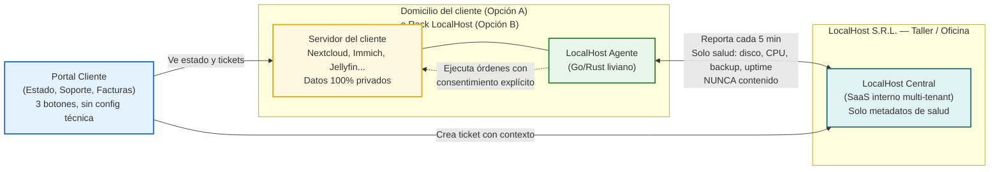
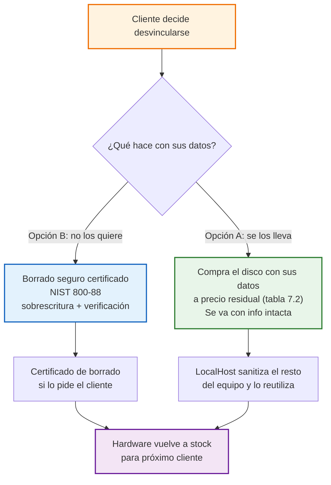
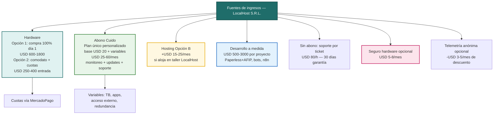

# LocalHost S.R.L. — Documento Integrado: Definición, Solución y Modelo de Negocio

**Empresa:** LocalHost S.R.L. — *Tu nube, en tu casa*  
**Plataforma a desarrollar:** LocalHost Nexus — Plataforma de Orquestación para Servidores Privados Personalizados (antes LocalHost Gestión / NodoGestión)  
**Nombre alternativo a votar:** LocalHost Hub — misma plataforma, nombre más claro de "centro conector" (votamos Nexus vs. Hub)  
**Fecha:** Agosto 2026  
**Equipo:** 5 estudiantes — Licenciatura en Sistemas, UNGS (Buenos Aires, AMBA)  
**Basado en:** Consignas de la materia + Business Model Canvas (Osterwalder, 2004) vía HubSpot  
**Archivos relacionados:** `LocalHost-Business-Model-Canvas.html` (lienzo visual A3, no se toca) · `consignas-para-definir-la-empresa.pdf`

> Este documento reemplaza a `LocalHost-Definicion-y-Canvas.md`. Tiene lo mismo que antes, pero ahora con el modelo de propiedad, seguro y datos integrado adentro (antes era un anexo aparte). Si estás corto de tiempo, leé el Resumen y la guía de abajo.

---

## Resumen en 30 segundos

**LocalHost S.R.L. te instala tu nube privada en tu casa u oficina en 48 horas.** Te llevás un mini-servidor con las apps que elijas — fotos, archivos, películas, contraseñas — y dejás de pagar 4 a 7 suscripciones en dólares (Drive, Fotos, Netflix, 1Password, etc.).

- El hardware puede ser tuyo desde el día 1 o quedar en comodato y lo comprás cuando quieras.
- Tus datos son siempre tuyos. LocalHost solo ve datos de salud del equipo para cuidarlo.
- Con abono Cuido tenés monitoreo y soporte proactivo. Sin abono, soporte por ticket.

**¿Para qué existe este documento en la materia?** LocalHost S.R.L. es la empresa ficticia que justifica el sistema **LocalHost Nexus**: baja la instalación de 8 horas a 90 minutos y permite cuidar 150 clientes sin sumar técnicos.

---

## Cómo leer este documento

Pensado para leer rápido, no para sufrirlo. Elegí cuánto tiempo tenés:

| Si tenés… | Leé esto |
| :--- | :--- |
| 2 minutos | Resumen de arriba + FAQ (sección 11) |
| 10 minutos | Resumen + sección 3 (Problema y objetivos) + diagramas Mermaid (6.1, 7.4, 10.1) + Canvas visual (10.3) |
| 30 minutos | Todo lineal. Las tablas y diagramas reemplazan párrafos largos |
| Para exponer | Sección 12 (guion de 5 minutos) + Canvas HTML impreso en A3 |

**Cómo está escrito:** cada sección arranca con la idea clave. Tablas para comparar, bullets cortos, diagramas para los flujos. Sin vueltas.

---

## Índice

1. [Industria](#1-industria-a-la-que-brinda-servicio-la-solución)
2. [La empresa LocalHost S.R.L.](#2-cómo-es-la-empresa-que-utilizará-la-solución)
3. [Problema, motivación y objetivos](#3-razón-que-motiva-el-desarrollo-necesidad-y-objetivos)
4. [Áreas que participan en la definición](#4-áreas-de-la-organización-que-participan-en-la-definición)
5. [Procesos donde interviene la solución](#5-procesos-donde-interviene-la-solución)
6. [LocalHost Nexus — Funciones y arquitectura](#6-localhost-nexus--funciones-y-arquitectura)
   - [6.1 Arquitectura en 3 piezas](#61-arquitectura-en-3-piezas)
   - [6.3 Packs 3+3](#63-catálogo-personalizado--packs-definidos-33)
7. [Modelo de propiedad y salida](#7-modelo-de-propiedad-y-salida)
   - [7.2 Comodato y compra](#72-comodato-con-opción-de-compra-en-cualquier-momento) · [7.4 Flujo de salida](#74-flujo-de-salida--desvinculación)
8. [Política de datos y privacidad](#8-política-de-datos-y-privacidad)
9. [Métricas anónimas](#9-métricas-anónimas-para-mejorar-el-producto)
10. [Modelo de ingresos y Canvas](#10-modelo-de-ingresos-y-business-model-canvas)
    - [10.1 Diagrama ingresos](#101-diagrama-de-modelo-de-ingresos) · [10.3 Lienzo A3](#103-lienzo-visual-resumen-imprimible-a3)
11. [Preguntas frecuentes (FAQ)](#11-preguntas-frecuentes-faq--objeciones-reales-del-grupo)
12. [Cómo exponer en clase](#12-cómo-exponerlo-en-clase-5-minutos)

- [Anexo A: Opciones de Naming](#anexo-a-opciones-de-naming-consideradas)
- [Anexo B: Refinamientos del Interrogatorio](#anexo-b-refinamientos-del-interrogatorio-intensivo-agosto-2026)

---

## 1. Industria a la que brinda servicio la solución

**Industria principal: Tecnología / Servicios Informáticos y Telecomunicaciones.**

LocalHost se para en la intersección de tres industrias de la consigna:

| Industria | Qué hace LocalHost ahí |
| :--- | :--- |
| **Electrónica** | Entrega y ensambla hardware (mini-PC, NAS, discos, UPS) para hogar o negocio |
| **Telecomunicaciones** | Conectividad y acceso remoto seguro (WireGuard / Tailscale), red local |
| **Servicios Informáticos / Software** | Instala, configura y mantiene apps open source auto-alojadas |

**LocalHost Nexus** es un software vertical para **infraestructura privada y soberanía digital**. Le sirve a cualquier familia u organización que quiera dejar de depender de suscripciones en la nube (Google Drive, Dropbox, Netflix, Google Fotos, 1Password) con un servidor propio.

> Por qué nos sirve para la materia: es un problema real y actual — costo en dólares + desconfianza en las grandes plataformas — con procesos administrativos, comerciales, productivos y financieros bien claros para justificar un sistema a medida.

---

## 2. Cómo es la empresa que utilizará la solución

### 2.1 Ficha básica

| Campo | Detalle |
| :--- | :--- |
| **Razón social** | LocalHost S.R.L. (ficticia) — nombre tomado de 127.0.0.1, transmite "tu nube, local, en tu casa" |
| **Fundación** | 2026, Buenos Aires (AMBA) — idea de 5 estudiantes de Sistemas de la UNGS |
| **Tamaño** | 5 personas, todas con perfil de desarrollo, repartidas en roles funcionales. Micro-PyME de 5 socios |
| **Facturación anual proyectada (12 meses)** | USD 120k–150k (70% instalaciones, 30% abonos de mantenimiento) |
| **Forma jurídica** | S.R.L. de 5 socios — se mantiene S.R.L. por consigna |

### 2.2 Áreas que la componen

Aunque somos 5, cubrimos 6 funciones. Así se reparte:

1. **Gerencia General / Producto** (1) — visión, roadmap de Nexus y catálogo de apps.
2. **Operaciones Técnicas e Instalaciones** (2) — ensamblan, preparan y dejan instalado en domicilio.
3. **Soporte y Monitoreo** (1, rotativo) — mira alertas, actualiza, atiende tickets.
4. **Comercial y Atención al Cliente** (1) — releva necesidades, presupuesta, atiende el portal.
5. **Administración y Finanzas** (rol compartido + contador externo) — compras, facturación AFIP, cobranzas.
6. **Desarrollo de Producto** (los 5) — todos construyen Nexus de forma transversal.

> Las 6 áreas son funcionales. Con 5 personas de perfil técnico las cubrimos bien y muestra versatilidad del equipo.

### 2.3 Instalaciones

- **Oficina / Taller central:** Buenos Aires (CABA/AMBA) — espacio de trabajo compartido del grupo (30–40 m², puede ser la casa de uno o un espacio de la facu) con banco de pruebas, stock inicial de 5 mini-PCs (Beelink, Intel N100), discos NAS y laboratorio para clonar imágenes. Sin alquiler comercial al inicio.
- **Depósito:** en el mismo taller, stock para 5 a 8 instalaciones iniciales.
- **Movilidad:** autos del grupo + mensajería. Instalaciones a domicilio en AMBA; interior (Córdoba, Rosario, Mendoza) con partner local o envío + instalación remota guiada.
- **Modelo de hardware:** ver sección 7. Por defecto vendemos el hardware (mini-PC/NAS + discos + UPS) como parte de la instalación llave en mano. Si ya tenés un NAS o mini-PC, lo auditamos (BYO — *Bring Your Own*, traé tu propio equipo — auditado, sección 7.3): si sirve, se reutiliza y baja el costo; si no, recomendamos reemplazo justificado. El servidor queda por defecto en tu casa u oficina (Opción A). Opción B: queda alojado en nuestro taller con fibra y energía 24/7 si no tenés lugar o condiciones.
- **Cómo trabajamos hoy (antes de Nexus):** Trello + Sheets para pedidos, WhatsApp Business, presupuestos en PDF hechos a mano, instalaciones 100% artesanales por SSH, sin monitoreo central y sin historial por cliente.

### 2.4 Mercados donde opera

- **Geográfico:** base en Buenos Aires (AMBA) y expansión a Córdoba, Rosario y Mendoza — ciudades con muchos profesionales independientes y pymes.
- **Segmento principal (70% del foco): Negocios y profesionales que dependen mucho de suscripciones (SaaS)** — no importa el rubro, importa cuánto duele la cuota en dólares. Ejemplos: estudios de fotografía con 4 TB en Google Fotos/Drive, estudios jurídicos/contables, productoras audiovisuales, agencias, consultorios. Todos pagan entre USD 40 y USD 400 por mes en servicios en la nube (caso testigo: Nate Gentile, creador español, ~EUR 33k en 2 años en Workspace, Slack, Notion, Adobe, Frame.io, etc.) y buscan tener el control de sus datos. Pymes de 3 a 30 personas.
- **Segmento secundario (30%): Hogares Prosumers** — familias con interés por tecnología que quieren tener sus fotos, películas y archivos bajo control sin volverse técnicas.

### 2.5 Competencia y ventaja diferencial

| Tipo | Quiénes son | Qué hacen y qué les falta |
| :--- | :--- | :--- |
| **Directa (local)** | Revendedores de NAS Synology/QNAP (ej. Tanyx, Multitech), técnicos freelance | Venden el aparato pero no arman un stack open source completo ni garantizan privacidad total. Instalación suelta, sin estándar ni soporte continuo |
| **Indirecta (Big Tech)** | Google Drive, Dropbox, Microsoft 365, Netflix, iCloud, 1Password | Cómodas y conocidas, pero cuota mensual en dólares y sin control real de tus datos |
| **Indirecta (DIY — hacelo vos mismo)** | Umbrel, Start9 Embassy, FreedomBox, CasaOS | Productos para gente muy técnica, filosofía "comprá y hacelo vos", sin servicio humano local |
| **Indirecta (remota)** | Co-op Cloud, YunoHost, NebulaWing | Cooperativas de Europa/EE. UU. que despliegan apps libres de forma remota, sin presencia física en Argentina |

**Ventaja de LocalHost:** la única propuesta **llave en mano, local, humana y a medida**: "te instalo tu nube en tu casa en 48 h, con las apps que vos elijas, y me quedo cuidándola". Nadie en Argentina ofrece ese combo con hardware tuyo en tu domicilio.

---

## 3. Razón que motiva el desarrollo, necesidad y objetivos

### 3.1 Necesidad y problema a resolver

**Para el cliente final (hogar o negocio):**

- Paga entre 4 y 7 suscripciones por mes en dólares (Drive, Fotos, Netflix, Dropbox, gestor de contraseñas). Casos como Nate Gentile (EUR 33k en 2 años) o estudios con terabytes en Google Drive lo muestran claro.
- No tiene control real sobre sus datos.
- La alternativa de armar su propio servidor es muy técnica (Docker, puertos, certificados, copias de seguridad). Resultado: sigue pagando y resigna privacidad.

**Para LocalHost (la empresa que va a usar el sistema):**

- Cada instalación es artesanal: 6 a 10 horas por servidor armado a mano (Debian, Docker, Nextcloud, Jellyfin, etc.), sin lista de verificación estándar, sin forma de mirar 30 clientes a la vez y sin registro de versiones.

| Problema operativo | Impacto |
| :--- | :--- |
| Cuello de botella | Máximo 8 instalaciones por mes |
| Errores y retrabajo | 25% de visitas de soporte por configs manuales distintas |
| Sin abono proactivo | Nos enteramos solo cuando el cliente llama porque ya se quedó sin espacio |
| Sin historial | No hay base de conocimiento central |

### 3.2 Razón que motiva el desarrollo

Estandarizar y automatizar es la única forma de pasar de taller artesanal a empresa de servicios. Sin plataforma, LocalHost no puede pasar de 30 a 150 clientes sin contratar 5 técnicos más. El sistema es lo que hace viable el negocio.

### 3.3 Objetivos

**Objetivo general:** bajar la instalación a medida de 8 horas a 90 minutos y poder monitorear 150 clientes en 12 meses. La plataforma debe cubrir relevamiento, presupuesto, preparación y soporte, dando a elegir entre hosting en domicilio (Opción A) o alojado en LocalHost (Opción B).

**Objetivos específicos:**

1. Catálogo de apps curadas con instalación en 1 clic (ver packs en 6.3).
2. Relevamiento guiado y presupuesto automático según lo que necesita el cliente.
3. Preparación sin intervención: grabar imagen base + inyectar el perfil del cliente.
4. Monitoreo central de salud (disco, copia de seguridad, disponibilidad, actualizaciones) con alertas.
5. Portal de soporte y facturación de abonos para el cliente final.

---

## 4. Áreas de la organización que participan en la definición

| Área | Rol en la definición |
| :--- | :--- |
| **Gerencia General** | Impulsa el proyecto, define alcance, packs y precios |
| **Comercial y Atención al Cliente** | Dueña del relevamiento, define flujo de presupuesto y portal cliente |
| **Operaciones Técnicas e Instalaciones** | Experta de dominio, valida checklist de instalación y la app del agente |
| **Soporte y Monitoreo** | Define alertas, guías de resolución y nivel de servicio del abono |
| **Administración y Finanzas** | Define facturación recurrente, compras y costo por instalación |
| **Desarrollo de Producto** | Traduce requerimientos a arquitectura (panel central + agente) |

**Cómo lo definimos:** 2 talleres de descubrimiento con técnicos + 5 entrevistas a clientes reales (3 negocios, 2 hogares) para validar packs y dolores. Prototipo en Figma del panel central y del portal cliente.

---

## 5. Procesos donde interviene la solución

LocalHost Nexus es transversal. Es el sistema operativo de la empresa.

### 5.1 Procesos administrativos

- Alta de cliente y relevamiento (formulario guiado: usuarios, TB, apps, lugar de alojamiento A/B, si necesita redundancia RAID/UPS).
- Presupuesto y orden de trabajo automáticos (con hardware nuevo o BYO auditado).
- Gestión de stock de hardware y compras.
- Facturación puntual (instalación en 1 pago o en cuotas vía MercadoPago) y recurrente (abono opcional pero recomendado) con integración AFIP.

### 5.2 Procesos comerciales

- Cotización con simulador de ahorro: "hoy pagás USD 85/mes, con LocalHost pagás USD 35/mes de abono + inversión inicial que recuperás en 8 meses", con desglose de hardware (1 pago o cuotas) + abono a medida.
- Seguimiento de oportunidad: lead → relevamiento → presupuesto → instalación → abono opcional. Software y abono son opcionales: sin abono, entrega + 30 días de garantía y luego soporte por ticket; con abono Cuido, monitoreo y actualizaciones incluidas.
- Portal cliente para ver estado del servidor, tickets y facturas.
- Venta de mejoras: desarrollo a medida ("¿querés que tu Nextcloud hable con tu sistema de gestión?").

### 5.3 Procesos productivos y operativos

- Armado de imagen: elección de pack + personalización (incluye definir redundancia RAID/UPS si el cliente la quiere).
- Preparación: grabado de imagen base en taller + inyección de perfil. Si es Opción B, se prepara y queda en el rack del taller.
- Instalación a domicilio (Opción A) o entrega en taller (Opción B): checklist en app móvil, pruebas de conectividad, entrega con capacitación de 30 min.
- Monitoreo post-instalación (solo con abono Cuido): el agente reporta cada 5 min a LocalHost Central con alertas automáticas. Sin abono, no hay monitoreo proactivo.
- Mantenimiento: con abono, actualizaciones coordinadas, copias verificadas, reemplazo preventivo; sin redundancia contratada, respuesta "lo antes posible" sin compromiso horario estricto; con redundancia, continuidad inmediata.

### 5.4 Procesos financieros

- Cálculo de costo por instalación (hardware + horas + licencias) y por hosting Opción B.
- Cálculo de margen por abono a medida (base + variables por TB/apps/acceso/redundancia) y valor de vida del cliente.
- Conciliación de cobranzas recurrentes (abono opcional) y control de morosidad. Sin abono, facturación por ticket/hora.

---

## 6. LocalHost Nexus — Funciones y arquitectura

### 6.1 Arquitectura en 3 piezas

La duda más común: "¿dónde vive cada cosa y quién ve qué?"

**Lectura rápida:**

| Pieza | Dónde vive | Quién la usa | Qué ve |
| :--- | :--- | :--- | :--- |
| **LocalHost Central** | En LocalHost (oficina) | Solo el equipo de LocalHost | Datos de salud y gestión. No tiene datos del cliente |
| **LocalHost Agente** | En cada servidor del cliente | Servicio automático | Reporta salud y ejecuta órdenes. Si se cae internet, el servidor sigue funcionando |
| **Portal Cliente** | Web/app simple | Cliente final | Ve estado, pide soporte, ve facturas. No configura el servidor |

> Regla de oro: Central nunca ve contenido. Ver sección 8 para garantías.

### 6.2 Módulos funcionales

1. **Catálogo Curado de Aplicaciones:** elegís apps por pack. Cada app es un contenedor probado y versionado (Nextcloud, Immich, Jellyfin, Vaultwarden, Paperless-ngx, OnlyOffice, Home Assistant). Instalación en 1 clic desde Central.
2. **Relevamiento y Presupuestador:** formulario guiado que según tus respuestas (¿cuántos usuarios? ¿cuántos TB? ¿querés acceso fuera de casa?) sugiere pack y hardware, y genera un PDF con retorno de inversión vs. lo que pagás hoy en suscripciones.
3. **Orquestador de Preparación:** genera imagen base, inyecta perfil del cliente (usuarios, apps, almacenamiento), graba vía USB/PXE y deja el servidor listo para entregar.
4. **Monitoreo y Alertas:** panel central con semáforo por cliente (verde/amarillo/rojo) para disco, CPU, copia OK, certificado, disponibilidad. Alertas por Telegram/Email al técnico antes de que el cliente se entere.
5. **Gestión de Soporte (Tickets):** el cliente crea un ticket desde su portal ("no puedo entrar desde afuera"), se crea con contexto del servidor, se asigna y se resuelve. Base de conocimiento interna.
6. **Facturación y Abonos:** alta de abono mensual (Plan Cuido: monitoreo + actualizaciones + 2 h de soporte). Integración con MercadoPago/AFIP, recordatorios y aviso por mora.
7. **Módulo de Mejoras — Desarrollo a Medida (opcional, lo hace LocalHost):** cuando el servidor ya funciona, el comercial puede presupuestar integraciones a medida hechas por el equipo (ej. conectar Paperless con AFIP, bot de WhatsApp sobre Nextcloud, automatizaciones n8n, app de fotos para estudio). Nexus genera la orden de desarrollo. Es ingreso extra y fideliza.

### 6.3 Catálogo personalizado — Packs definidos (3+3)

Todos los packs son base personalizable: podés pedir "Pack Negocio + Immich" o "Pack Hogar + Vaultwarden".

**Pack Negocio/Profesional — foco en confidencialidad y productividad:**

| App | Reemplaza a |
| :--- | :--- |
| **Nextcloud + OnlyOffice** | Google Drive / Dropbox / Microsoft 365 |
| **Vaultwarden** | 1Password / Bitwarden en la nube — contraseñas del equipo |
| **Paperless-ngx** | Escaneo y gestión de documentos en papel — ideal para estudios |

**Pack Hogar/Familia — foco en recuerdos y entretenimiento:**

| App | Reemplaza a |
| :--- | :--- |
| **Immich** | Google Fotos / iCloud Fotos — fotos con IA local |
| **Jellyfin** | Netflix / Plex — películas y series propias |
| **Nextcloud** | Archivos familiares y copia de seguridad de celulares |

### 6.4 Características no funcionales

| Característica | Decisión |
| :--- | :--- |
| **Seguridad y privacidad por diseño** | LocalHost no ve contenido, solo datos de salud. Acceso remoto solo con permiso explícito y auditado (WireGuard con aprobación del cliente). Vale para Opción A y Opción B (aunque esté en taller, el dato y el equipo siguen siendo del cliente) |
| **Funciona sin internet (Opción A)** | El servidor anda 100% sin internet. El agente guarda reportes y sincroniza al volver. Opción B depende de la fibra del taller (99% disponibilidad) |
| **Escalabilidad** | Pensado para 500 nodos sin cambiar arquitectura. Preparación en paralelo |
| **Usabilidad** | Panel central para técnicos: 2 clics por tarea. Portal cliente muy simple (3 botones: Estado, Soporte, Facturas) |
| **Mantenibilidad** | Actualizaciones coordinadas y probadas en laboratorio antes de llegar a clientes |

---

## 7. Modelo de propiedad y salida

> Esta sección es el ex-anexo de Propiedad/Seguro/Datos. Ya no está separado: es parte del modelo de negocio.

### 7.1 Principio: el equipo es nuestro, los datos son del cliente

| Activo | De quién es | Dónde está |
| :--- | :--- | :--- |
| **Hardware** (mini-PC, discos, UPS) | Al inicio, de LocalHost (comodato). Ver 7.2 para compra | En casa/oficina del cliente (Opción A) o en taller LocalHost (Opción B), pero el título es nuestro hasta que lo compres |
| **Datos** | 100% del cliente, siempre | En su servidor. Nunca son nuestros, ni siquiera si nos deja el disco |

**Por qué importa:** baja el costo de entrada de ~USD 1.500 (compra directa) a ~USD 250–400 (instalación + primer mes), porque el primer día no financiás todo el equipo. Es un modelo **leasing con opción a compra**, defendible frente al profesor (como hacen las telcos o automotrices).

### 7.2 Comodato con opción de compra en cualquier momento

Podés comprar el equipo cuando quieras: día 1, a los 3 años, o el día que te desvinculás. Precio según depreciación lineal:

| Momento | Valor residual | Ejemplo sobre USD 800 |
| :--- | :--- | :--- |
| Día 1 | 100% | USD 800 |
| 12 meses | 66% | USD 528 |
| 24 meses | 33% | USD 264 |
| 36+ meses | 10% simbólico (por reutilización) | USD 80 |

- Valores de ejemplo. El presupuesto real detalla el valor base del equipo entregado.
- La depreciación es lineal y está escrita en el contrato. Sin sorpresas.
- Si querés comprar el día 1, pagás 100% y sos dueño desde el inicio. Si esperás 3 años, pagás valor simbólico.

### 7.3 BYO auditado — ¿y si el cliente ya tiene equipo?

Si el cliente ya tiene un NAS o mini-PC, lo auditamos:

| Resultado de auditoría | Qué pasa |
| :--- | :--- |
| **Suficiente** (CPU, RAM, discos, estado) | Se reutiliza. Baja el presupuesto (no se cobra hardware nuevo). Esta cláusula de comodato/compra no aplica: el equipo ya era suyo |
| **Insuficiente** | Recomendamos reemplazo justificado por escrito (ej. "tu NAS tiene 2 GB de RAM y necesitás 8 GB para Immich con 3 usuarios") |

BYO auditado reduce costo y es parte de las economías de escala del Canvas.

### 7.4 Flujo de salida / desvinculación

Cuando el cliente decide irse, elige. No hay letra chica.

**Detalle de cada opción:**

| Opción | Pasos | Qué recibe el cliente |
| :--- | :--- | :--- |
| **A — Se lleva sus datos** | Paga precio residual del disco/equipo según tabla 7.2. Se lleva el disco con sus datos intactos. Sanitizamos el resto y lo reutilizamos | Su disco con sus datos + factura de compra residual |
| **B — Borrado certificado** | Borrado seguro según NIST 800-88 (sobrescritura + verificación). El equipo vuelve a stock | Certificado de borrado si lo pide. Cero datos remanentes |

No existe la opción "nos quedamos con tus datos para revender". Ver sección 8 para el porqué.

### 7.5 Seguro del hardware (opcional del plan a medida)

Como el equipo es nuestro en comodato, ofrecer seguro cierra el modelo.

| Campo | Detalle |
| :--- | :--- |
| **Qué cubre** | Falla eléctrica, sobretensión, daño por agua/polvo, robo con denuncia |
| **Qué no cubre** | Mal uso intencional |
| **Costo** | +USD 5–8/mes como adicional del abono Cuido (o +USD 60/año prepago) |
| **Sin seguro** | Si se rompe, pagás reposición a precio residual + mano de obra |
| **Con seguro** | Reposición en 72 h sin costo |
| **Combo ideal** | Redundancia RAID1/UPS + seguro = "no te enterás que se rompió" |

El seguro se contrata o no, a elección del cliente, como cualquier otro opcional (redundancia, hosting Opción B). Se factura junto al abono.

**Impacto en el Canvas (actualizado):**

| Bloque Canvas | Cómo cambia con este modelo |
| :--- | :--- |
| **Recursos Clave** | El hardware pasa a ser activo de LocalHost (stock rotativo), no solo costo |
| **Estructura de Costes** | Amortización del equipo + gestión de stock + borrado seguro |
| **Fuentes de Ingresos** | Abono Cuido + venta residual eventual + seguro opcional + descuento por telemetría anónima como palanca comercial |
| **Relación con Clientes** | Salida limpia y documentada genera confianza y boca a boca ("me fui y me dieron todo perfecto") |

---

## 8. Política de datos y privacidad

### 8.1 Datos siempre del cliente

- Los datos (fotos, documentos, películas, contraseñas) viven en el servidor del cliente, en su domicilio (Opción A) o en su servidor alojado en nuestro taller (Opción B). En ambos casos, el cliente es dueño del dato y del equipo.
- LocalHost no copia, no indexa y no accede al contenido sin permiso explícito, auditado y temporal (WireGuard con aprobación del cliente, ver 8.3).

### 8.2 No hay descuento por quedarse con datos personales

**Corta: no, y no te conviene hacerlo.**

La idea "te hago descuento si me dejás tus fotos/documentos" suena tentadora para bajar el precio, pero mata la propuesta de valor principal: privacidad y control.

| Riesgo | Por qué te afecta |
| :--- | :--- |
| **Legal** | En Argentina (Ley 25.326 de Protección de Datos) y para clientes profesionales (abogados, consultorios), quedarte con datos personales a cambio de plata es cesión de datos y te expone a demandas |
| **Marca** | Pasás de "tu nube, privada, tuya" a "te miro más barato". Perdés confianza, que es tu diferencial contra Google |
| **Académico** | El profesor te va a preguntar "¿entonces cuál es la diferencia con Google si ustedes también se quedan con los datos?" y no tenés defensa |

**Alternativa que sí ofrecemos y que abarata sin romper privacidad:** descuento a cambio de **telemetría anónima y opcional** (ver sección 9). El cliente comparte métricas anónimas (ej. "uso 60% del disco, app más usada es Immich") — nunca contenido — y recibe USD 3–5 de descuento en el abono. Mismo efecto (más barato), sin romper el principio.

Si igual se quisiera explorar la vía de datos personales, haría falta consentimiento explícito, informado y revocable, con contrato separado y auditoría — mucho lío para un trabajo de la facu.

**Decisión del documento:** **no se ofrece descuento por quedarse con datos personales**. Sí se ofrece descuento por telemetría anónima opcional.

### 8.3 Garantías: ¿cómo sabe el cliente que no vemos sus datos?

| Garantía | Cómo funciona |
| :--- | :--- |
| **Arquitectura** | Central solo recibe datos de salud (disco, CPU, copia, disponibilidad). El agente no accede al contenido de Nextcloud/Immich/Jellyfin |
| **Acceso remoto con permiso** | Solo vía WireGuard/Tailscale, con aprobación explícita del cliente desde su Portal, temporal y auditado (queda registro de quién entró, cuándo y qué hizo) |
| **Servidor que anda sin internet** | Si se cae internet, el servidor sigue funcionando. El agente guarda reportes. No dependés de nosotros para usar tus cosas |
| **Opción B también es privada** | Aunque el equipo esté en nuestro rack, el disco está cifrado y la clave es del cliente. Damos energía y fibra, no vemos contenido |
| **Borrado certificado** | Si te vas y no querés tus datos, borrado NIST 800-88 con certificado. Verificable |
| **Contrato** | Cláusula de privacidad y propiedad de datos en el contrato de comodato/abono |

---

## 9. Métricas anónimas para mejorar el producto

> Descuento de USD 3–5/mes en el abono Cuido si el cliente elige compartir telemetría anónima. Es opcional, revocable y nunca incluye contenido.

### 9.1 Qué telemetría anónima se recolecta (ejemplos reales)

| Categoría | Ejemplo de dato anónimo |
| :--- | :--- |
| **Uso de almacenamiento** | "62% del disco usado", "crecimiento 15 GB/mes" |
| **Apps y actividad** | "App más usada: Immich (45% del tiempo)", "3 usuarios activos este mes" |
| **Salud del sistema** | "Disponibilidad 99.2%", "copia OK 28/30 días", "1 alerta de disco lleno" |
| **Rendimiento** | "Tiempo promedio de carga de fotos: 1.2 s en red local" |
| **Entorno** | "Modelo mini-PC: Beelink N100, 16 GB RAM" (para compatibilidad) |

### 9.2 Qué nunca se recolecta

- Nombres de archivos, contenido de fotos/documentos, texto de chats, contraseñas, contenido de mails, títulos de películas con datos personales, ubicación precisa.
- Nada que permita reconstruir la vida del cliente. Si un dato puede identificar a una persona, no se recolecta.

### 9.3 Cómo se anonimiza

1. **Agregación en el agente:** el agente en el servidor del cliente suma y anonimiza localmente (ej. cuenta cuántos usuarios, no quiénes son).
2. **Sin identificadores personales:** se envía un ID anónimo rotativo por instalación, no nombre, email ni IP.
3. **Opt-in y revocable:** el cliente activa o desactiva la telemetría desde su Portal en 1 clic. Sin penalización.
4. **Retención corta:** métricas agregadas por mes, no historial personal. Se usan para mejorar el producto (ej. "el 70% usa Immich, prioricemos esa app"), no para perfilar.
5. **Transparencia:** lista pública de métricas en el contrato y en el Portal.

### 9.4 Incentivo

| Opción | Efecto en el abono |
| :--- | :--- |
| **Sin telemetría** | Abono Cuido a precio de lista (USD 25–60/mes según a medida) |
| **Con telemetría anónima opcional** | Descuento de **USD 3–5/mes** en el abono |

Es el mismo ahorro que buscaba la idea de "quedarse con datos", pero sin romper privacidad. Para LocalHost, esas métricas valen más que el descuento: permiten priorizar desarrollo y prevenir fallas.

---

## 10. Modelo de ingresos y Business Model Canvas

### 10.1 Diagrama de modelo de ingresos

**Lectura:** el cliente elige cómo pagar el equipo (compra o comodato en cuotas), elige si quiere Cuido (recomendado), elige si quiere hosting en taller, y puede sumar desarrollo a medida. Seguro y telemetría son opcionales del abono.

### 10.2 Tabla de ingresos detallada

| Fuente | Modalidad | Rango | Cuándo se cobra |
| :--- | :--- | :--- | :--- |
| **Instalación llave en mano** (hardware + mano de obra) | 1 pago o cuotas MercadoPago | USD 600–1.800 | Al instalar. Con comodato, entrada USD 250–400 + cuotas del residual |
| **Venta residual** (si compra después) | Según tabla 7.2 | USD 80–800 | Cuando el cliente ejerce opción de compra o se va con el disco |
| **Abono Cuido** (a medida, no hay niveles) | Mensual | USD 25–60/mes (base ~USD 20 + variables por TB/apps/acceso/redundancia) | Mensual. Opcional pero recomendado |
| **Hosting Opción B** | Mensual | +USD 15–25/mes | Solo si elige alojar en taller |
| **Seguro hardware** | Mensual o anual prepago | +USD 5–8/mes o USD 60/año | Opcional del Cuido |
| **Desarrollo a medida** | Por proyecto | USD 500–3.000 | Post-instalación, como mejora |
| **Soporte por ticket** (sin abono) | Por hora | USD 80/h | Solo si no tiene Cuido, luego de 30 días de garantía |
| **Descuento telemetría** | Mensual | -USD 3–5/mes | Si elige telemetría anónima |

### 10.3 Lienzo visual (resumen imprimible A3)

> Ver `LocalHost-Business-Model-Canvas.html` para la versión visual a color. Esta tabla es el respaldo imprimible en markdown.

| **8. Asociaciones Clave** | **7. Actividades Clave** | **2. Propuesta de Valor** | **4. Relaciones con Clientes** | **1. Segmentos de Clientes** |
| :--- | :--- | :--- | :--- | :--- |
| Proveedores hardware (Beelink, Seagate, APC) | Relevamiento y consultoría previa | **Para Negocios:** control de datos + ahorro 40–60% vs suscripciones en USD + privacidad legal | Asistencia personal (técnico a domicilio) | **Principal (70%):** Negocios/Profesionales 3–30 personas |
| Upstream open source (Nextcloud, Jellyfin, Immich) | Ensamblado y preparación automatizada | **Para Hogares:** tus fotos y pelis en tu casa, sin Big Tech, para siempre | Soporte proactivo (avisamos antes que llame) | Estudios, agencias, productoras, consultorios |
| Partners de conectividad (Tailscale/WireGuard) | Instalación llave en mano + capacitación | **Diferencial:** llave en mano + a medida + soporte local humano | Comunidad: grupo de usuarios LocalHost | **Secundario (30%):** Hogares Prosumers |
| MercadoPago / AFIP | Monitoreo y soporte post-venta | **Prueba:** demo en taller + simulador de ahorro | Autoservicio: Portal cliente | Familias con interés tech |
| Partners regionales (Rosario, CABA) para interior | Curaduría y testing de apps | **Garantía:** "Si no te adaptás en 30 días, te lo desinstalo" | Co-creación: feedback para nuevos packs | |
| **6. Recursos Clave** | | | **3. Canales** | |
| Físicos: Home-lab en Buenos Aires (grupo de 5), stock inicial, vehículos. *Con comodato: stock rotativo como activo* | | | Directo: Web + Instagram + boca a boca profesional/universitario | |
| Intelectuales: LocalHost Nexus, catálogo de imágenes, marca | | | Directo: visita de relevamiento a domicilio/empresa | |
| Humanos: 5 socios fundadores (todos devs, roles distribuidos) | | | Indirecto: partners regionales | |
| Financieros: capital de trabajo para stock | | | Digital: Portal cliente, WhatsApp Business | |
| | **9. Estructura de Costes** | | **5. Fuentes de Ingresos** | |
| | Fijos: honorarios equipo (5), servicios home-lab, seguros, rack para Opción B | | Instalación llave en mano (1 pago o cuotas: USD 600–1.800) + venta residual (tabla 7.2) | |
| | Variables: hardware por proyecto, combustible, comisiones, energía/fibra Opción B | | Abono mensual Cuido opcional pero recomendado — plan único a medida (base ~USD 20 + variables = USD 25–60/mes) | |
| | Inversión: desarrollo LocalHost Nexus | | Hosting Opción B (si aloja en taller, +USD 15–25/mes) + seguro opcional (USD 5–8/mes) | |
| | Economía de escala: preparación automatizada baja horas de 8 a 1.5; BYO auditado reduce costo | | Mejoras: desarrollo a medida opcional (USD 500–3.000) + soporte por ticket sin abono (USD 80/h) — descuento telemetría -USD 3–5 | |

### 10.4 Detalle por bloque

**1. Segmentos de Clientes**

- *¿Cliente ideal?* Estudio contable de 8 personas que paga Dropbox Business + Google Workspace y quiere dejar de pagar en dólares y tener sus balances en su oficina. O familia con 2 TB de fotos en Google que quiere Immich local.
- *Tipo de mercado:* nicho B2B profesional (segmentado) + nicho prosumer hogareño. Mercado diversificado pero con packs específicos.

**2. Propuesta de Valor**

- Novedad: nadie en Argentina ofrece servidor privado a medida llave en mano a domicilio con stack open source curado.
- Rendimiento: ahorro comprobable 40–60% anual vs suscripciones, acceso en red local 10x más rápido que la nube.
- Personalización: packs 3+3 combinables. No es talle único.
- Marca: "Tu nube, en tu casa. Privada, tuya, para siempre."
- Diseño: hardware silencioso y estético, no un rack ruidoso.
- Precio: inversión inicial que recuperás en 8–12 meses vs suscripciones.

**3. Canales (5 fases HubSpot)**

- Información: Instagram con antes/después, web con simulador de ahorro, charlas en colegios profesionales.
- Evaluación: visita de relevamiento gratuita + demo en taller.
- Compra: presupuesto PDF + seña 50%.
- Entrega: instalación a domicilio + capacitación + acta de entrega.
- Post-venta: monitoreo proactivo + visita trimestral + grupo de WhatsApp.

**4. Relaciones con Clientes**

- Asistencia personal (instalación humana), asistencia proactiva (avisamos antes que falle), comunidad (usuarios LocalHost comparten tips), co-creación (votan próximo pack).

**5. Fuentes de Ingresos**

- Venta de activos (hardware en 1 pago o cuotas + venta residual), cuota por uso (instalación), suscripción opcional pero recomendada (abono Cuido a medida: base + variables), hosting opcional (Opción B), proyecto (desarrollo a medida opcional) y ticket sin abono. Incluye seguro opcional y descuento por telemetría. Modelo híbrido que maximiza valor de vida del cliente. El abono es único y a medida, no hay niveles Basic/Pro.

**6. Actividades Clave**

- Producción: ensamblado y preparación.
- Resolución de problemas: consultoría de privacidad y soporte.
- Plataforma: LocalHost Nexus como red que orquesta todos los nodos.

**7. Recursos Clave**

- Físicos (home-lab compartido + stock rotativo en comodato), intelectuales (Nexus es el activo más valioso), humanos (5 socios devs de confianza que entran a tu casa/oficina), económicos.

**8. Asociaciones Clave**

- Optimizar: proveedores de hardware para buen precio. Reducir riesgo: upstream open source (no reinventar la rueda). Escalar: partners regionales.

**9. Estructura de Costes**

- Fijos: honorarios del equipo (5) y servicios del home-lab. Variables: hardware y viáticos. Economías de escala por automatización (de 8 h a 1.5 h por instalación) y por equipo técnico propio sin tercerizar todo. Con comodato: amortización y gestión de stock.

---

## 11. Preguntas frecuentes (FAQ) — Objeciones reales del grupo

### 11.1 ¿Qué Es LocalHost Nexus? (explicación simple)

Es el sistema que usa el equipo de LocalHost para instalar y cuidar tu servidor sin hacerlo a mano. Vos no lo ves ni lo configurás. Para vos es: te instalan un aparatito en tu casa con tus apps (fotos, archivos, pelis), y ellos lo monitorean desde su oficina. Si algo se llena o falla, te avisan antes de que te enteres. Vos solo usás tus apps, como siempre.

### 11.2 ¿Cuál Es el problema que resuelve la empresa?

Dos problemas en uno:

- **Para vos (cliente):** pagás USD 40–400/mes en suscripciones en dólares y no sos dueño de tus datos. Armarte tu servidor por tu cuenta es muy difícil.
- **Para LocalHost:** cada instalación les lleva 6–10 horas artesanal, con errores, sin poder escalar ni cobrar un abono proactivo. Sin sistema, no pasan de 30 clientes.

Nexus automatiza la instalación (de 8 h a 90 min) y el monitoreo, para que el negocio escale de taller a empresa.

### 11.3 ¿Por Qué monitorear si el cliente paga por privacidad?

Porque monitoreamos **salud, no contenido**. Es como el service del auto: miramos "cuánta nafta tenés y si el motor está bien", no a dónde fuiste. El agente reporta "disco 80% lleno, copia OK, disponibilidad 99%" — nunca "foto de vacaciones.jpg" ni el texto de tus documentos. Sin ese monitoreo, no podemos avisarte antes de que te quedes sin espacio o se rompa un disco. Y sin abono, directamente no monitoreamos: es tu elección.

### 11.4 ¿Cómo Sabe el cliente que no vemos sus datos? (garantías)

Cuatro garantías concretas:

1. **Arquitectura:** Central solo recibe datos de salud. El agente no lee contenido de Nextcloud/Immich.
2. **Acceso con permiso:** si necesitamos entrar a tu servidor, lo hacemos vía WireGuard solo si vos lo aprobás desde tu Portal, queda registrado y es temporal.
3. **Servidor en tu casa:** el disco está en tu domicilio (Opción A). Si se cae internet, seguís usando todo. No somos intermediarios.
4. **Contrato y borrado certificado:** cláusula de privacidad en el comodato y, si te vas, borrado NIST 800-88 con certificado.

### 11.5 ¿Cómo Funciona el abono? ¿Es obligatorio?

No es obligatorio, pero es recomendado. Es un **plan único a medida**, no hay niveles Basic/Pro.

| Modalidad | Qué incluye | Precio |
| :--- | :--- | :--- |
| **Sin abono** | Entrega + 30 días de garantía. Luego soporte por ticket a USD 80/h. Sin monitoreo proactivo | Solo instalación |
| **Con abono Cuido** | Monitoreo cada 5 min, actualizaciones coordinadas, copias verificadas, 2 h de soporte/mes, alertas proactivas | Base ~USD 20 + variables por TB/apps/acceso/redundancia = **USD 25–60/mes** |

Variables: si tenés 1 TB u 8 TB, si usás 2 apps o 6, si querés acceso fuera de casa, si querés redundancia RAID/UPS. Se calcula en el presupuestador y queda en el contrato. Seguro (+USD 5–8) y telemetría (-USD 3–5) son opcionales del Cuido.

### 11.6 ¿Qué Pasa si el cliente se quiere ir? (propiedad y datos)

Elige entre dos opciones limpias (ver diagrama 7.4):

- **Opción A — Se lleva su disco:** paga el precio residual según antigüedad (tabla 7.2: 100% día 1, 66% a 12 meses, 33% a 24 meses, 10% simbólico a 36+ meses) y se va con sus datos intactos. Sanitizamos el resto.
- **Opción B — Borrado certificado:** hacemos borrado seguro NIST 800-88 (sobrescritura + verificación) y el equipo vuelve a stock. Entregamos certificado si lo pide.

BYO (equipo propio auditado) no entra en esta tabla: ya era suyo.

### 11.7 ¿Y Si no tengo lugar o no quiero el equipo en casa?

Opción B: alojamos **tu** servidor (que sigue siendo tuyo, en comodato o comprado) en nuestro taller con fibra y energía 24/7. Pagás +USD 15–25/mes de hosting. Sigue siendo privado: disco cifrado, clave tuya, nosotros solo damos rack y conectividad. Podés migrar de Opción B a Opción A cuando quieras.

### 11.8 ¿Qué Son las métricas anónimas y por qué me dan descuento?

Si aceptás compartir métricas anónimas (ej. "60% del disco usado, 3 usuarios activos, app más usada Immich"), nos ayudás a mejorar el producto (priorizar apps, prevenir fallas). Nunca es contenido. Se anonimiza en tu servidor, es opt-in y revocable en 1 clic. A cambio te damos **USD 3–5 de descuento** en el abono. Es la forma de abaratar sin resignar privacidad. Ver sección 9.

---

## 12. Cómo exponerlo en clase (5 minutos)

**Guion recomendado:**

1. **Historia (60 s):** "¿Cuánto pagás por mes en Drive, Fotos y Netflix? ¿Y si por lo que pagás en un año te armás tu propia nube que es tuya para siempre y nadie la mira? Caso real: Nate Gentile, EUR 33k en 2 años en servicios en la nube. Un estudio de fotografía con 4 TB en Google paga USD 80/mes para siempre."
2. **Solución (60 s):** mostrar diagrama de arquitectura (6.1). "LocalHost te instala tu nube en tu casa en 48 h, con las apps que vos elijas. Nosotros la monitoreamos, pero solo vemos salud, nunca tu contenido."
3. **Modelo de propiedad (60 s):** mostrar diagrama de flujo de salida (7.4). "El equipo es nuestro en comodato, lo comprás cuando querés con tabla de depreciación. Si te vas, te llevás tu disco o lo borramos certificado. Y BYO auditado si ya tenés equipo."
4. **Canvas y packs (90 s):** mostrar lienzo HTML A3 + packs 3+3. "Pack Negocio (Nextcloud, Vaultwarden, Paperless) y Pack Hogar (Immich, Jellyfin, Nextcloud), combinables. Negocio paga USD 40–400/mes en suscripciones; nosotros lo convertimos en USD 0 a Big Tech + USD 35/mes de abono local."
5. **Cierre con métrica (30 s):** "LocalHost convierte USD 85/mes de suscripciones en USD 0/mes a Big Tech + USD 35/mes que se queda en Buenos Aires. Instalación de 8 h a 90 min, de 30 a 150 clientes sin sumar técnicos. Y si no te adaptás en 30 días, te lo desinstalamos."

**Qué llevar impreso:** Canvas HTML A3 + tabla de depreciación (7.2) + diagrama de ingresos (10.1).

---

## Anexo A: Opciones de Naming Consideradas

> El nombre comercial elegido es **LocalHost S.R.L.** por ser un término nativo y universal en la industria (127.0.0.1 — "esta máquina, tu casa") que comunica de forma inmediata "local, privado, tuyo". Se evaluaron las siguientes alternativas aportadas por el equipo:

### Listado completo de opciones exploradas

- **Ownix, Arx**
- **LocalStack, OwnStack, HomeStack**
- **OwnHost, Own Hub, Local Hub, HomeNode, LAN HUB, LocalLAN, LANIT**
- **OwnCloud, LocalCloud, HomeCloud**
- **Cloudless, Selfish, itself**
- **Own I.T. / Ownit** — favorito del equipo por el juego de palabras "Own IT = sé dueño de tu IT"
- **Mount I.T., Hostit, Keepit, Homeit, Localit**
- **LocalHost** — **NOMBRE ELEGIDO**

### Criterios de evaluación

| Nombre | Pros | Contras / Riesgo |
| :--- | :--- | :--- |
| **LocalHost** | Término universal dev, memorable, explica solo "local vs nube". Dominio .com.ar disponible, escalable a B2B y B2C | Levemente técnico para hogares poco técnicos (se mitiga con tagline "Tu nube en tu casa") |
| Own I.T. / Ownit | Juego de palabras brillante, muy brandeable | Pronunciación ambigua en español, posible conflicto marcario con OwnCloud |
| OwnStack / LocalStack | Sonido moderno "stack", transmite pack a medida | Ya existe LocalStack (AWS mock) — conflicto SEO/marca fuerte |
| HomeNode / HomeCloud | Cálido y descriptivo para hogares | Menos profesional para estudios jurídicos/pymes |
| Cloudless | Concepto potente "sin nube" | Negativo como marca ("less"), difícil de registrar |
| OwnCloud | Muy descriptivo | Marca registrada existente (OwnCloud GmbH) — descartado legal |

**Decisión:** se adopta **LocalHost S.R.L.** como nombre principal para el trabajo, manteniendo Own I.T. y OwnStack como alternativas sólidas si se requiere pivotar por disponibilidad marcaria.

---

## Anexo B: Refinamientos del Interrogatorio Intensivo (Agosto 2026)

**Pregunta 1 — Buyer persona:** se afinó de "pymes genéricas" a "pymes/profesionales que dependen mucho de suscripciones". Referencia real: Nate Gentile (~EUR 33k/2 años en servicios en la nube). Ejemplo transversal: estudio de fotografía con TBs en Google Fotos/Drive.

**Pregunta 2 — Hardware:** LocalHost vende el hardware por defecto. BYO (equipo del cliente) es posible si pasa auditoría de suficiencia y abarata costos. Ubicación por defecto en domicilio del cliente (Opción A).

**Pregunta 3 — Pricing:** hardware en 1 pago o cuotas (MercadoPago). Software y abono son opcionales (el cliente puede autogestionar), pero con incentivo: sin abono solo 30 días de garantía + ticket pago; con abono Cuido (único plan a medida, sin niveles) hay monitoreo y soporte. Abono = base fija + variables por TB/apps/acceso/redundancia (~USD 25–60/mes).

**Pregunta 4 — Redundancia/SLA:** redundancia (RAID1/UPS) es opcional del plan a medida. Con redundancia, continuidad inmediata ante fallo de disco. Sin redundancia, respuesta "lo antes posible" sin compromiso horario estricto.

**Pregunta 5 — Sin lugar:** Opción B: el cliente puede alojar su servidor (que sigue siendo suyo) en el taller de LocalHost con fibra y energía 24/7.

**Pregunta 6 — Hosting y desarrollo a medida:** hosting Opción A (en casa/oficina) u Opción B (en LocalHost), ambas opcionales. Desarrollo de apps a medida opcional, realizado por LocalHost (ej. Paperless+AFIP, n8n, bots WhatsApp), como mejora post-instalación.

---

> **Nota para el grupo:** todos los datos de LocalHost son ficticios pero verosímiles para el mercado argentino 2025–2026. La plataforma LocalHost Nexus (antes NodoGestión) está diseñada para cumplir los 6 puntos de la consigna y es implementable como proyecto de la materia (MVP en 3 meses: relevamiento + presupuestador + preparación de 1 pack + panel de monitoreo simulado). Los refinamientos del interrogatorio intensivo están integrados: buyer que depende de suscripciones (ej. Nate Gentile, estudios de fotografía), hardware BYO auditado, hosting Opción A/B, abono único a medida opcional y redundancia opcional. El modelo de propiedad en comodato, seguro opcional y política de datos/telemetría están en las secciones 7, 8 y 9. Si el profesor pregunta, defendemos cada decisión con esta misma estructura.

---

## Referencias y archivos relacionados

| Archivo | Descripción |
| :--- | :--- |
| `LocalHost-Business-Model-Canvas.html` | Lienzo visual A3 a color (no tocar, referencia para impresión) |
| `consignas-para-definir-la-empresa.pdf` | Consignas de cátedra (6 puntos) |
| `LocalHost-Definicion-y-Canvas.md` | Copia idéntica de este documento (para compatibilidad con entregas que esperan ese nombre) |
| `LocalHost-Anexo-Modelo-Propiedad-Seguro-Datos.md` | Anexo original previo a la integración (conservado como histórico) |
| `Empresa-Ficticia-Definicion-y-Canvas.md` | Ejemplo alternativo Frío Andino (no relacionado a LocalHost, se conserva) |

---

## Checklist de verificación

- [ ] Lector entiende en 30 segundos qué hace LocalHost y por qué importa (Resumen)
- [ ] Arquitectura clara: quién ve qué y por qué Central no ve contenido (diagrama 6.1)
- [ ] Modelo de propiedad entendido: comodato + tabla depreciación + BYO (7.2–7.3)
- [ ] Flujo de salida sin ambigüedad: llevarse disco vs borrado certificado (7.4)
- [ ] Política de datos sin letra chica: no descuento por datos personales, sí por telemetría anónima (8.2 y 9)
- [ ] Modelo de ingresos legible: hardware + Cuido + Opción B + desarrollo (10.1)
- [ ] FAQ responde las 6 objeciones reales del grupo (sección 11)
- [ ] Canvas HTML y tabla markdown coinciden (10.3)
- [ ] Anexos A y B originales preservados

---

*Documento versionado en git. Ver historial con `git log --oneline`. Última integración: agosto 2026.*
