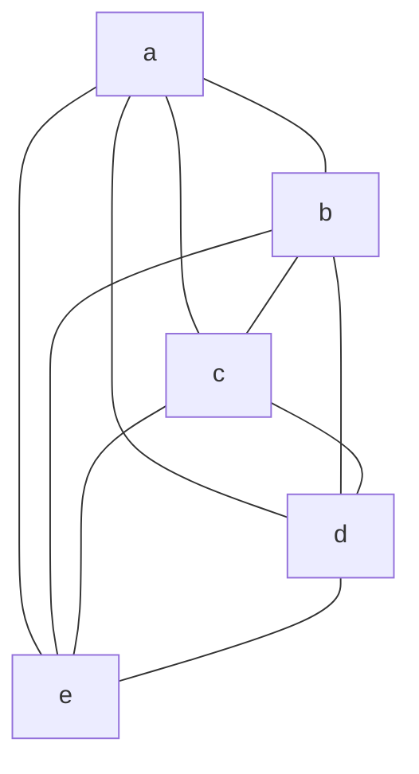
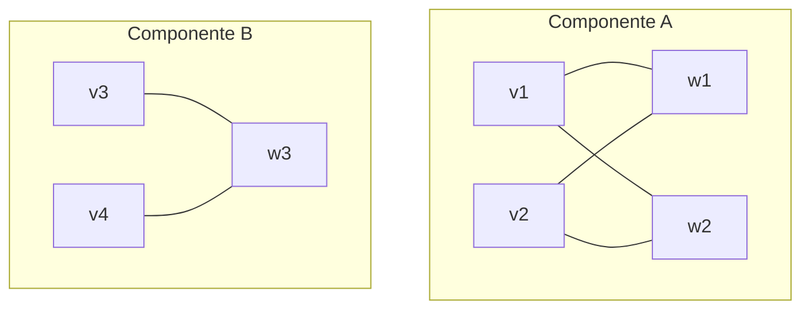
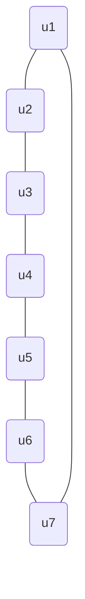

### Ejercicio 1
![[Pasted image 20251130205132.png]]
### Ejercicio 2
<mark style="background: #FFB86CA6;">a)</mark>
$$
V (G1) = \{ a,b,c,d,e \},\quad E(G1) = \{ ab,ac,ad,ae,bc,bd,be,cd,ce,de \}
$$

<mark style="background: #FFB86CA6;">b)</mark>
$$
V (G2) = \{ v1, v2, v3, v4,w1,w2,w3 \},\quad E(G2) = \{ v1w1, v1w2, v2w1, v2w2,w3v3,w3v4 \}
$$

<mark style="background: #FFB86CA6;">d)</mark>
$$
V(G4​)= \{ u1​,u2​,u3​,u4​,u5​,u6​,u7​ \},\quad E(G4​)= \{ u1​u2​,u2​u3​,u3​u4​,u4​u5​,u5​u6​,u6​u7​,u7​u1​ \}
$$

### Ejercicio 3
![[Pasted image 20251130205306.png]]
Para el grafo $H$:
- $\{ v_{2},v_{3},v_{4},v_{5} \}$ forman una clique de tamaño 4.
- $\{ v_{1},v_{5} \}$ forman un conjunto independiente de tamaño 2.
Para el grafo $F$:
- $\{ a,b,e \}$ forman una clique de tamaño 3.
- $\{ a,d \}$ forman un conjunto independiente de tamaño 2.
Para el grafo $G$:
- $\{ x_{4},x_{5},x_{6} \}$ forman una clique de tamaño 3.
- $\{ x_{8},x_{10},x_{12} \}$ forman un conjunto independiente de tamaño 3.
Para el grafo $G'$:

$\{ a,b,c,d,e \}$ forman una clique de tamaño 5.
$\{ a \}$ forma un conjunto independiente de tamaño 1.
Para el grafo $G''$:

$\{ v_{1},w_{2} \}$ forman una clique de tamaño 2.
$\{ v_{1},v_{2},v_{3},v_{4} \}$ forman un conjunto independiente de tamaño 4.
Para el grafo $G'''$:

$\{ u_{1},u_{3},u_{5} \}$ forman un conjunto independiente de tamaño 3.
$\{ u_{1},u_{2} \}$ forman una clique de tamaño 2.

### Ejercicio 4
Encuentre el tamaño máximo de una clique y el tamaño máximo de un conjunto independiente en los grafos de los ejercicios 1 y 2.
![[Pasted image 20251130205306.png]]
<mark style="background: #FFB8EBA6;">Grafo H.</mark>

Buscamos $\alpha(H)$:
Notemos que $\alpha(H)\geq{2}$.

Armemos $H_{1}$ inducido por $\{ v_{2},v_{3},v_{4},v_{5} \}$.
Notemos que $\alpha(H_{1})=1$.

Armemos $H_{2}$ inducido por $\{ v_{1} \}$.
Notemos que $\alpha(H_{2})=1$.

Como $V(H)=\{ v_{2},v_{3},v_{4},v_{5} \}\cup \{ v_{1} \}$, podemos usar la siguiente propiedad:
$$
\alpha(H) \leq \alpha(H_{1}) + \alpha(H_{2})
$$
Por lo tanto
$$
\alpha(H) \leq 1+1 = 2
$$
Como $2\leq \alpha(H)\leq{2}$, entonces $\alpha(H)=2$.

---

Buscamos $\omega(H)$:
Notemos que $\omega(H)\geq{4}$.

Para que exista $\omega(H)\geq{5}$ debe cumplirse la siguiente condición:
Deben existir al menos 5 vértices de grado al menos 4.

Listemos los grados de los vértices.
- $d(v_{1})=2$.
- $d(v_{2})=4$.
- $d(v_{3})=3$.
- $d(v_{4})=4$.
- $d(v_{5})=3$.
Notemos que la condición mencionada no se cumple. Por lo tanto, $\omega(H)<5$ y esto implica que $\omega(H)\leq{4}$.

Al demostrar que $4\leq \omega(H)\leq{4}$, podemos afirmar que $\omega(H)=4$.

<mark style="background: #FFB8EBA6;">Grafo F</mark>

Buscamos $\alpha(F)$.
Notemos que $\alpha(F)\geq{2}$.

Armemos $F_{1}$ inducido por $A=\{ a,b,c,d \}$.
Notemos que $\alpha(F_{1})=2$.

Armemos $F_{2}$ inducido por $A'=\{ e \}$.
Notemos que $\alpha(F_{2})=1$.

Como $V(F)=A\cup A'$ y $A\cap A'=\{  \}$, podemos usar la siguiente propiedad:
$$
\alpha(F) \leq \alpha(F_{1}) + \alpha(F_{2})
$$
$$
\alpha(F) \leq 2 + 1 = 3
$$
Luego, $2\leq \alpha(F)\leq{3}$.

Si intentamos encontrar un conjunto independiente de tamaño 3 deberíamos elegir al vértice $e$ y dos vértices cualesquiera de $A$. Luego, podemos notar que no es posible encontrar un conjunto independiente de tamaño 3, pues los 2 vértices elegidos de $A$ son vecinos al vértice $e$. Esto confirma que $\alpha(F)<3$, es decir, $2\leq \alpha(F)<{3}$, esto implica que $\alpha(F)=2$.

---

Buscamos $\omega(F)$.
Notemos que $\omega(F)\geq{3}$.

Si en $F$ existe una clique de tamaño 4, entonces deben existir al menos 4 vértices con grado al menos 3.

Listemos los grados de cada vértice:
- $d(a)=d(b)=d(c)=d(d)=3$.
- $d(e)=4$.

Para que el conjunto de vértices $\{ a,b,c,d \}$ sea una clique de tamaño 4, debería ocurrir que son todos vecinos entre sí. Esto no ocurre, puesto que $a\not\sim d$. Luego, el conjunto propuesto no forma una clique de tamaño 4.

Por lo tanto, $\omega(F)=3$.

<mark style="background: #FFB8EBA6;">Grafo G</mark>

Buscamos $\alpha(G)$.
Si tomamos el conjunto de vértices $\{ x_{4},x_{11},x_{9},x_{7} \}$ tenemos un conjunto independiente de tamaño 4. Por lo tanto, $\alpha(G)\geq{4}$.

Armemos:
- $G_{1}$ inducido por $A_{1}=\{ x_{1},x_{2},x_{3} \}$.
- $G_{2}$ inducido por $A_{2}=\{ x_{7},x_{8},x_{9},x_{10},x_{11},x_{12} \}$.
- $G_{3}$ inducido por $A_{3}=\{ x_{4},x_{5},x_{6} \}$.

Notemos que 
- $\alpha(G_{1})=1$.
- $\alpha(G_{2})=3$.
- $\alpha(G_{3})=1$.

Como $V(G)=A_{1}\cup A_{2}\cup A_{3}$ y $A_{1}\cap A_{2}\cap A_{3}=\emptyset$, podemos utilizar la siguiente propiedad:
$$
\alpha(G) \leq \alpha(G_{1}) + \alpha(G_{2}) + \alpha(G_{3})
$$
$$
\alpha(G) \leq 1+3+1 = 5
$$
Luego, el valor de $\alpha(G)$ se encuentra en el siguiente rango:
$$
4\leq \alpha(G)\leq{5}
$$

Para tener un conjunto independiente $S$ de tamaño 5, necesitamos tomar exactamente 1 vértice de $A_{1}$, 1 de $A_{3}$ y 3 de $A_{2}$.
Del subgrafo inducido $G_{2}$ podemos encontrar 2 conjuntos independientes de tamaño 3, estos son $I_{1}=\{ x_{7},x_{11},x_{9} \}$ y $I_{2}=\{ x_{8},x_{10},x_{12} \}$.

Consideremos $I_{1}$.
El conjunto independiente buscado tiene la siguiente forma: $S=\{ x_{A_{1}},x_{A_{3}},x_{7},x_{9},x_{11} \}$.
Notemos que el vértice elegido $x_{A_{1}}\in A_{1}$ no debe ser adyacente a $x_{7},x_{9},x_{11}$.
- $x_{1}\sim x_{7}$ (falla).
- $x_{2}\sim x_{9}$ (falla).
- $x_{3}\sim x_{11}$ (falla).
Por lo tanto, es imposible elegir un vértice perteneciente a $A_{1}$ que no sea adyacente a los tres vértices de $I_{1}$.

Consideremos $I_{2}$.
El conjunto independiente buscado tiene la siguiente forma: $S=\{ x_{A_{1}},x_{A_{3}},x_{8},x_{10},x_{12} \}$.
Notemos que el vértice elegido $x_{A_{3}}\in A_{3}$ no debe ser adyacente a $x_{8},x_{10},x_{12}$.
- $x_{4}\sim x_{12}$ (falla).
- $x_{5}\sim x_{8}$ (falla).
- $x_{6}\sim x_{10}$ (falla).
Por lo tanto, es imposible elegir un vértice perteneciente a $A_{3}$ que no sea adyacente a los tres vértices de $I_{2}$.

Dado que para cualquier selección posible de conjuntos independientes de tamaño 3, $(I_{1},I_{2})$, se encuentran vértices adyacentes a $A_{1}$ o $A_{3}$, podemos concluir que no existe un conjunto independiente de tamaño 5 o mayor.

Combinando la cota inferior, $\alpha(G)\geq{4}$, y la cota superior, $\alpha(G)\leq{4}$, queda demostrado que $\alpha(G)=4$.

---

Buscamos $\omega(G)$.
Notemos que el conjunto de vértices $S=\{ x_{4},x_{5},x_{6} \}$ es isomorfo a un $K_{3}$ y por lo tanto, forma una clique de tamaño 3, luego $\omega(G)\geq{3}$.

Para que exista una clique de tamaño 4, se debería cumplir que existen por lo menos 4 vértices de grado $\geq{3}$.
Como $G$ es un grafo 3-regular, todos los vértices cumplen la condición de tener grado $\geq{3}$.

Para formar un $K_{4}$ necesitamos un vértice $x_{i}$ que sea adyacente a $x_{4},x_{5},x_{6}$.
Listemos los vecinos de cada uno y verifiquemos si existe un vértice que sea vecino a $x_{4},x_{5},x_{6}$ simultáneamente.
- Vecinos de $x_{4}:\{ x_{5},x_{6},x_{12} \}$.
- Vecinos de $x_{5}:\{ x_{4},x_{6},x_{8} \}$.
- Vecinos de $x_{6}:\{ x_{4},x_{5},x_{10} \}$.

Notemos que no existe un vértice $x_{i}$ que sea vecino a $x_{4},x_{5},x_{6}$ simultáneamente.

Luego, $x_{12}\not\sim x_{5},x_{6}$, $x_{8}\not\sim x_{4},x_{6}$ y $x_{10}\not\sim x_{4},x_{5}$.

Por lo tanto, no es posible encontrar un cuarto vértice $x_{i}$ que forme un $K_{4}$, es decir, una clique de tamaño 4.
Luego, concluimos que $\omega(G)=3$.

### Ejercicio 5
![[Pasted image 20251201004242.png]]

### Ejercicio 14
¿Puede el grafo $\bar{C_{6}}$ (el complemento del ciclo de seis vértices) descomponerse en copias de $P_{4}$?

Se desea conocer si el grafo $\bar{C_{6}}$ se puede descomponer en copias de $P_{4}$.
Conocemos los siguientes datos:
- $\bar{C_{6}}$ es simple.
- $|V(\bar{C_{6}})|=|V(C_{6})|=6$.
- $C_{6}$ es isomorfo a un grafo 2-regular, es decir, un grafo donde todos los vértices $v\in V(C_{6})$ tienen grado 2, por lo tanto, $d_{C_{6}}(v)=2$.
- Tenemos que $d_{\bar{C_{6}}}(v)=|V(C_{6})|-d_{C_{6}}(v)-1\leftrightarrow 6-2-1 \leftrightarrow 3$.
- Aplicando el Teorema de Apretón de Manos $\sum_{v\in V(G)}d(v)=2|E(G)|$.
	- $|E(C_{6})|=\frac{\sum_{v\in V(C_{6})}d(v)}{2}=\frac{6\cdot{2}}{2}=6$.
	- $|E(\bar{C_{6}})|=\frac{\sum_{v\in V(\bar{C_{6}})}d(v)}{2}=\frac{6\cdot{3}}{2}=9$.

Ahora analicemos la estructura de un $P_{4}$:
- Es un grafo simple.
- Tiene 4 vértices.
- Tiene 3 aristas.
- Sus vértices pueden ordenarse en hilera de forma tal que 2 vértices son vecinos si y solo si son consecutivos en ese orden.
- 2 vértices de $V(P_{4})$ son los extremos, estos vértices tienen grado 1. Los otros 2 vértices restantes de $V(P_{4})$ tienen grado 2.

Con este panorama, verifiquemos si $\bar{C_{6}}$ se podría descomponer en copias de $P_{4}$.
Si la descomposición existiese, entonces debería existir una lista de subgrafos de $\bar{C_{6}}$ tal que cada arista de $\bar{C_{6}}$ pertenece a solo un subgrafo de la lista. Llamemos $H_{1},H_{2},\dots,H_{k}$ a los subgrafos que conforman la descomposición de $\bar{C_{6}}$ con $k\in \mathbb{N}$.
A su vez, se deberían cumplir las siguientes condiciones: 
- $|E(\bar{C_{6}})|=|E(H_{1})|+|E(H_{2})|+\dots+|E(H_{k})|=9$.
- $d_{\bar{C_{6}}}(v)=d_{H_{1}}(v)+d_{H_{2}}(v)+\dots+d_{H_{k}}(v)=3$.

Verifiquemos si se cumple la primer condición.
Sabemos que $|E(\bar{C_{6}})|=9$ y $|E(P_{4})|=3$. Como 9 se puede escribir como $9=3k$ podemos distribuir las 9 aristas de $\bar{C_{6}}$ en $k=3$ subgrafos $H_{1},H_{2},H_{3}$, de forma tal que cada arista de $\bar{C_{6}}$ pertenezca solo a uno de estos tres subgrafos. Particularmente, cada subgrafo de la descomposición va a ser una copia de $P_{4}$.

Ahora verifiquemos la segunda condición.
Sabemos que en un $P_{4}$ los grados posibles para cada vértice son: 0, 1 (extremos) o 2 (interno). Las únicas combinaciones posibles para que la suma sea 3 son permutaciones de $(1,1,1)$ o $(2,1,0)$.

Dijimos que íbamos a descomponer a $\bar{C_{6}}$ en 3 copias de $P_{4}$, por lo que podemos deducir que la única manera de que los 6 vértices (todos de grado 3) cumplan esta condición es si cada vértice participa exactamente:
- Una vez como vértice interno (grado 2).
- Una vez como vértice extremo (grado 1).
- Una vez no participando en el camino (grado 0).
De esta manera, la contribución total de cada vértice es $2+1+0=3$.

Como las condiciones se cumplen, la descomposición es posible. Ahora debemos construir la descomposición explícita.
![[Pasted image 20251025210912.png]]
Dado que se cumplen las condiciones necesarias y brindamos una descomposición explícita, podemos concluir que $\bar{C_{6}}$ se puede descomponer en copias de $P_{4}$.
### Ejercicio 18
El grafo simple $P_{4}$ es autocomplementario, es decir, el complemento de $P_{4}$ es isomorfo a $P_{4}$. 
Demuestre que si un grafo simple $G$ de $n$ vértices es autocomplementario entonces $n$ o $n-1$ es múltiplo de 4. 
Para cada $n$ tal que 4 divide a $n$ o a $n-1$, dé un ejemplo de un grafo autocomplementario de $n$ vértices. **Ayuda**: intente aprovechar la estructura que presenta $P_{4}$ para construir estos ejemplos.

Sea $G$ un grafo sabemos que:
- $G$ es un grafo simple.
- Tiene $n$ vértices, es decir $|V(G)|=n$ con $n\in \mathbb{N}$.
- $G$ es autocomplementario, por lo tanto se satisface la siguiente condición $|E(G)|= \frac{n(n-1)}{4}$.
Nos piden probar que $n=4m\quad$ o $\quad n-1=4m$, con $m\in \mathbb{N}$.

Analicemos la condición mencionada. Sabemos que $|E(G)|$ tiene que ser un número entero **no negativo** porque estamos trabajando con los números naturales. También sabemos que $$
\begin{gather}
|E(G)|=\frac{n(n-1)}{4} \\
4|E(G)|=n(n-1)
\end{gather}
$$ Es decir, $n(n-1)$ debe ser múltiplo de 4. Además, $n$ y $n-1$ son números consecutivos, es decir, uno de ellos es par y el otro es impar. 

Si $n$ es par entonces $n-1$ resultará impar. Por lo tanto, $n$ debe ser múltiplo de 4, es decir, debe poder escribirse como $n=4m$.
Si $n$ es impar entonces $n-1$ resultará par. Por lo tanto, $n-1$ debe ser múltiplo de 4, es decir, debe poder escribirse como $n-1=4m$.
Queda así demostrado que si el grafo $G$ es simple, tiene $n$ vértices y es autocomplementario entonces $n$ o $n-1$ es múltiplo de 4.
### Ejercicio 20
Pruebe que el complemento de un grafo simple disconexo es siempre conexo.

Sea $G$ un grafo simple y disconexo. Nos piden demostrar que $\overline{G}$ es siempre conexo. Es decir, debemos probar que para cada par de vértices $u,v\in V(\overline{G})$ existe un camino que los tiene por extremos. Recordemos que $\overline{G}$ está conformado por $V(G)=V(\overline{G})$ y $w\in E(\overline{G})\iff w \not\in E(G)$.

Que $G$ sea disconexo implica que está compuesto por dos componentes conexas como mínimo. Es decir, los vértices $v$ pertenecientes a una componente conexa $\mathcal{C_{1}}$ no son adyacentes con los vértices $w$ de otra componente conexa $\mathcal{C_{2}}$.

Dividamos el problema en dos casos.

**Caso 1**: tomemos dos vértices pertenecientes a componentes conexas distintas. Es decir, $v\in V(\mathcal{C_{1}})$ y $u\in V(\mathcal{C_{2}})$.
Sabemos que en $G$, $v$ y $u$ no son adyacentes porque pertenecen a componentes conexas distintas. Esto implica que en $\bar{G}$ $v$ y $u$ si lo serán, esto por definición de complemento. Es decir, en $\bar{G}$ existe un camino entre $v$ y $u$ que los tiene por extremos.

**Caso 2**: tomemos dos vértices pertenecientes a la misma componente conexa. Es decir, $v,u\in V(\mathcal{C_{1}})$.
Sabemos que en $G$ $u$ y $v$ son adyacentes entre sí. También sabemos que existe otra componente conexa $\mathcal{C_{2}}$ como mínimo donde un vértice $w\in \mathcal{C_{2}}$ no es adyacente tanto a $u$ como a $v$ en $G$. Esto implica que en $\bar{G}$, $u$ y $v$ no serán adyacentes pero $w$ será adyacente a $u$ y también a $v$, esto por definición de complemento. Por lo tanto, habrá un camino entre $v$ y $u$ que los tendrá por extremos.

Dado que no hay otra posibilidad sobre los vértices, queda demostrado que para todo par de vértices $u,v\in V(\bar{G})$ existe un camino en dicho grafo tal que sus extremos son $u$ y $v$, por lo tanto el grafo $\bar{G}$ es conexo.
### Ejercicio 21
Sea $G$ un grafo simple sin vértices aislados y que no contiene un subgrafo inducido con exactamente dos aristas. Probar que $G$ es conexo.

Sabemos que:
- $G$ es simple.
- No tiene vértices aislados.
- No contiene un subgrafo inducido con exactamente dos aristas.
Queremos probar que $G$ es conexo.

Para eso, analicemos por el absurdo. Es decir, tomemos como ciertas las hipótesis anteriormente mencionadas y supongamos que $G$ es disconexo.

Que $G$ sea disconexo implica que $G$ esté compuesto por dos componentes conexas como mínimo. Por hipótesis n°2 $G$ no tiene que tener vértices aislados por lo que cada componente conexa debe ser no trivial. Por hipótesis n°1 $G$ no puede tener bucles ni aristas múltiples, eso también se aplica para cada componente conexa de $G$ por lo que cada componente conexa no puede tener un único vértice $v$ con un bucle, sino que, cada componente conexa debe contener, como mínimo, 2 vértices que sean vecinos entre sí a través de una arista.

Tomemos dos vértices $v_{1},v_{2}$ pertenecientes a una componente conexa y otros dos vértices $v_{3},v_{4}$ pertenecientes a otra componente conexa. Si armamos $T=\{ v_{1},v_{2},v_{3},v_{4} \}$ y calculamos $G[T]$ obtenemos un subgrafo inducido con exactamente dos aristas.

**Observación**: el subgrafo inducido $G[T]$ está formado por dos copias de $P_{2}$.

Notemos que llegamos a una contradicción puesto que por hipótesis n°3 $G$ no contiene ningún subgrafo inducido con exactamente dos aristas.

Esta contradicción ocurrió porque supusimos que $G$ era disconexo, por lo que acabamos de demostrar que $G$ es conexo.
