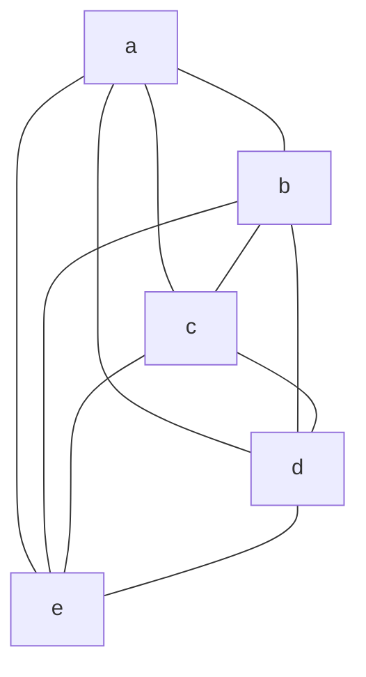
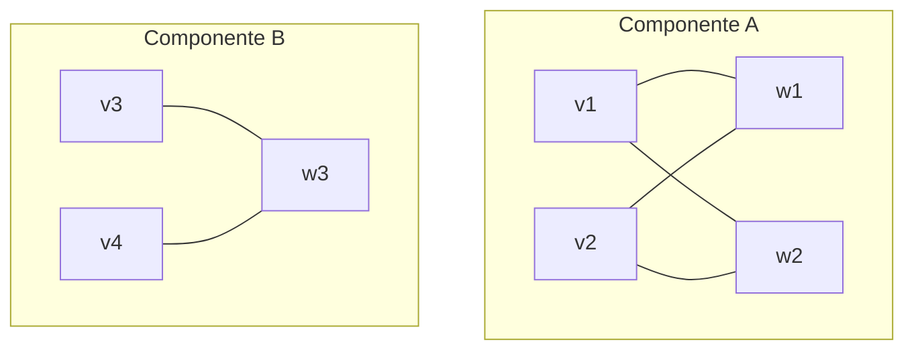
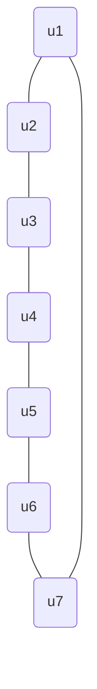

### Ejercicio 1
![[Pasted image 20251130205132.png]]
### Ejercicio 2
<mark style="background: #FFB86CA6;">a)</mark>
$$
V (G1) = \{ a,b,c,d,e \},\quad E(G1) = \{ ab,ac,ad,ae,bc,bd,be,cd,ce,de \}
$$

<mark style="background: #FFB86CA6;">b)</mark>
$$
V (G2) = \{ v1, v2, v3, v4,w1,w2,w3 \},\quad E(G2) = \{ v1w1, v1w2, v2w1, v2w2,w3v3,w3v4 \}
$$

<mark style="background: #FFB86CA6;">d)</mark>
$$
V(G4​)= \{ u1​,u2​,u3​,u4​,u5​,u6​,u7​ \},\quad E(G4​)= \{ u1​u2​,u2​u3​,u3​u4​,u4​u5​,u5​u6​,u6​u7​,u7​u1​ \}
$$

### Ejercicio 3
![[Pasted image 20251130205306.png]]
Para el grafo $H$:
- $\{ v_{2},v_{3},v_{4},v_{5} \}$ forman una clique de tamaño 4.
- $\{ v_{1},v_{5} \}$ forman un conjunto independiente de tamaño 2.
Para el grafo $F$:
- $\{ a,b,e \}$ forman una clique de tamaño 3.
- $\{ a,d \}$ forman un conjunto independiente de tamaño 2.
Para el grafo $G$:
- $\{ x_{4},x_{5},x_{6} \}$ forman una clique de tamaño 3.
- $\{ x_{8},x_{10},x_{12} \}$ forman un conjunto independiente de tamaño 3.
Para el grafo $G'$:

$\{ a,b,c,d,e \}$ forman una clique de tamaño 5.
$\{ a \}$ forma un conjunto independiente de tamaño 1.
Para el grafo $G''$:

$\{ v_{1},w_{2} \}$ forman una clique de tamaño 2.
$\{ v_{1},v_{2},v_{3},v_{4} \}$ forman un conjunto independiente de tamaño 4.
Para el grafo $G'''$:

$\{ u_{1},u_{3},u_{5} \}$ forman un conjunto independiente de tamaño 3.
$\{ u_{1},u_{2} \}$ forman una clique de tamaño 2.

### Ejercicio 4
Encuentre el tamaño máximo de una clique y el tamaño máximo de un conjunto independiente en los grafos de los ejercicios 1 y 2.
![[Pasted image 20251130205306.png]]
<mark style="background: #FFB8EBA6;">Grafo H.</mark>

Buscamos $\alpha(H)$:
Notemos que $\alpha(H)\geq{2}$.

Armemos $H_{1}$ inducido por $\{ v_{2},v_{3},v_{4},v_{5} \}$.
Notemos que $\alpha(H_{1})=1$.

Armemos $H_{2}$ inducido por $\{ v_{1} \}$.
Notemos que $\alpha(H_{2})=1$.

Como $V(H)=\{ v_{2},v_{3},v_{4},v_{5} \}\cup \{ v_{1} \}$, podemos usar la siguiente propiedad:
$$
\alpha(H) \leq \alpha(H_{1}) + \alpha(H_{2})
$$
Por lo tanto
$$
\alpha(H) \leq 1+1 = 2
$$
Como $2\leq \alpha(H)\leq{2}$, entonces $\alpha(H)=2$.

---

Buscamos $\omega(H)$:
Notemos que $\omega(H)\geq{4}$.

Para que exista $\omega(H)\geq{5}$ debe cumplirse la siguiente condición:
Deben existir al menos 5 vértices de grado al menos 4.

Listemos los grados de los vértices.
- $d(v_{1})=2$.
- $d(v_{2})=4$.
- $d(v_{3})=3$.
- $d(v_{4})=4$.
- $d(v_{5})=3$.
Notemos que la condición mencionada no se cumple. Por lo tanto, $\omega(H)<5$ y esto implica que $\omega(H)\leq{4}$.

Al demostrar que $4\leq \omega(H)\leq{4}$, podemos afirmar que $\omega(H)=4$.

<mark style="background: #FFB8EBA6;">Grafo F</mark>

Buscamos $\alpha(F)$.
Notemos que $\alpha(F)\geq{2}$.

Armemos $F_{1}$ inducido por $A=\{ a,b,c,d \}$.
Notemos que $\alpha(F_{1})=2$.

Armemos $F_{2}$ inducido por $A'=\{ e \}$.
Notemos que $\alpha(F_{2})=1$.

Como $V(F)=A\cup A'$ y $A\cap A'=\{  \}$, podemos usar la siguiente propiedad:
$$
\alpha(F) \leq \alpha(F_{1}) + \alpha(F_{2})
$$
$$
\alpha(F) \leq 2 + 1 = 3
$$
Luego, $2\leq \alpha(F)\leq{3}$.

Si intentamos encontrar un conjunto independiente de tamaño 3 deberíamos elegir al vértice $e$ y dos vértices cualesquiera de $A$. Luego, podemos notar que no es posible encontrar un conjunto independiente de tamaño 3, pues los 2 vértices elegidos de $A$ son vecinos al vértice $e$. Esto confirma que $\alpha(F)<3$, es decir, $2\leq \alpha(F)<{3}$, esto implica que $\alpha(F)=2$.

---

Buscamos $\omega(F)$.
Notemos que $\omega(F)\geq{3}$.

Si en $F$ existe una clique de tamaño 4, entonces deben existir al menos 4 vértices con grado al menos 3.

Listemos los grados de cada vértice:
- $d(a)=d(b)=d(c)=d(d)=3$.
- $d(e)=4$.

Para que el conjunto de vértices $\{ a,b,c,d \}$ sea una clique de tamaño 4, debería ocurrir que son todos vecinos entre sí. Esto no ocurre, puesto que $a\not\sim d$. Luego, el conjunto propuesto no forma una clique de tamaño 4.

Por lo tanto, $\omega(F)=3$.

<mark style="background: #FFB8EBA6;">Grafo G</mark>

Buscamos $\alpha(G)$.
Si tomamos el conjunto de vértices $\{ x_{4},x_{11},x_{9},x_{7} \}$ tenemos un conjunto independiente de tamaño 4. Por lo tanto, $\alpha(G)\geq{4}$.

Armemos:
- $G_{1}$ inducido por $A_{1}=\{ x_{1},x_{2},x_{3} \}$.
- $G_{2}$ inducido por $A_{2}=\{ x_{7},x_{8},x_{9},x_{10},x_{11},x_{12} \}$.
- $G_{3}$ inducido por $A_{3}=\{ x_{4},x_{5},x_{6} \}$.

Notemos que 
- $\alpha(G_{1})=1$.
- $\alpha(G_{2})=3$.
- $\alpha(G_{3})=1$.

Como $V(G)=A_{1}\cup A_{2}\cup A_{3}$ y $A_{1}\cap A_{2}\cap A_{3}=\emptyset$, podemos utilizar la siguiente propiedad:
$$
\alpha(G) \leq \alpha(G_{1}) + \alpha(G_{2}) + \alpha(G_{3})
$$
$$
\alpha(G) \leq 1+3+1 = 5
$$
Luego, el valor de $\alpha(G)$ se encuentra en el siguiente rango:
$$
4\leq \alpha(G)\leq{5}
$$

Para tener un conjunto independiente $S$ de tamaño 5, necesitamos tomar exactamente 1 vértice de $A_{1}$, 1 de $A_{3}$ y 3 de $A_{2}$.
Del subgrafo inducido $G_{2}$ podemos encontrar 2 conjuntos independientes de tamaño 3, estos son $I_{1}=\{ x_{7},x_{11},x_{9} \}$ y $I_{2}=\{ x_{8},x_{10},x_{12} \}$.

Consideremos $I_{1}$.
El conjunto independiente buscado tiene la siguiente forma: $S=\{ x_{A_{1}},x_{A_{3}},x_{7},x_{9},x_{11} \}$.
Notemos que el vértice elegido $x_{A_{1}}\in A_{1}$ no debe ser adyacente a $x_{7},x_{9},x_{11}$.
- $x_{1}\sim x_{7}$ (falla).
- $x_{2}\sim x_{9}$ (falla).
- $x_{3}\sim x_{11}$ (falla).
Por lo tanto, es imposible elegir un vértice perteneciente a $A_{1}$ que no sea adyacente a los tres vértices de $I_{1}$.

Consideremos $I_{2}$.
El conjunto independiente buscado tiene la siguiente forma: $S=\{ x_{A_{1}},x_{A_{3}},x_{8},x_{10},x_{12} \}$.
Notemos que el vértice elegido $x_{A_{3}}\in A_{3}$ no debe ser adyacente a $x_{8},x_{10},x_{12}$.
- $x_{4}\sim x_{12}$ (falla).
- $x_{5}\sim x_{8}$ (falla).
- $x_{6}\sim x_{10}$ (falla).
Por lo tanto, es imposible elegir un vértice perteneciente a $A_{3}$ que no sea adyacente a los tres vértices de $I_{2}$.

Dado que para cualquier selección posible de conjuntos independientes de tamaño 3, $(I_{1},I_{2})$, se encuentran vértices adyacentes a $A_{1}$ o $A_{3}$, podemos concluir que no existe un conjunto independiente de tamaño 5 o mayor.

Combinando la cota inferior, $\alpha(G)\geq{4}$, y la cota superior, $\alpha(G)\leq{4}$, queda demostrado que $\alpha(G)=4$.

---

Buscamos $\omega(G)$.
Notemos que el conjunto de vértices $S=\{ x_{4},x_{5},x_{6} \}$ es isomorfo a un $K_{3}$ y por lo tanto, forma una clique de tamaño 3, luego $\omega(G)\geq{3}$.

Para que exista una clique de tamaño 4, se debería cumplir que existen por lo menos 4 vértices de grado $\geq{3}$.
Como $G$ es un grafo 3-regular, todos los vértices cumplen la condición de tener grado $\geq{3}$.

Para formar un $K_{4}$ necesitamos un vértice $x_{i}$ que sea adyacente a $x_{4},x_{5},x_{6}$.
Listemos los vecinos de cada uno y verifiquemos si existe un vértice que sea vecino a $x_{4},x_{5},x_{6}$ simultáneamente.
- Vecinos de $x_{4}:\{ x_{5},x_{6},x_{12} \}$.
- Vecinos de $x_{5}:\{ x_{4},x_{6},x_{8} \}$.
- Vecinos de $x_{6}:\{ x_{4},x_{5},x_{10} \}$.

Notemos que no existe un vértice $x_{i}$ que sea vecino a $x_{4},x_{5},x_{6}$ simultáneamente.

Luego, $x_{12}\not\sim x_{5},x_{6}$, $x_{8}\not\sim x_{4},x_{6}$ y $x_{10}\not\sim x_{4},x_{5}$.

Por lo tanto, no es posible encontrar un cuarto vértice $x_{i}$ que forme un $K_{4}$, es decir, una clique de tamaño 4.
Luego, concluimos que $\omega(G)=3$.

### Ejercicio 5
![[Pasted image 20251201205155.png]]

<mark style="background: #FFB8EBA6;">Grafo cubo</mark>

Nombramos al grafo cubo como $G$ con el siguiente conjunto de vértices y arístas.

Buscamos $\alpha(G)$.

Notemos que el conjunto de vértices $A_{1}=\{ A,C,F,H \}$ es un conjunto independiente de tamaño 4.
Por lo tanto, podemos decir que $\alpha(G)\geq{4}$.

Tomemos el grafo $G_{1}$ inducido por $A_{2}=\{ A,B,C,D \}$ y el grafo $G_{2}$ inducido por $A_{3}=\{ E,F,G,H \}$.

Notemos que $G_{1}$ y $G_{2}$ son copias de $C_{4}$, es decir, un grafo ciclo de 4 vértices.
Por lo tanto, $\alpha(G_{1})=\alpha(G_{2})=2$.

Como $V(G)=V(G_{1})\cup V(G_{2})$, podemos usar la siguiente propiedad:
$$
\alpha(G) \leq \alpha(G_{1}) + \alpha(G_{2})
$$
$$
\alpha(G) \leq 2+2 = 4
$$
Entones
$$
4 \leq \alpha(G) \leq 4
$$
Por lo tanto, $\alpha(G)=4$.

---

Buscamos $\omega(G)$.

Notemos que el conjunto de vértices $B_{1}=\{ A,B \}$ es una clique de tamaño 2.
Por lo tanto, podemos decir que $\omega(G)\geq{2}$.

Tomemos un par de vértices cualesquiera $v_{1},v_{2}\in V(G)$ tal que $v_{1}\sim v_{2}$.
Listamos los vecinos de ambos:
- $N(v_{1})=\{ v_{2},w_{1},w_{2} \}$.
- $N(v_{2})=\{ v_{1},w_{3},w_{4} \}$.
- Donde $w_{1},w_{2},w_{3},w_{4}\in V(G)$.

Notemos que no existe un vértice $v_{3}\in V(G)$ tal que $v_{1}\sim v_{3},v_{2}\sim v_{3}$.
Esto impide que se genere una clique de tamaño 3 en $G$, es decir, $\omega(G)<3\leftrightarrow \omega(G)\leq{2}$.

Como $2\leq \omega(G)\leq{2}\implies \omega(G)=2$.

<mark style="background: #FFB8EBA6;">Grafo de Petersen</mark>

Nombramos al Grafo de Petersen como $H$ con el siguiente conjunto de vértices y arístas.

Buscamos $\alpha(H)$.

Notemos que el conjunto de vértices $B=\{ H,I,B,E \}$ es un conjunto independiente de tamaño 4, por lo tanto, $\alpha(H)\geq{4}$.

Tomemos al subgrafo $H_{1}$ inducido por $B_{1}=\{ A,B,C,D,E \}$ y al subgrafo $H_{2}$ inducido por $B_{2}=\{ F,G,H,I,J \}$.

Notemos que $H_{1}$ y $H_{2}$ son copias de $C_{5}$ y $\alpha(H_{1})=\alpha(H_{2})=2$.

Como $V(H)=B_{1}\cup B_{2}$, podemos usar la siguiente propiedad
$$
\alpha(H) \leq \alpha(H_{1}) + \alpha(H_{2})
$$
$$
\alpha(H) \leq 2+2=4
$$
Por lo tanto $4\leq \alpha(H)\leq{4}\implies \alpha(H)=4$.

Buscamos $\omega(H)$.

Notemos que el conjunto de vértices $B_{3}=\{ A,B \}$ es una clique de tamaño 2. Por lo tanto, $\omega(H)\geq{2}$.

Si existiese una clique de tamaño 3, tendríamos un conjunto de vértices $B_{4}=\{ v_{1},v_{2},v_{3} \}$ tal que $v_{1}\sim v_{2},v_{2}\sim v_{3},v_{3}\sim v_{1}$.

Tomemos dos vértices $v_{1},v_{2}\in V(H)$ tal que $v_{1}\sim v_{2}$.
Listemos a los vecinos de cada uno.
- $N(v_{1})=\{ v_{2},w_{1},w_{2} \}$.
- $N(v_{2})=\{ v_{1},w_{3},w_{4} \}$.
Donde $w_{1},w_{2},w_{3},w_{4}\in V(H)$.

Notemos que $v_{1}$ y $v_{2}$ no tienen vecinos en común. Por lo tanto, es imposible encontrar un $v_{3}\in V(H)$ tal que $v_{1}\sim v_{2},v_{2}\sim v_{3},v_{3}\sim v_{1}$, esto indica que $\omega(H)<3\leftrightarrow \omega(H)\leq{2}$.

Como $2\leq\omega(H)\leq{2}=\omega(H)=2$.

### Ejercicio 6
![[Pasted image 20251201214924.png]]

Modelemos el problema con un grafo simple $G$, donde los vértices representan a las personas y una arista representa la relación "conocerse mutuamente".

La condición "tres personas se conocen todas entre sí" significa que $G$ contiene una clique de tamaño 3.

La condición "tres personas tales que no hay dos de ellas que se conocen entre sí" significa que el conjunto de personas forma un conjunto independiente de tamaño 3.

Queremos demostrar que para todo grafo simple $G$ con $|V(G)|=6$ se cumple que $\omega(G)\geq{3}$ o $\alpha(G)\geq{3}$.

Tomamos un vértice $v\in V(G)$. Sabemos que $d(v)$ puede ser $0,1,2,3,4$ o $5$.

Por el **Teorema del Palomar** sabemos que los 5 vértices restantes o bien son vecinos de $v$ o bien no lo son (no simultáneamente, necesariamente). Por lo tanto, al menos una categoría debe tener 3 vértices.

Es decir, podemos identificar dos casos:
1. $v$ tiene al menos 3 vecinos
   Es decir, $3\leq d(v)\leq{5}$.
   Luego, podemos identificar dos subcasos:
	1. Existe al menos una arista entre los vecinos de $v$.
	   Tomemos dos $w_{1},w_{2}\in N(v)$ tal que $w_{1}\sim w_{2}$.
	   En este caso, $w_{1}\sim w_{2},v\sim w_{1},v\sim w_{2}\implies \omega(G)\geq{3}$.
	2. No existe ninguna arista entre los vecinos de $v$.
	   Tomemos tres $w_{1},w_{2},w_{3}\in N(v)$ tal que $w_{1}\not\sim w_{2},w_{1}\not\sim w_{3},w_{2}\not\sim w_{3}$.
	   En este caso, $w_{1}\not\sim w_{2},w_{1}\not\sim w_{3},w_{2}\not\sim w_{3}\implies \alpha(G)\geq{3}$.
2. $v$ tiene como mucho 2 vecinos
   Es decir, $0\leq d(v)\leq{2}$.
   Luego, podemos identificar dos subcasos:
	1. Existe al menos un par de no vecinos de $v$ que no son vecinos entre sí.
	   Tomemos $w_{1},w_{2}\in V(G)$ tal que $w_{1}\not\sim w_{2},v\not\sim w_{1},v\not\sim w_{2}$. 
	   En este caso, $w_{1}\not\sim w_{2},v\not\sim w_{1},v\not\sim w_{2}\implies \alpha(G)\geq{3}$.
	2. Todos los no vecinos son vecinos entre sí.
	   Tomemos $w_{1},w_{2},w_{3}\in V(G)$ tal que $w_{1}\sim w_{2},w_{1}\sim w_{3},w_{2}\sim w_{3}$ pero $v\not\sim w_{1},v\not\sim w_{2},v\not\sim w_{3}$.
	   En este caso, $w_{1}\sim w_{2},w_{1}\sim w_{3},w_{2}\sim w_{3}\implies \omega(G)\geq{3}$.

### Ejercicio 7
![[Pasted image 20251202014510.png]]
#### <mark style="background: #FFB8EBA6;"> Apartado A</mark>

Por hipótesis, $H$ es un grafo simple. Esto implica que $H$ no tiene bucles ni arístas múltiples.
Luego, sabemos que $\bar{H}$ está compuesto por $V(\bar{H})=V(H)$ y $ab\in E(\bar{H})\leftrightarrow ab\not\in E(H)$.

Si en $H$ tenemos un conjunto independiente de tamaño $k$ entonces existen $k$ vértices que no son vecinos entre sí. Luego, por definición de grafo complemento, en $\bar{H}$ estos $k$ vértices generan una clique de tamaño $k$.

Recíprocamente, si en $\bar{H}$ existe una clique de tamaño $k$ entonces existen $k$ vértices que son vecinos entre sí. Luego, por definición de grafo complemento, en $H$ estos $k$ vértices generan un conjunto independiente de tamaño $k$.

#### <mark style="background: #FFB8EBA6;"> Apartado B</mark>

Nos piden calcular $\alpha(G),\omega(G),\alpha(\bar{G}),\omega(\bar{G})$.
Como $G$ es un grafo simple $\bar{G}$ también lo es. Esto por definición de grafo complemento.
Por lo tanto, podemos hacer uso de la propiedad demostrada en el apartado A, que afirma lo siguiente:
$$
\text{Sea H un grafo simple.}\quad \alpha(H)=\omega(\bar{H})
$$
Nos dicen que $\bar{G}$ es isomorfo a un grafo que se forma agregando $m$ vértices aislados al grafo $K_{n}$, donde $n,m\in \mathbb{Z}:n,m\geq{3}$. 
De esto podemos saber lo siguiente:
- $|V(\bar{G})|=m+n$.
- Un $K_{n}$ está contenido dentro de $\bar{G}$. Es decir, hay $n$ vértices que forman una clique de tamaño $n$.
- Hay $m$ vértices aislados, esto forma un conjunto independiente de tamaño $m$.

Veamos si la clique de tamaño $n$ es $\omega(\bar{G})$:
Sabemos que $\omega(\bar{G})\geq n$.
Que haya $m$ vértices aislados no disminuye ni incrementa el tamaño de la clique encontrada ni tampoco genera nuevas cliques de mayor tamaño que la ya encontrada. Por lo tanto, podemos afirmar que $\omega(\bar{G})=n$.
Si utilizamos la propiedad mencionada, tenemos que $\omega(\bar{G})=\alpha(G)=n$.

Veamos si el conjunto independiente de tamaño $m$ es $\alpha(\bar{G})$:
Sabemos que $\alpha(\bar{G})\geq m$.
Sin embargo, podemos tomar uno y solo uno de los vértices de $K_{n}$ para agrandar el conjunto independiente de tamaño $m$ por uno de tamaño $m+1$. Si tomamos 2 vértices o más, estamos tomando dos vértices o más que son vecinos entre sí y por lo tanto, no pueden ser considerados en el armado del conjunto independiente.
Luego, podemos afirmar que $\alpha(\bar{G})=m+1$ ya que no podemos considerar los $n-1$ vértices restantes para agrandar el conjunto independiente actual. 
Si utilizamos la propiedad mencionada, tenemos que $\alpha(\bar{G})=\omega(G)=m+1$.

### Ejercicio 8
![[Pasted image 20251202023634.png]]

El enunciado es falso.
**Contraejemplo:** Sea $G$ la unión disjunta de dos ciclos $C_{3}$ tal que $G=C_{3}\cup C_{3}$. Se cumple que, $G$ es simple y 2-regular, pero no es un ciclo porque es disconexo.

El enunciado es verdadero si se agrega como hipótesis que $G$ sea conexo.

### Ejercicio 9
![[Pasted image 20251202183354.png]]

Por el Teorema del Apretón de manos tenemos que
$$
\frac{2\cdot{8}+7\cdot{2}}{2} = \frac{16+14}{2} = \frac{30}{2} = 15 = |E(G)|
$$

### Ejercicio 10
![[Pasted image 20251202183559.png]]

Sabemos que:
- $G$ es conexo.
- $|E(G)|=8$.
- Hay 6 vértices de grado 1.
- Al menos un vértice tiene grado 3.
- No hay vértices de grado 5.
- Hay un vértice de grado par.

Se pide conocer la cantidad de vértices de $G$, es decir, $|(VG)|$, y los grados de los vértices restantes.

Una de las posibles representaciones de $G$ es la siguiente
![[Pasted image 20251202191409.png]]
Notemos que cumple con las condiciones pedidas.

Luego, $|V(G)|=9$ y cuenta con:
- 6 vértices de grado 1
- 2 vértices de grado 3.
- 1 vértice de grado 4.

### Ejercicio 11
![[Pasted image 20251202191649.png]]

a) El grafo de Petersen

b) No es posible armar un grafo 3-regular con exactamente 17 vértices.
Por el Teorema de Apretón de manos, tenemos que
$$
|E(G)|=\frac{17\cdot{3}}{2}=\frac{51}{2}=25,5
$$
Como $|E(G)|$ tiene que ser un número entero positivo, el resultado es absurdo.

c) Sea $G$ un grafo tal que $|V(G)|=2n+1$ con $n\in \mathbb{N}$ y que es 3-regular.
Por el Teorema del Apretón de Manos tenemos que
$$
\sum_{v\in V(G)} d(v) = 2|E(G)|
$$
La suma de los grados es simplemente la cantidad de vértices multiplicada por el grado regular, es decir:
$$
(2n+1)\cdot{3} = 2|E(G)|
$$
$$
6n+3 = 2|E(G)|
$$
$$
\frac{6n+3}{2} = |E(G)|
$$
$$
3n+\frac{3}{2} = |E(G)|
$$
Notemos que sumar un número racional con un número da como resultado un número racional.
Pero, $|E(G)|\in \mathbb{N}$. Esto ocurre porque tenemos una cantidad de vértices impares. 

d) No existe un grafo 3-regular para cualquier cantidad par de vértices.
Esto es porque con 1 vértice, no se puede armar un grafo 3-regular.
Con 2 o 3 vértices, tampoco.
Solo es posible armar grafos 3-regulares, a partir de los 4 vértices.

### Ejercicio 12
![[Pasted image 20251202201726.png]]
 
a) 
Sea $n=|V(G)|$.
Por el Teorema del Apretón de Manos tenemos que
$$
\sum_{v\in V(G)} d(v) = 2|E(G)|
$$
La suma de los grados es simplemente la cantidad de vértices multiplicada por el grado regular, es decir:
$$
k\cdot n = 2|E(G)|
$$
$$
\frac{kn}{2} = |E(G)|
$$

b)
Por el Teorema del Apretón de Manos tenemos que
$$
\sum_{v\in V(G)} d(v) = 2|E(G)|
$$
La suma de los grados es simplemente la cantidad de vértices multiplicada por el grado regular, es decir:
$$
k\cdot |V(G)| = 2|E(G)|
$$
Notemos que $2|E(G)|$ es un número par y que $k$ puede tomar cualquier valor en los $\mathbb{N}$.
Podemos identificar dos casos:
- Si $k$ es impar entonces $|V(G)|$ debe tomar valores $\in \mathbb{Z}>0$ tales que sea par. Sin esta condición, la igualdad no se cumple. 
- Si $k$ es par entonces el valor que tome $|V(G)|\in \mathbb{Z}>0$ es irrelevante. La igualdad se cumple siempre.

c)
Por el Teorema del Apretón de Manos tenemos que
$$
\sum_{v\in V(G)} d(v) = 2|E(G)|
$$
La suma de los grados es simplemente la cantidad de vértices multiplicada por el grado regular, es decir:
$$
k\cdot |V(G)| = 2|E(G)|
$$
Notemos que $2|E(G)|$ es un número par y que $k$ o $|V(G)|$ pueden tomar cualquier valor en los $\mathbb{Z}>0$.
Como el producto entre un número par y un número entero positivo, da como resultado resultado un número entero positivo par, la igualdad se cumple si alguno de los dos términos es par.

Como $2|E(G)|$ es par, entonces $k\cdot |V(G)|$ es par. Esto implica lógicamente que $k$ es par o $|V(G)|$ es par.

### Ejercicio 13
![[Pasted image 20251202204851.png]]

a)
Un grafo simple pertenece a $S$ si
$$
\sum_{v\in V(G)} d(v) = 2|E(G)| \leftrightarrow 2n(2n-1) = 2|E(G)|
$$
Un grafo completo $K_{m}$ tiene $m$ vértices y cada vértice tiene grado $m-1$. Por lo tanto, podemos identificar $m=2n$ y $2n-1=\text{El grado de cada vértice}$.

Consideremos al grafo $K_{2n}$ que tiene $2n$ vértices y cada vértice tiene grado $2n-1$.
Por el Teorema del Apretón de Manos tenemos que
$$
\sum_{v\in V(K_{2n})} d(v) = 2|E(G)| \leftrightarrow 2n\cdot(2n-1) = 2|E(G)|
$$
Notemos que llegamos a la misma expresión. Por lo tanto, el grafo $K_{2n}\in S$.

b)
Un grafo simple pertenece a $S$ si
$$
\sum_{v\in V(G)} d(v) = 2|E(G)| \leftrightarrow 2n(2n-1) = 2|E(G)|
$$
Un grafo completo $K_{m}$ tiene $m$ vértices y cada vértice tiene grado $m-1$. Por lo tanto, podemos identificar $m=2n$ y $2n-1=\text{El grado de cada vértice}$.

Consideremos al grafo $K_{2n-1}$ que tiene $2n-1$ vértices y que cada vértice tiene grado $2n-2$.
Por el Teorema del Apretón de Manos tenemos que
$$
\sum_{v\in V(K_{2n-1})} d(v) = (2n-1)(2n-2) = 2|E(G)|
$$
Comparemos los factores:
- Suma requerida: $2n(2n-1)$.
- Suma máxima: $(2n-1)(2n-2)$.
Ambos factores comparten el término $2n-1$. Como $2n-2<2n$, el producto total es menor, por lo tanto, nunca alcanzará la suma requerida.

c) 
Sea $G$ un grafo en $S$, por el inciso a) y b) sabemos que la cantidad mínima de vértices de $G$ es $2n$.

El mayor grado de un vértice en un grafo simple con $2n$ vértices es $2n-1$.
Si todos los vértices de $G$ tuvieran grado $2n-1$, entonces
Por el Teorema del Apretón de Manos tenemos que
$$
\sum_{v\in V(G)} d(v) = 2n(2n-1) = 2|E(G)|
$$
Comparemos los factores:
- Suma requerida: $2n(2n-1)$.
- Suma máxima: $2n(2n-1)$.
Ambos factores son iguales, esto nos confirma que $G$ pertenece a $S$. A su vez, cada vértice de $G$ tiene grado $2n-1$ y esto implica que $G$ es isomorfo a un $K_{2n}$,

> **Otra resolución posible**: Supongamos que $G$ no es completo. Entonces, existe al menos un vértice en $G$ tal que $d(v)<2n-1$. Esto implicaría que $\sum d(v)<2n(2n-1)$ y por lo tanto, $G\not\in S$. 
> Por lo tanto, $\forall v\in V(G),d(v)=2n-1$ para que $G\in S$ y que $G\simeq K_{2n}$,

---

Repaso conceptual:
1. **Inciso a):** Confirmamos que el grafo completo $K_{2n}$ pertenece a $S$. Al tener $2n$ vértices, cada uno con grado máximo $2n-1$, la suma de grados es exactamente $2n(2n-1)$.
2. **Inciso b):** Demostramos que es imposible pertenecer a $S$ con menos vértices. Incluso el grafo con más aristas posible, con $2n-1$ vértices, tiene una suma de grados $(2n-1)(2n-2)$, la cual es estrictamente menor que el objetivo $2n(2n-1)$.
3. **Inciso c):** Probamos que si $G$ tiene el mínimo de vértices $2n$, debe ser completo. Para alcanzar la suma requerida, $2n(2n-1)$, con solo $2n$ vértices, **todos** deben tener el grado máximo, $2n-1$. Si faltara una sola arista, la suma bajaría y $G$ no estaría en $S$.

### Ejercicio 14
![[Pasted image 20251202223445.png]]

Se desea conocer si el grafo $\bar{C_{6}}$ se puede descomponer en copias de $P_{4}$.
Conocemos los siguientes datos:
- $\bar{C_{6}}$ es simple.
- $|V(\bar{C_{6}})|=|V(C_{6})|=6$.
- $C_{6}$ es isomorfo a un grafo 2-regular, es decir, un grafo donde todos los vértices $v\in V(C_{6})$ tienen grado 2, por lo tanto, $d_{C_{6}}(v)=2$.
- Tenemos que $d_{\bar{C_{6}}}(v)=|V(C_{6})|-d_{C_{6}}(v)-1\leftrightarrow 6-2-1 \leftrightarrow 3$.
- Aplicando el Teorema de Apretón de Manos $\huge{\sum_{v\in V(G)}d(v)=2|E(G)|}$.
	- $\Huge{|E(C_{6})|=\frac{\sum_{v\in V(C_{6})}d(v)}{2}=\frac{6\cdot{2}}{2}=6}$.
	- $\Huge{|E(\bar{C_{6}})|=\frac{\sum_{v\in V(\bar{C_{6}})}d(v)}{2}=\frac{6\cdot{3}}{2}=9}$.

Ahora analicemos la estructura de un $P_{4}$:
- Es un grafo simple.
- Tiene 4 vértices.
- Tiene 3 aristas.
- Sus vértices pueden ordenarse en hilera de forma tal que 2 vértices son vecinos si y solo si son consecutivos en ese orden.
- 2 vértices de $V(P_{4})$ son los extremos, estos vértices tienen grado 1. Los otros 2 vértices restantes de $V(P_{4})$ tienen grado 2.

Con este panorama, verifiquemos si $\bar{C_{6}}$ se podría descomponer en copias de $P_{4}$.
Si la descomposición existiese, entonces debería existir una lista de subgrafos de $\bar{C_{6}}$ tal que cada arista de $\bar{C_{6}}$ pertenece a solo un subgrafo de la lista. Llamemos $H_{1},H_{2},\dots,H_{k}$ a los subgrafos que conforman la descomposición de $\bar{C_{6}}$ con $k\in \mathbb{N}$.
A su vez, se deberían cumplir las siguientes condiciones: 
- $|E(\bar{C_{6}})|=|E(H_{1})|+|E(H_{2})|+\dots+|E(H_{k})|=9$.
- $d_{\bar{C_{6}}}(v)=d_{H_{1}}(v)+d_{H_{2}}(v)+\dots+d_{H_{k}}(v)=3$.

Verifiquemos si se cumple la primer condición.
Sabemos que $|E(\bar{C_{6}})|=9$ y $|E(P_{4})|=3$. Como 9 se puede escribir como $9=3k$ podemos distribuir las 9 aristas de $\bar{C_{6}}$ en $k=3$ subgrafos $H_{1},H_{2},H_{3}$, de forma tal que cada arista de $\bar{C_{6}}$ pertenezca solo a uno de estos tres subgrafos. Particularmente, cada subgrafo de la descomposición va a ser una copia de $P_{4}$.

Ahora verifiquemos la segunda condición.
Sabemos que en un $P_{4}$ los grados posibles para cada vértice son: 0, 1 (extremos) o 2 (interno). Las únicas combinaciones posibles para que la suma sea 3 son permutaciones de $(1,1,1)$ o $(2,1,0)$.

Dijimos que íbamos a descomponer a $\bar{C_{6}}$ en 3 copias de $P_{4}$, por lo que podemos deducir que la única manera de que los 6 vértices (todos de grado 3) cumplan esta condición es si cada vértice participa exactamente:
- Una vez como vértice interno (grado 2).
- Una vez como vértice extremo (grado 1).
- Una vez no participando en el camino (grado 0).
De esta manera, la contribución total de cada vértice es $2+1+0=3$.

Como las condiciones se cumplen, la descomposición es posible. Ahora debemos construir la descomposición explícita.
![[Pasted image 20251025210912.png]]
Dado que se cumplen las condiciones necesarias y brindamos una descomposición explícita, podemos concluir que $\bar{C_{6}}$ se puede descomponer en copias de $P_{4}$.

### Ejercicio 15
![[Pasted image 20251202224200.png]]

Sea un grafo $G$ con 7 o más vértices de grado impar.
Nos piden demostrar que $G$ no se puede descomponer en 3 caminos.

Sea $I(G)$ el conjunto de vértices de grado impar de $G$. Por hipótesis, $|I(G)|\geq{7}$, pero como la cantidad de vértices de grado impar debe ser par, podemos ajustarlo a $|I(G)|\geq{8}$.

Si $G$ se descompone en tres caminos, notados como $P_{1},P_{2},P_{3}$, entonces para todo $v$ se debe cumplir que 
$$
\Huge{d_{G}(v) = d_{P_{1}}(v) + d_{P_{2}}(v) + d_{P_{3}}(v)}
$$
Sea $v\in I(G)$. Para que $d_{G}(v)$ sea impar, $v$ debe ser extremo en 1 o 3 caminos. Por lo tanto, $v$ aparece al menos una vez en la unión de multiconjuntos de los extremos.

Un camino está compuesto por 2 vértices extremos de grado impar. Si tenemos 3 caminos, entonces necesitamos $3\times{2}=6$ vértices de grado impar que sean los extremos de cada camino.

Por lo tanto, cada $v\in I(G)$ consume al menos 1 extremo disponible.
Llegamos al absurdo, $8\leq |I(G)|\leq{6}$. Es decir, con 6 vértices de grado impar no logran igualar los 8 vértices de grado impar de $G$. Haría falta descomponer $G$ en un cuarto camino $P_{4}$.

### Ejercicio 18
El grafo simple $P_{4}$ es autocomplementario, es decir, el complemento de $P_{4}$ es isomorfo a $P_{4}$. 
Demuestre que si un grafo simple $G$ de $n$ vértices es autocomplementario entonces $n$ o $n-1$ es múltiplo de 4. 
Para cada $n$ tal que 4 divide a $n$ o a $n-1$, dé un ejemplo de un grafo autocomplementario de $n$ vértices. **Ayuda**: intente aprovechar la estructura que presenta $P_{4}$ para construir estos ejemplos.

Sea $G$ un grafo sabemos que:
- $G$ es un grafo simple.
- Tiene $n$ vértices, es decir $|V(G)|=n$ con $n\in \mathbb{N}$.
- $G$ es autocomplementario, por lo tanto se satisface la siguiente condición $|E(G)|= \frac{n(n-1)}{4}$.
Nos piden probar que $n=4m\quad$ o $\quad n-1=4m$, con $m\in \mathbb{N}$.

Analicemos la condición mencionada. Sabemos que $|E(G)|$ tiene que ser un número entero **no negativo** porque estamos trabajando con los números naturales. También sabemos que $$
\begin{gather}
|E(G)|=\frac{n(n-1)}{4} \\
4|E(G)|=n(n-1)
\end{gather}
$$ Es decir, $n(n-1)$ debe ser múltiplo de 4. Además, $n$ y $n-1$ son números consecutivos, es decir, uno de ellos es par y el otro es impar. 

Si $n$ es par entonces $n-1$ resultará impar. Por lo tanto, $n$ debe ser múltiplo de 4, es decir, debe poder escribirse como $n=4m$.
Si $n$ es impar entonces $n-1$ resultará par. Por lo tanto, $n-1$ debe ser múltiplo de 4, es decir, debe poder escribirse como $n-1=4m$.
Queda así demostrado que si el grafo $G$ es simple, tiene $n$ vértices y es autocomplementario entonces $n$ o $n-1$ es múltiplo de 4.
### Ejercicio 20
Pruebe que el complemento de un grafo simple disconexo es siempre conexo.

Sea $G$ un grafo simple y disconexo. Nos piden demostrar que $\overline{G}$ es siempre conexo. Es decir, debemos probar que para cada par de vértices $u,v\in V(\overline{G})$ existe un camino que los tiene por extremos. Recordemos que $\overline{G}$ está conformado por $V(G)=V(\overline{G})$ y $w\in E(\overline{G})\iff w \not\in E(G)$.

Que $G$ sea disconexo implica que está compuesto por dos componentes conexas como mínimo. Es decir, los vértices $v$ pertenecientes a una componente conexa $\mathcal{C_{1}}$ no son adyacentes con los vértices $w$ de otra componente conexa $\mathcal{C_{2}}$.

Dividamos el problema en dos casos.

**Caso 1**: tomemos dos vértices pertenecientes a componentes conexas distintas. Es decir, $v\in V(\mathcal{C_{1}})$ y $u\in V(\mathcal{C_{2}})$.
Sabemos que en $G$, $v$ y $u$ no son adyacentes porque pertenecen a componentes conexas distintas. Esto implica que en $\bar{G}$ $v$ y $u$ si lo serán, esto por definición de complemento. Es decir, en $\bar{G}$ existe un camino entre $v$ y $u$ que los tiene por extremos.

**Caso 2**: tomemos dos vértices pertenecientes a la misma componente conexa. Es decir, $v,u\in V(\mathcal{C_{1}})$.
Sabemos que en $G$ $u$ y $v$ son adyacentes entre sí. También sabemos que existe otra componente conexa $\mathcal{C_{2}}$ como mínimo donde un vértice $w\in \mathcal{C_{2}}$ no es adyacente tanto a $u$ como a $v$ en $G$. Esto implica que en $\bar{G}$, $u$ y $v$ no serán adyacentes pero $w$ será adyacente a $u$ y también a $v$, esto por definición de complemento. Por lo tanto, habrá un camino entre $v$ y $u$ que los tendrá por extremos.

Dado que no hay otra posibilidad sobre los vértices, queda demostrado que para todo par de vértices $u,v\in V(\bar{G})$ existe un camino en dicho grafo tal que sus extremos son $u$ y $v$, por lo tanto el grafo $\bar{G}$ es conexo.
### Ejercicio 21
Sea $G$ un grafo simple sin vértices aislados y que no contiene un subgrafo inducido con exactamente dos aristas. Probar que $G$ es conexo.

Sabemos que:
- $G$ es simple.
- No tiene vértices aislados.
- No contiene un subgrafo inducido con exactamente dos aristas.
Queremos probar que $G$ es conexo.

Para eso, analicemos por el absurdo. Es decir, tomemos como ciertas las hipótesis anteriormente mencionadas y supongamos que $G$ es disconexo.

Que $G$ sea disconexo implica que $G$ esté compuesto por dos componentes conexas como mínimo. Por hipótesis n°2 $G$ no tiene que tener vértices aislados por lo que cada componente conexa debe ser no trivial. Por hipótesis n°1 $G$ no puede tener bucles ni aristas múltiples, eso también se aplica para cada componente conexa de $G$ por lo que cada componente conexa no puede tener un único vértice $v$ con un bucle, sino que, cada componente conexa debe contener, como mínimo, 2 vértices que sean vecinos entre sí a través de una arista.

Tomemos dos vértices $v_{1},v_{2}$ pertenecientes a una componente conexa y otros dos vértices $v_{3},v_{4}$ pertenecientes a otra componente conexa. Si armamos $T=\{ v_{1},v_{2},v_{3},v_{4} \}$ y calculamos $G[T]$ obtenemos un subgrafo inducido con exactamente dos aristas.

**Observación**: el subgrafo inducido $G[T]$ está formado por dos copias de $P_{2}$.

Notemos que llegamos a una contradicción puesto que por hipótesis n°3 $G$ no contiene ningún subgrafo inducido con exactamente dos aristas.

Esta contradicción ocurrió porque supusimos que $G$ era disconexo, por lo que acabamos de demostrar que $G$ es conexo.
