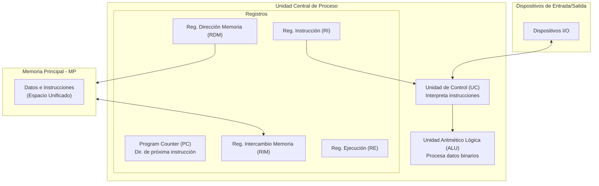
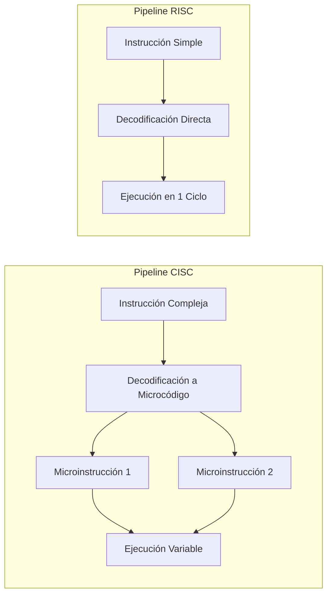
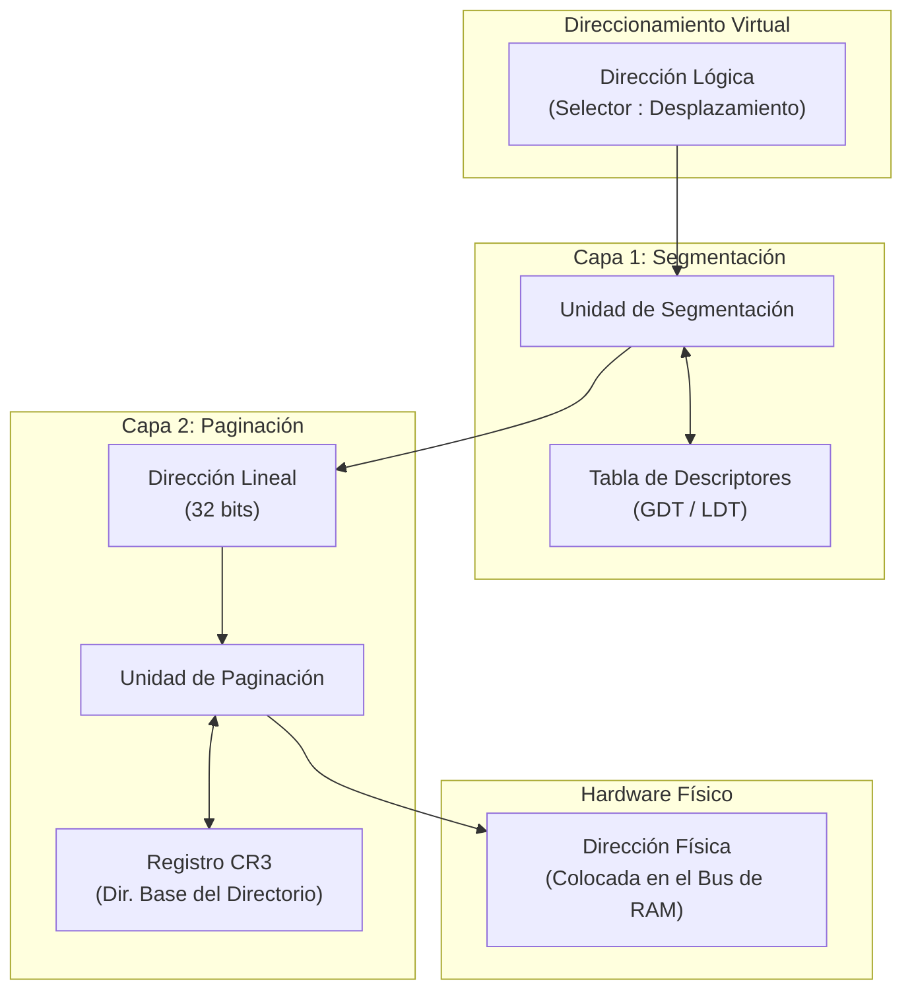
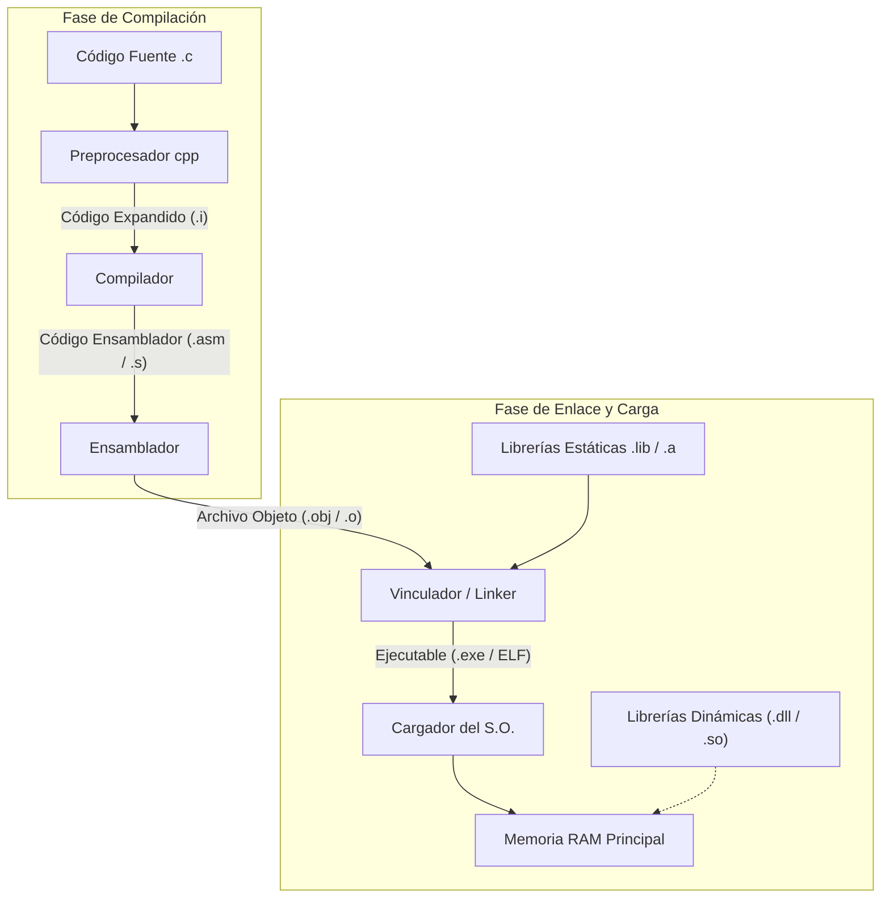
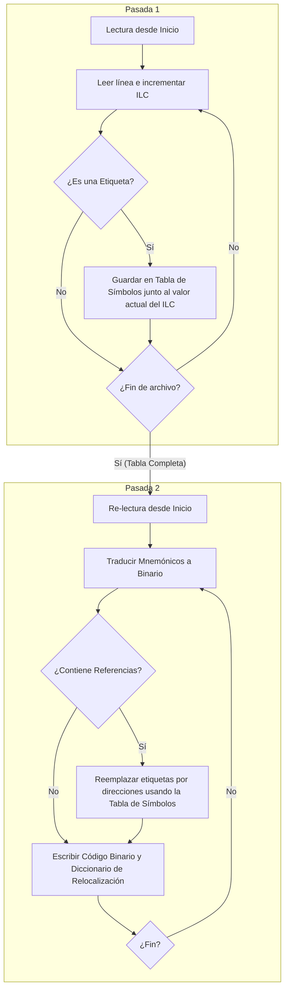

# Referencia Técnica Exhaustiva: Arquitectura de Computadores, FPU x87, Gestión de Memoria y Ciclo del Software

Este informe consolida y analiza de manera rigurosa los cuatro pilares fundamentales de la materia **Organización del Computador II**, basándose en las clases de la cátedra, las especificaciones técnicas de la arquitectura IA-32/x86-64, y la bibliografía clásica de sistemas operativos y arquitectura de computadoras (*Silberschatz, Tanenbaum, Hennessy & Patterson*).

## 1. Evolución de Arquitecturas e Instrucciones: IAS, x86 y Paradigmas RISC vs CISC

Para entender los procesadores modernos, primero tenés que comprender de dónde venimos. La evolución desde la primera computadora de programa almacenado hasta los procesadores de $64\text{ bits}$ actuales ha redefinido el límite entre el hardware y el software.

### 1.1. La Estructura de la Computadora IAS (von Neumann)

La computadora del *Institute for Advanced Study* (IAS), propuesta por John von Neumann en la década de 1950, es la piedra angular del concepto de **programa almacenado**. Antes de esto, programar requería recablear físicamente la máquina.



- **Principio de Programa Almacenado:** Tanto los datos como las instrucciones de máquina se almacenan de manera unificada en la **Memoria Principal (MP)**.
    
- **Ciclo de Ejecución Básico (Fetch-Decode-Execute):**
    
    1. El **PC** apunta a la dirección de la siguiente instrucción en la MP.
        
    2. Dicha dirección se transfiere al **RDM**.
        
    3. La instrucción se lee a través del bus y se almacena temporalmente en el **RIM**.
        
    4. El código de operación (Opcode) se transfiere al **RI** para su decodificación por la **Unidad de Control (UC)**, mientras que los operandos van al **RE**.
        
    5. La UC activa los caminos de datos en la **ALU** para ejecutar la instrucción sobre los datos.

### 1.2. RISC vs CISC: La Batalla de los Paradigmas

La división entre *Reduced Instruction Set Computer* (RISC) y *Complex Instruction Set Computer* (CISC) no es solo técnica, sino filosófica. Pensalo como un balance de complejidad: ¿querés hardware complejo con compiladores simples, o hardware simple con compiladores ultra-optimizados?

| **Característica**          | **CISC (Complex Instruction Set)**                                   | **RISC (Reduced Instruction Set)**                               |
| --------------------------- | -------------------------------------------------------------------- | ---------------------------------------------------------------- |
| **Filosofía**               | Énfasis en el hardware. Reducir tamaño del código.                   | Énfasis en el software y el compilador. Velocidad.               |
| **Tamaño de Instrucciones** | Formato y longitud variable (ej. de $1$ a $15\text{ bytes}$ en x86). | Tamaño fijo (normalmente $32\text{ bits}$ uniformes).            |
| **Registros**               | Pocos registros de propósito general (originalmente $8$ en IA-32).   | Gran cantidad de registros ($32$ o más de propósito general).    |
| **Acceso a Memoria**        | Instrucciones complejas pueden operar directo en memoria.            | Solo instrucciones dedicadas `LOAD` y `STORE` acceden a memoria. |
| **Ciclos por Instrucción**  | Variable (una instrucción puede tardar muchos ciclos).               | Idealmente un ciclo de clock por instrucción (CPI = $1$).        |
| **Pipeline**                | Muy difícil de implementar por variabilidad de tamaño y ciclos.      | Altamente eficiente y sencillo de segmentar en etapas regulares. |
| **Uso de Silicio**          | Mucha microprogramación (conversión de microcódigo).                 | Control cableado, liberando silicio para más registros o caché.  |



### 1.3. Evolución de la Arquitectura Intel

Intel comenzó con un diseño CISC puro, pero a partir del **Pentium Pro**, implementó un núcleo interno de tipo RISC. Las instrucciones CISC externas complejas se decodifican al vuelo en microoperaciones ($\mu\text{ops}$) simples y de tamaño fijo que se ejecutan de forma ultra-rápida y fuera de orden.

- **16 bits (8086/8088 - 80286):** Direccionamiento segmentado primitivo. Nace la arquitectura x86. El 80286 introduce el *Modo Protegido* básico.
    
- **32 bits IA-32 (80386 - Pentium 4):** Registros ampliados a $32\text{ bits}$ (prefijo "E", como `EAX`). Se introduce soporte nativo para **Paginación**, habilitando el espacio plano de direccionamiento virtual de $4\text{ GB}$ ($2^{32}\text{ bytes}$).
    
- **64 bits x86-64 (AMD64 / Intel 64):** Rompe la barrera de los $4\text{ GB}$ permitiendo teóricamente un direccionamiento de $2^{64}\text{ bytes}$. Amplía los registros a $64\text{ bits}$ (prefijo "R", como `RAX`) y añade $8$ nuevos registros de uso general (`R8` a `R15`), reduciendo la "presión de registros" (*register pressure*).

## 2. Cómputo en Punto Flotante: Arquitectura e Instrucciones de la FPU x87

Cuando tu procesador necesita calcular números decimales con extrema precisión (como física de videojuegos o criptografía), la ALU entera se queda corta. Históricamente, Intel delegaba esto a un coprocesador matemático externo: la **FPU x87**. Hoy en día, está integrada dentro del propio silicio de la CPU.

### 2.1. Formato de Precisión Extendida (IEEE 754)

Aunque tu código de alto nivel trabaje con `float` ($32\text{ bits}$) o `double` ($64\text{ bits}$), internamente la FPU x87 opera **siempre con una precisión extendida de** $80\text{ bits}$. Esto minimiza los errores de redondeo acumulativos durante cálculos complejos.

$$\text{Formato x87 de } 80 \text{ bits}: \quad [1 \text{ bit de Signo}] \ [15 \text{ bits de Exponente}] \ [64 \text{ bits de Mantisa (Parte entera explícita)}]$$

### 2.2. La Arquitectura de Pila (Stack) de 8 Niveles

La x87 no usa registros de propósito general tradicionales. En su lugar, organiza sus ocho registros de $80\text{ bits}$ como una **pila circular**, direccionada desde $ST(0)$ (el tope de la pila, o *Top of Stack*) hasta $ST(7)$.


- **Comportamiento Circular:** El puntero de tope de pila (TOS) reside dentro del registro de estado. Al hacer un `PUSH` (instrucción `FLD`), el TOS decrece en $1$ y se escribe el valor en el nuevo $ST(0)$. Si se desborda el límite de $8$ registros sin hacer un `POP` (`FSTP`), se produce una excepción de FPU.

### 2.3. Registros de Control y Estado

La FPU se gobierna a través de tres registros de sistema:

1. **Register Stack (Datos):** Los $8$ registros de $80\text{ bits}$ descritos.
    
2. **Status Word (Palabra de Estado):** Refleja el estado de ejecución actual. Contiene el puntero TOS, los códigos de condición ($C_0, C_1, C_2, C_3$) que equivalen a los flags aritméticos de la CPU entera, y los bits de excepciones (división por cero, desbordamiento, etc.).
    
    - *Sincronización:* Podés copiar la Palabra de Estado a la memoria mediante `FSTSW` o transferirla directamente al registro `AX` de la CPU (`FSTSW AX`) para tomar decisiones con saltos condicionales enteros.
        
3. **Control Word (Palabra de Control):** Permite al programador enmascarar excepciones de punto flotante y cambiar el modo de redondeo (hacia el entero más cercano, truncamiento, hacia $-\infty$, hacia $+\infty$) y definir la precisión interna de cómputo ($24$, $53$ o $64\text{ bits}$ de mantisa).

### 2.4. Set de Instrucciones de la FPU x87

- **Transferencia:**
    
    - `FLD <origen>`: Carga (PUSH) un valor de memoria o registro FPU en $ST(0)$.
        
    - `FILD <origen>`: Carga y convierte un entero de memoria a punto flotante de $80\text{ bits}$.
        
    - `FST <destino>`: Copia $ST(0)$ en el destino sin modificar la pila.
        
    - `FSTP <destino>`: Copia $ST(0)$ en el destino y realiza un POP de la pila.
        
- **Aritmética:**
    
    - `FADD` / `FSUB` / `FMUL` / `FDIV`: Operaciones básicas con operandos implícitos (ej: `FADD` suma $ST(0)$ y $ST(1)$, almacena en $ST(1)$ y hace POP, dejando el resultado en el nuevo $ST(0)$).
        
    - `FSQRT`: Calcula la raíz cuadrada de $ST(0)$ de forma extremadamente rápida a nivel hardware.

### 2.5. El Desafío de las Excepciones Asíncronas

La CPU entera y la FPU funcionan en paralelo. Esto significa que una instrucción entera de la CPU puede ejecutarse mientras la FPU está calculando una instrucción previa.

Si la instrucción de la FPU genera un error (por ejemplo, división por cero en `FDIV`), la CPU no se enterará de inmediato. Si no se sincronizan correctamente, el programa puede seguir adelante y sobreescribir los datos de entrada antes de que el manejador de excepciones de punto flotante sea invocado.

- **Sincronización Correcta:**

```
FILD COUNT  ; Carga entero
FSQRT       ; Ejecuta raíz (puede generar excepción)
FWAIT       ; Sincroniza: frena la CPU hasta que la FPU termine FSQRT
INC COUNT   ; Ahora es seguro modificar 'COUNT'
```

> Si no usáramos `FWAIT` (o una instrucción subsiguiente de FPU que sincronice implícitamente), `INC COUNT` podría modificar la variable antes de que `FILD` o `FSQRT` terminen de procesarla.

## 3. Gestión de Memoria en Modo Protegido: Segmentación y Paginación

En sistemas multitarea modernos, no podemos permitir que un proceso acceda libremente a la memoria física. Si un proceso tiene un puntero corrupto, podría pisar el código del Sistema Operativo o de otro programa. Para evitar esto, la Unidad de Gestión de Memoria (MMU) del procesador implementa dos capas de traducción y protección: **Segmentación** y **Paginación**.



### 3.1. Segmentación en IA-32 (Modo Protegido)

La segmentación divide el espacio de direccionamiento lógico del programa en bloques de tamaño variable llamados **Segmentos** (Código, Datos, Pila).

Una **dirección lógica** está compuesta por un par: `Selector de Segmento` (de $16\text{ bits}$) y un `Desplazamiento` (offset de $32\text{ bits}$).

#### Estructura del Selector de Segmento:

El selector no es una dirección de memoria directa, sino un índice que apunta a una estructura del sistema:

- **Index (**$13\text{ bits}$**):** Apoya la búsqueda de la entrada correspondiente dentro de la tabla de descriptores ($2^{13} = 8192$ descriptores posibles).
    
- **TI (Table Indicator -** $1\text{ bit}$**):** Indica si se usa la **GDT** (Global Descriptor Table, común a todo el sistema, $TI=0$) o la **LDT** (Local Descriptor Table, privada de un proceso específico, $TI=1$).
    
- **RPL (Requested Privilege Level -** $2\text{ bits}$**):** Especifica el nivel de privilegio que solicita el selector ($0 \dots 3$). Aquí se implementan los famosos **Anillos de Protección (Rings)**, donde el Anillo 0 es el Kernel y el Anillo 3 es el Modo Usuario.

#### El Descriptor de Segmento ($8\text{ bytes}$ en memoria):

Ubicado en la GDT/LDT, describe las características del segmento físico:

- **Base Address (**$32\text{ bits}$**):** La dirección de inicio del segmento en el espacio lineal de $4\text{ GB}$.
    
- **Segment Limit (**$20\text{ bits}$**):** Define el tamaño máximo del segmento.
    
- **Granularidad (G -** $1\text{ bit}$**):**
    
    - Si $G = 0$, el límite se mide en **bytes** (tamaño máximo: $1\text{ MB}$).
        
    - Si $G = 1$, el límite se escala en páginas de $4\text{ KB}$ (tamaño máximo: $4\text{ GB}$).
        
- **Present (P -** $1\text{ bit}$**):** Indica si el segmento está cargado en la memoria RAM física. Si $P=0$, se genera una excepción de fallo de segmento (*Segment Not Present Fault*), útil para implementar memoria virtual segmentada.
    
- **DPL (Descriptor Privilege Level -** $2\text{ bits}$**):** El nivel mínimo de privilegio requerido para acceder a este segmento.

### 3.2. Paginación en IA-32

La paginación toma la dirección lineal plana de $32\text{ bits}$ generada por la unidad de segmentación y la traduce a una dirección física en RAM, dividiendo la memoria en páginas de tamaño fijo (típicamente $4\text{ KB}$).

Para una página estándar de $4\text{ KB}$, la arquitectura IA-32 utiliza un esquema de **Paginación de Dos Niveles**. Esto evita tener una tabla de páginas gigantesca y plana en RAM, permitiendo paginar las propias tablas de páginas.

#### Descomposición de la Dirección Lineal de $32\text{ bits}$:

La dirección lineal se divide en tres partes:

```
+------------------------+------------------------+------------------------+
|   Directorio (PDE)     |   Tabla Páginas (PTE)  |   Desplazamiento       |
|       10 bits          |        10 bits         |       12 bits          |
+------------------------+------------------------+------------------------+
31                     22 21                    12 11                      0
```

1. **Directorio de Páginas (Bits 31-22):** Índice de $10\text{ bits}$ ($1024$ entradas) que apunta a una **Tabla de Páginas**. La dirección base física del Directorio de Páginas de la tarea actual se almacena en el registro de control **CR3**.
    
2. **Tabla de Páginas (Bits 21-12):** Índice de $10\text{ bits}$ ($1024$ entradas) que apunta a la base física del frame de página en RAM (el bloque físico).
    
3. **Desplazamiento / Offset (Bits 11-0):** Desplazamiento de $12\text{ bits}$ ($2^{12} = 4096\text{ bytes}$) que se mapea directamente byte a byte en el frame físico de la RAM.

#### Banderas de Control en PDE y PTE:

- **Present (P):** Si es $0$, la página no está en RAM (está en disco). Dispara una excepción de **Fallo de Página (Page Fault)**. El Sistema Operativo intercepta esto, lee la página de disco, la coloca en RAM, actualiza la tabla y reanuda la instrucción.
    
- **Read/Write (R/W):** Si es $0$, la página es de solo lectura. Protege el código del programa de escrituras accidentales o maliciosas.
    
- **User/Supervisor (U/S):** Si es $1$, la página pertenece al modo usuario (Anillo 3). Si es $0$, solo puede ser accedida por código del Kernel (Anillo 0, 1, 2).
    
- **Dirty (D):** Indica si se ha escrito en la página. El S.O. usa esto para saber si debe resguardar la página en el disco duro antes de desalojarla de la memoria RAM.
    
- **Page Size (PS - solo en el PDE):** Si se activa ($PS=1$), se habilitan **páginas gigantes de** $4\text{ MB}$. El directorio apunta directamente al frame de $4\text{ MB}$, saltándose el segundo nivel de la tabla de páginas. Los $22\text{ bits}$ más bajos de la dirección lineal se usan directamente como desplazamiento.

## 4. Del Código Fuente a la Ejecución en Memoria: El Ciclo de Vida del Software

Todo programa escrito en lenguaje de alto nivel (como C/C++) debe atravesar un riguroso proceso de transformación antes de convertirse en un proceso dinámico en ejecución dentro de la memoria del computador.



### 4.1. Fases del Compilador (Análisis y Síntesis)

El compilador realiza la parte más pesada del análisis semántico y la optimización de código. Sus etapas internas son:

1. **Preprocesamiento:**
    
    - *Entrada:* Código fuente original (`.c`, `.h`).
        
    - *Operación:* Expande macros `#define`, procesa directivas de inclusión `#include`, elimina comentarios.
        
    - *Salida:* Código fuente expandido e higienizado (`.i`).
        
2. **Compilación en Sí (Traducción a Ensamblador):**
    
    - **Scanner (Analizador Léxico):** Convierte la secuencia de caracteres en "tokens" (palabras clave, operadores, identificadores). Detecta errores como caracteres inválidos o strings sin cerrar.
        
    - **Parser (Analizador Sintáctico):** Agrupa los tokens en estructuras jerárquicas como el **Árbol de Sintaxis Abstracta (AST)**, verificando las reglas gramaticales del lenguaje. Detecta paréntesis huérfanos, falta de puntos y comas, etc.
        
    - **Analizador Semántico:** Realiza la comprobación de tipos, verifica si las variables fueron declaradas antes de usarse y si las funciones coinciden con sus firmas de llamadas.
        
    - **Generación de Código Intermedio (IR):** Traduce el árbol sintáctico a un lenguaje pseudo-ensamblador abstracto e independiente de la arquitectura física del hardware final.
        
3. **Optimización de Código Intermedio:**
    
    Búsqueda de equivalencias lógicas que consuman menos recursos. Muchas optimizaciones son computacionalmente difíciles de resolver de forma perfecta (problemas NP-Hard), por lo que se emplean heurísticas:
    
    - *Constant Folding:* Reemplazar expresiones constantes en tiempo de compilación. Ejemplo: `x = 30 * 2` se traduce directamente a `x = 60`.
        
    - *Simplificación Algebraica:* Eliminar cómputos inútiles como `y = x + 0` o `z = x * 1`.
        
    - *Eliminación de Código Muerto:* Borrar ramificaciones del programa a las que es físicamente imposible llegar (ej: bloques dentro de un `if (false)`).
        
    - *Recursión de Cola a Iteración:* Convertir llamadas recursivas extremas en bucles planos para evitar desbordar el stack.
        
4. **Generación de Código Objetivo:**
    
    Traduce la representación intermedia a instrucciones nativas reales del procesador destino (x86, ARM), decidiendo qué registros físicos asignarle a cada variable de forma óptima.

### 4.2. Ensamblado en Dos Pasadas

El ensamblador toma el archivo en ensamblador (`.asm` o `.s`) y genera el código binario equivalente en un **archivo objeto** (`.o` o `.obj`). Sin embargo, se topa con un problema clásico de diseño: la **Referencia hacia Adelante (Forward Reference)**.

#### El Problema de la Referencia hacia Adelante:

Imaginá que tenés un salto condicional a una etiqueta que está escrita más abajo en el archivo:

```
JNZ miEtiqueta  ; ¿Qué dirección de memoria física le asignamos acá?
...
miEtiqueta:
MOV EAX, 1      ; La etiqueta recién se define aquí
```

Cuando el ensamblador lee la línea `JNZ miEtiqueta`, todavía no sabe en qué posición física de memoria va a caer la definición de la etiqueta. Para resolverlo, los ensambladores ejecutan un **algoritmo de dos pasadas**.



- **Instruction Length Counter (ILC):** Es un registro virtual del ensamblador que actúa como puntero interno. Lleva la cuenta del tamaño exacto de cada instrucción que se va a generar.
    
- **Al finalizar la Pasada 1**, el ensamblador ha mapeado todas las etiquetas existentes en una estructura llamada **Tabla de Símbolos**.
    
- **En la Pasada 2**, vuelve a escanear el archivo, traduce los mnemónicos a código máquina binario sin problemas, porque ante cualquier salto a etiqueta simplemente consulta su dirección numérica en la Tabla de Símbolos construida en la primera pasada.

### 4.3. Vinculación (Linking) Estática vs Dinámica

El compilador genera archivos objeto independientes para cada módulo de tu código fuente. El **Vinculador (Linker)** une todos los archivos `.o`, resuelve las llamadas a funciones externas y genera el ejecutable final.

#### Vinculación Estática:

El vinculador copia físicamente todo el código de las funciones de las bibliotecas de sistema (ej: `printf` de la biblioteca estándar de C) adentro de tu archivo ejecutable final.

- *Ventaja:* El ejecutable es independiente, no requiere dependencias externas para correr.
    
- *Desventaja:* Los archivos son más pesados en disco y se desperdicia RAM al cargar copias duplicadas de la misma función por cada programa que se ejecute en el S.O.

#### Vinculación Dinámica:

En lugar de copiar el código, el vinculador solo inserta una tabla de referencias externas y deja que las bibliotecas se carguen dinámicamente en tiempo de ejecución (`.dll` en Windows, `.so` en UNIX/Linux).

- *Ventaja:* Varios procesos concurrentes pueden compartir exactamente la misma porción de código físico de la librería en RAM. Actualizar la librería corrige bugs en todos los programas que la usen sin necesidad de re-compilarlos.
    
- *Desventaja:* El problema de dependencias (versiones de librerías incompatibles o faltantes).

### 4.4. Carga y Ejecución en Memoria

El **Cargador (Loader)** del Sistema Operativo se encarga de:

1. Leer el archivo ejecutable y verificar que no esté corrupto.
    
2. Reservar espacio para los segmentos de datos, código y pila.
    
3. **Relocalizar las direcciones:** El código ejecutable suele tener direcciones relativas a la base del programa. Si el S.O. carga el programa en una dirección física diferente a la por defecto, debe ajustar dinámicamente todas las direcciones relativas usando la *Tabla de Relocalización* generada por el Linker.
    
    - *Paginación al rescate:* Si el procesador utiliza memoria virtual paginada, la traducción la hace transparentemente el hardware a través de la Tabla de Páginas. Las direcciones virtuales lógicas dentro de tu programa **no cambian**, permitiendo que el cargador coloque el código en frames físicos no contiguos de RAM sin tener que reescribir una sola dirección del código binario cargado.
        
4. Saltar al punto de entrada del programa (`main` o `_start`), transfiriendo el control de ejecución a la CPU.
