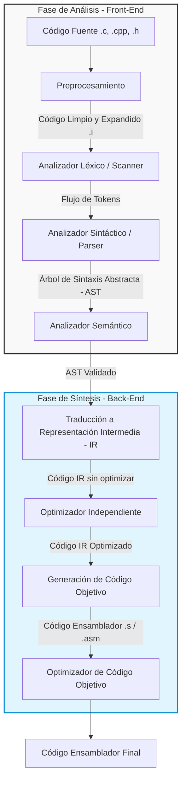
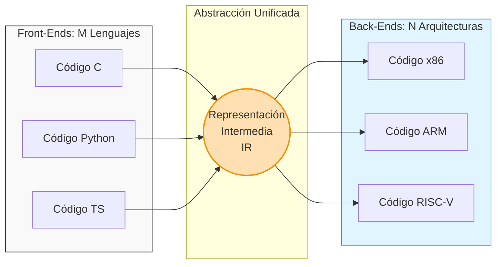
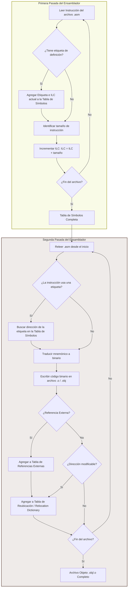
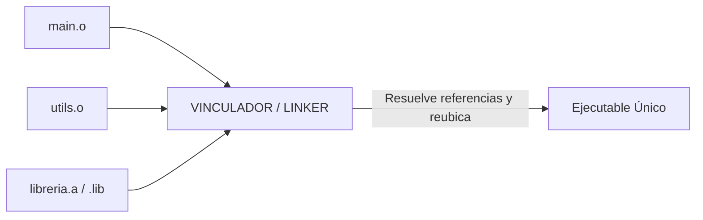
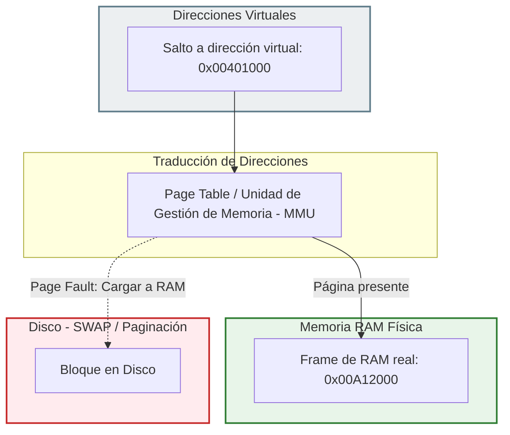

# Guía de Estudio Definitiva: El Camino del Código al Proceso en Ejecución

## Introducción: El Viaje del Código Fuente al Silicio

Cuando escribís una línea de código en un lenguaje de alto nivel como C o C++, estás interactuando con una abstracción diseñada para la mente humana. Sin embargo, el procesador real de tu computadora es un dispositivo que solo entiende señales binarias específicas de una arquitectura de hardware (como x86 o ARM).

Para acortar esta brecha, el sistema operativo y el conjunto de herramientas de desarrollo (*toolchain*) realizan una serie de transformaciones sucesivas. Este documento técnico detalla cada una de estas etapas, estructurado para servir como material de estudio riguroso.

## Parte I: El Proceso de Compilación (Análisis y Síntesis)

La compilación no es una traducción palabra por palabra. Es un proceso de comprensión del significado del código fuente para luego generar un código equivalente de bajo nivel. Tradicionalmente se divide en dos fases: **Análisis** (front-end, independiente de la máquina) y **Síntesis** (back-end, dependiente de la máquina).



### 1. Preprocesamiento (cpp)

El preprocesador prepara el terreno. No analiza la sintaxis del lenguaje; realiza manipulación de texto pura y dura bajo directivas específicas:

- **Inclusión de archivos (`#include`):** Reemplaza la línea del include con el contenido entero del archivo de cabecera (.h).
    
- **Expansión de macros (`#define`):** Reemplaza sistemáticamente los identificadores definidos por sus valores o bloques de texto asociados.
    
- **Eliminación de comentarios:** Remueve todas las aclaraciones del programador (`//` o `/* */`) para dejar un archivo exclusivamente con código ejecutable.
    
- **Resultado:** Un archivo de código fuente "limpio" y expandido (usualmente con extensión `.i` o `.ii`).
    

### 2. Subetapas de la Compilación propiamente dicha

#### A. Analizador Léxico (Scanner)

El Scanner lee el archivo expandido carácter por carácter y los agrupa en unidades lógicas con significado llamadas **Tokens** (palabras clave, identificadores, operadores, números, constantes).

- *Ejemplo:* La cadena `if (x >= 10)` se convierte en los tokens: `[KEYWORD: if]`, `[PUNCTUATION: (]`, `[IDENTIFIER: x]`, `[OPERATOR: >=]`, `[NUMBER: 10]`, `[PUNCTUATION: )]`.
    
- *Detección de errores:* Es el encargado de detectar caracteres inválidos (como un símbolo extraño fuera de un string) o cadenas de texto mal cerradas.

#### B. Analizador Sintáctico (Parser)

El Parser toma el flujo de tokens provisto por el Scanner y verifica si respetan las reglas gramaticales del lenguaje de programación. Para esto, construye una estructura de datos jerárquica llamada **Árbol de Sintaxis Abstracta (AST)**.

- *Detección de errores:* Encuentra paréntesis desbalanceados, falta de puntos y comas, o estructuras mal formadas como `if x >= 10 )`.

#### C. Analizador Semántico

El analizador semántico examina el AST para asegurar que el programa tenga coherencia lógica, más allá de estar bien escrito sintácticamente. Su tarea principal es el **chequeo de tipos** (*type checking*) y la resolución de nombres.

- *Verificaciones típicas:* Asegurar que una variable se use solo si fue declarada previamente, validar que no se intente sumar un puntero con un tipo incompatible, o verificar que las funciones reciban la cantidad y tipo correcto de argumentos.
    
- *Detección de errores:* Discrepancias de tipos de datos, variables no definidas, redeclaración de variables en el mismo ámbito.

## Parte II: Representación Intermedia (IR) y Optimización

### 1. Lenguaje de Representación Intermedia (IR)

Una vez validado el AST, el compilador traduce el árbol a un lenguaje abstracto intermedio. Este lenguaje no pertenece a la máquina física (no es x86 ni ARM) pero tampoco es de alto nivel.

- **¿Por qué es crucial?** Si quisiéramos diseñar compiladores para $M$ lenguajes de alto nivel dirigidos a $N$ arquitecturas de hardware diferentes sin una IR, necesitaríamos escribir $M \times N$ compiladores individuales. Al usar una Representación Intermedia, solo necesitamos $M$ front-ends (que traducen de alto nivel a IR) y $N$ back-ends (que traducen de IR al hardware específico).
    



### 2. El Optimizador Independiente del Target

Esta etapa analiza el código en su formato IR para hacerlo más eficiente en velocidad de ejecución y tamaño, sin alterar el comportamiento semántico original del programa. Como trabaja sobre la IR, estas mejoras benefician a cualquier procesador de destino.

#### Estrategias Comunes de Optimización Independiente:

- **Constant Folding (Plegado de Constantes):** Consiste en calcular operaciones con constantes en tiempo de compilación en lugar de generar instrucciones de ejecución para el procesador.
$$\text{Ejemplo: } \text{int } a = 30 * 2; \quad \rightarrow \quad \text{int } a = 60;$$
- **Simplificación Algebraica:** Reemplaza expresiones matemáticamente equivalentes pero computacionalmente costosas por otras más simples.
$$\text{Ejemplos: } x + 0 \rightarrow x \quad \text{o} \quad x * 2 \rightarrow x \ll 1 \quad (\text{shift a la izquierda})$$
- **Eliminación de código inalcanzable o muerto:** Remueve porciones de código que nunca se van a ejecutar (por ejemplo, bloques dentro de un `if (false)`) o variables asignadas que nunca se vuelven a leer.
    
- **Recursión de cola a iteración (Tail Recursion Elimination):** Transforma una función recursiva pura en un bucle iterativo, evitando el costo de crear nuevos *stack frames* en cada llamada y previniendo un potencial *Stack Overflow*.

### 3. Generación y Mejora de Código Objetivo

El generador toma la IR optimizada y la traduce a código ensamblador real (archivos `.s` o `.asm`) para la arquitectura física seleccionada (x86, ARM, etc.). En esta etapa se realizan optimizaciones altamente dependientes de la arquitectura física:

- **Asignación de Registros:** Los registros de la CPU son extremadamente rápidos pero escasos. El compilador debe resolver qué variables se guardan en registros y cuáles deben "derramarse" (*spilling*) a la memoria RAM, minimizando el acceso a memoria.
    
- **Selección de Instrucciones:** Aprovecha instrucciones específicas y complejas que provee el procesador para realizar tareas comunes en menos ciclos de reloj.
    
- **Uso de modos de direccionamiento óptimos:** Emplea los modos de direccionamiento nativos de la CPU para agilizar el cálculo de índices y punteros de memoria.
    
- **Aprovechamiento de caché y Pipeline:** Ordena las instrucciones binarias generadas de tal manera que se reduzcan los riesgos (*hazards*) en el pipeline del procesador y se maximice la localidad de los datos en la memoria caché.
    

## Parte III: Ensamblado y el Problema de las Referencias

El ensamblador toma el código en lenguaje ensamblador (`.s` o `.asm`) y lo traduce a código binario de máquina, generando un **archivo objeto** (`.o` o `.obj`). Sin embargo, el ensamblador se topa con un problema de diseño clásico: las referencias hacia adelante (*forward references*).



### 1. El Problema de la "Forward Reference"

Ocurre cuando una instrucción del programa hace referencia a una etiqueta que se define más adelante en el archivo de texto.

```
JMP destino    ; ¿Adónde salto? El ensamblador aún no leyó la etiqueta 'destino'
ADD EAX, EBX

destino:
	SUB EAX, ECX
```

Para resolver esto de manera elegante, los ensambladores implementan un esquema de **dos pasadas**.

### 2. Mecánica del Ensamblador de Dos Pasadas

#### Primera Pasada: Construcción de la Tabla de Símbolos

El objetivo único de la primera pasada es descubrir la ubicación de todas las etiquetas del programa.

- **ILC (Instruction Length Counter):** Es un registro de control interno del ensamblador que actúa como un puntero de posición relativa. Comienza en $0$.
    
- A medida que el ensamblador lee cada línea de código, calcula cuántos bytes ocupará esa instrucción en memoria y avanza el ILC según esa longitud:
$$\text{ILC}_{\text{nuevo}} = \text{ILC}_{\text{actual}} + \text{Longitud de la Instrucción}$$
- Si encuentra la definición de una etiqueta, crea una entrada en la **Tabla de Símbolos** asociando el nombre de la etiqueta con el valor actual del ILC.
    
- *Nota:* Al terminar esta pasada, el ensamblador ya conoce las direcciones relativas de todas las etiquetas internas del archivo, resolviendo por completo las referencias hacia adelante.
    

#### Segunda Pasada: Generación de Código de Máquina

Con la Tabla de Símbolos completa, el ensamblador vuelve a leer el archivo desde el principio para realizar la traducción final:

- Traduce cada mnemónico (como `MOV` o `ADD`) a su representación binaria (Opcode).
    
- Cuando encuentra una instrucción que usa una etiqueta (por ejemplo, `JMP destino`), busca el nombre "destino" en la Tabla de Símbolos y reemplaza la referencia simbólica por la dirección binaria calculada en la primera pasada.
    
- **Generación de tablas auxiliares:** Si el código fuente hace referencia a símbolos externos (funciones declaradas en otras librerías), el ensamblador no puede resolver sus direcciones. En su lugar, los etiqueta como "externos" y genera metadatos específicos dentro del archivo objeto.
    

### 3. Estructura Interna de un Archivo Objeto (`.o`, `.obj`)

Un archivo objeto no es un binario ejecutable plano; es un archivo estructurado (por ejemplo, en formato **ELF** en Unix/Linux o **PE** en Windows) que contiene secciones bien delimitadas:

```
+-------------------------------------------------------------+
| Identificación (Header del archivo)                         |
+-------------------------------------------------------------+
| Instrucciones de máquina (Sección .text)                    |
+-------------------------------------------------------------+
| Constantes y datos inicializados (Sección .data)            |
+-------------------------------------------------------------+
| Tabla de Reubicación (Relocation Dictionary)                |
| -> Lista de direcciones que el Linker debe ajustar.         |
+-------------------------------------------------------------+
| Tabla de Referencias Externas (External Reference Table)    |
| -> Lista de símbolos usados que no están definidos aquí.    |
+-------------------------------------------------------------+
| Tabla de Puntos de Entrada (Entry Point Table)              |
| -> Lista de símbolos definidos aquí que exportamos a otros. |
+-------------------------------------------------------------+
```

## Parte IV: Vinculación (Linking) y Carga (Loading)

### 1. El Vinculador (Linker)

El proceso de compilación genera un archivo objeto independiente por cada módulo de código fuente. La tarea del vinculador es unificar todos estos archivos objeto independientes junto con las bibliotecas del sistema para generar un archivo ejecutable único.



#### Tareas Fundamentales del Linker:

1. **Resolución de Referencias Externas:** El Linker busca cada símbolo declarado en la *Tabla de Referencias Externas* de un módulo y lo aparea con su definición correspondiente en la *Tabla de Puntos de Entrada* de otro archivo objeto o de una librería estática. Si no encuentra la definición para una referencia externa, el proceso falla arrojando un error de vinculación (como el famoso `undefined reference to '…'`).
    
2. **Reubicación de Direcciones:** Cada archivo objeto se generó asumiendo de manera optimista que su código comenzaba en la dirección de memoria relativa $0$. Al unir múltiples archivos, el Linker debe concatenar las secciones de código (`.text`) y datos (`.data`) en bloques contiguos globales. Utilizando la **Tabla de Reubicación**, recalcula y corrige todas las direcciones internas de salto y acceso a datos para que apunten a los nuevos desplazamientos globales coherentes.
    

#### Vinculación Estática vs. Dinámica

- **Vinculación Estática (.lib, .a):** El Linker copia físicamente el código de las funciones utilizadas de las librerías dentro del archivo ejecutable final.
    
    - *Ventaja:* El ejecutable es totalmente autónomo y no depende de la presencia de archivos externos en el sistema operativo del usuario.
        
    - *Desventaja:* Genera archivos ejecutables muy pesados. Además, si múltiples programas en ejecución usan la misma librería, cada uno tendrá una copia idéntica cargada en la RAM de forma redundante.
        
- **Vinculación Dinámica (DLL en Windows, .so en Unix/Linux):** En lugar de copiar el código de la librería al ejecutable, el Linker solo guarda una referencia o "promesa" indicando qué archivo externo se necesita y qué funciones se van a invocar de él. La vinculación real se posterga.
    
    - *Implementaciones de Carga en Vinculación Dinámica:*
        
        1. **Precarga:** El sistema operativo busca y carga en memoria todas las librerías dinámicas requeridas por el ejecutable en el momento exacto en que se inicia el programa.
            
        2. **A demanda (Lazy Loading):** Las librerías dinámicas solo se cargan en la RAM en el momento preciso en que el flujo de ejecución del programa invoca por primera vez a una de sus funciones.
            
    - *Ventaja:* Ahorro masivo de espacio en disco y memoria RAM (múltiples procesos activos en el sistema operativo pueden compartir una única copia física de la librería cargada en memoria). Facilidad de actualización: si se arregla un bug en la DLL, todos los programas se benefician sin necesidad de ser recompilados.
        
    - *Desventaja:* El inicio del programa puede ser más lento. Introduce dependencias externas complejas (problema conocido históricamente como el *DLL Hell*).
        

### 2. El Cargador (Loader) y Ejecución

El Cargador es un componente fundamental del sistema operativo encargado de preparar un programa ejecutable para su ejecución real en la CPU.

#### Pasos que realiza el Loader:

1. **Lectura e Interpretación:** Lee la cabecera del archivo ejecutable para comprender la disposición de sus secciones (`.text`, `.data`), tamaño requerido y el punto de entrada.
    
2. **Asignación de Memoria:** Solicita espacio de memoria al sistema operativo para albergar el código y los datos.
    
3. **Copia a la RAM:** Copia las instrucciones de máquina y las constantes del archivo ejecutable a las direcciones de memoria física asignadas.
    
4. **Transferencia de Control:** Modifica el Program Counter (PC/IP) de la CPU para que apunte a la dirección del punto de entrada (*Entry Point*) del programa, cediéndole el control para iniciar la ejecución.
    

#### El Rol de la Memoria Virtual y la Paginación

¿Qué sucede si nos quedamos sin memoria RAM física suficiente para cargar el programa completo? ¿El Loader debe reubicar dinámicamente las direcciones de salto del programa al mover bloques entre el disco y la RAM?



- **La Abstracción de la Memoria Virtual:** Los sistemas operativos modernos implementan memoria virtual basada en **Paginación**.
    
- El programa en ejecución interactúa exclusivamente con **direcciones virtuales**. Estas direcciones virtuales se mantienen completamente estables y constantes a lo largo de toda la vida del proceso, sin importar en qué lugar de la memoria RAM física se encuentren alojadas sus instrucciones en un momento determinado.
    
- **Traducción en Hardware:** La Unidad de Gestión de Memoria de la CPU (MMU) y la **Page Table** controlada por el sistema operativo traducen de forma dinámica y transparente cada dirección virtual a una dirección física real en tiempo de ejecución.
    
- **Consecuencia para el Cargador:** Gracias a esta abstracción, el Cargador **no necesita modificar el código ni recalcular direcciones** si partes del programa son trasladadas al disco de almacenamiento por falta de memoria RAM física. Las direcciones relativas internas no cambian.
    

## Parte V: Clasificación Exhaustiva de Errores por Etapa

Uno de los tópicos más importantes en exámenes teóricos es identificar con precisión matemática qué etapa del proceso de desarrollo es responsable de detectar un determinado tipo de error. La siguiente tabla sintetiza este comportamiento:

|Etapa del Proceso|Momento / Pasada|Tipo de Errores que Detecta|Ejemplos Prácticos de Errores|
|---|---|---|---|
|**Léxico (Scanner)**|Compilación|Caracteres inválidos, tokens mal formados, constantes numéricas con formato fuera de norma, strings literales sin cerrar.|`int $var = 10;`<br><br>`string s = "Hola;` (sin comilla final)|
|**Sintáctico (Parser)**|Compilación|Violaciones de las reglas gramaticales del lenguaje de programación, estructuras incompletas o desbalanceadas.|`if (x > 5`<br><br>`for (int i=0; i<10 i++)`<br><br>`x = + * 5;`|
|**Semántico**|Compilación|Incoherencias lógicas, discrepancias y violaciones del sistema de tipos de datos, uso de entidades no declaradas.|`int a = "hola";`<br><br>`funcionNoDefinida();`<br><br>`int x = y + 1;` (siendo `y` no declarada)|
|**Ensamblado**|Primera Pasada|Ninguno (En esta pasada solo se resuelven las etiquetas y referencias hacia adelante).|Las *forward references* no generan error, se resuelven aquí de manera natural.|
|**Ensamblado**|Segunda Pasada|Símbolos duplicados localmente, sintaxis de mnemónicos inválida, operandos incorrectos para una instrucción, falta de directiva de fin de archivo.|`MOV EAX, 1, 2`<br><br>`miEtiqueta:`<br><br>`miEtiqueta:` (etiqueta duplicada en el mismo archivo)<br><br>`Opcode inválido`|
|**Vinculación (Linker)**|Post-Compilación|Referencias externas imposibles de resolver (funciones o variables globales no encontradas), solapamiento de segmentos o colisiones de nombres globales duplicados.|`undefined reference to 'main'`<br><br>`multiple definition of 'miFuncionGlobal'`|
|**Carga (Loader)**|Ejecución|Recursos de hardware o del sistema insuficientes, archivo ejecutable con formato corrupto o incompatible con el sistema operativo actual.|`Memoria insuficiente para inicializar el proceso`<br><br>`Ejecutable corrupto (formato ELF/PE dañado)`|

## Parte VI: Resumen Conceptual del Ciclo de Vida

Para consolidar tu aprendizaje, repasemos la secuencia temporal de transformación de un programa de manera directa:

1. **Fase de Texto:** Escribís código fuente inteligible para humanos. El **preprocesador** limpia comentarios y expande macros. El **compilador** analiza la estructura lógica, la optimiza y la convierte en código mnemónico ensamblador para una CPU de destino concreta.
    
2. **Fase de Objeto Local:** El **ensamblador** analiza en dos pasadas el código ensamblador, calcula los desplazamientos usando el **ILC**, asocia direcciones a las etiquetas en la **Tabla de Símbolos**, y genera código binario nativo pero incompleto (un archivo `.o`/`.obj` que aún no sabe dónde vivirá en memoria ni dónde están las librerías externas).
    
3. **Fase de Ejecutable Contiguo:** El **vinculador (linker)** fusiona los objetos locales, resuelve sus dependencias externas, corrige las direcciones usando la **Tabla de Reubicación** y entrega un archivo ejecutable plano y coherente.
    
4. **Fase de Proceso en Memoria:** El **cargador (loader)** coloca las secciones en memoria física o virtual, la MMU asocia las direcciones virtuales estables del programa a la RAM real, y la CPU comienza a ejecutar las instrucciones de máquina, convirtiendo finalmente el código fuente original en un proceso dinámico activo.