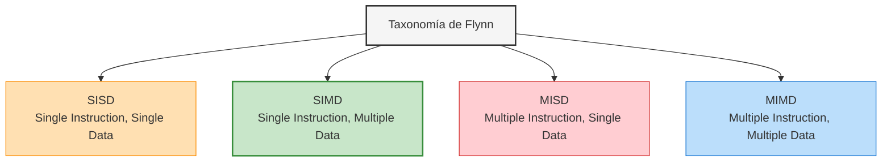

# Guía de Estudio: Computación Paralela SIMD (MMX y SSE)

*Materia: Organización del Computador II*

## 1. Introducción a la Computación Paralela: Taxonomía de Flynn

Para entender por qué surgieron tecnologías como MMX y SSE, primero tenés que pararte sobre la **Taxonomía de Flynn** ($1972$), que clasifica los sistemas de computación según cómo interactúan sus flujos de instrucciones y sus flujos de datos.



- **SISD (Single Instruction, Single Data):** Es la arquitectura Von Neumann tradicional. Un único procesador ejecuta secuencialmente un único flujo de instrucciones sobre un único flujo de datos (un dato por ciclo de reloj). Aunque use *pipelining* o segmentación, sigue siendo secuencial en su lógica de datos.
    
- **MISD (Multiple Instruction, Single Data):** Múltiples instrucciones operan sobre un único flujo de datos de forma simultánea. Es una arquitectura muy poco común en la práctica, reservada casi exclusivamente para sistemas con paralelismo redundante tolerante a fallas (como la navegación aeroespacial o sistemas militares de alta seguridad).
    
- **SIMD (Single Instruction, Multiple Data):** **Este es nuestro foco.** Una única instrucción de máquina controla la ejecución simultánea de una misma operación matemática sobre múltiples elementos de datos independientes (vectores o arreglos). Es sumamente eficiente para procesamiento de imágenes, audio, video y videojuegos.
    
- **MIMD (Multiple Instruction, Multiple Data):** Múltiples procesadores o núcleos autónomos ejecutan diferentes flujos de instrucciones sobre diferentes flujos de datos de manera completamente independiente. Es el modelo de los procesadores multinúcleo (*multicore*) actuales de propósito general.
    

## 2. La Tecnología MMX: SIMD de 64 bits

Introducida por Intel en $1996$ (con los procesadores Pentium MMX), esta tecnología fue diseñada específicamente para acelerar aplicaciones multimedia y de comunicaciones.

### A. El Registro "Aliasing": El Truco y su Costo Arquitectónico

Uno de los aspectos más preguntados en los exámenes de Organización del Computador II es cómo se manejan físicamente los registros MMX.

- **El Problema:** Agregar registros físicos nuevos a una arquitectura de CPU implica un cambio drástico en el "Estado del Procesador". Esto obligaba a modificar los sistemas operativos existentes para que pudieran salvar y restaurar estos nuevos registros durante un cambio de contexto (guardando el estado del proceso en memoria).
    
- **La Solución (Aliasing):** Intel decidió mapear los $8$ **registros MMX (denominados `MM0` a `MM7`, de** $64$ **bits cada uno)** directamente sobre los registros de mantisa de la pila de punto flotante **x87 FPU (`ST0` a `ST7`, que son de** $80$ **bits)**.
    

```
Pila FPU x87 (80 bits)        Registros MMX (64 bits)
+------------------------+    +-----------------------+
| ST0 (Mantisa 80 bits)  |<==>| MM0 (64 bits bajos)   |
+------------------------+    +-----------------------+
| ST1 (Mantisa 80 bits)  |<==>| MM1 (64 bits bajos)   |
+------------------------+    +-----------------------+
| ...                    |    | ...                   |
+------------------------+    +-----------------------+
| ST7 (Mantisa 80 bits)  |<==>| MM7 (64 bits bajos)   |
+------------------------+    +-----------------------+
```

- **La Consecuencia Crítica:** Como comparten el mismo hardware físico, **no podés mezclar libremente operaciones matemáticas de punto flotante tradicionales (FPU) con instrucciones MMX**. Si lo hacés, pisás los datos de manera catastrófica.
    
- **La Directiva `EMMS` (Empty MMX State):** Para solucionar esto, cada vez que terminás de ejecutar código MMX y querés volver a usar la FPU, tenés que llamar de forma obligatoria a la instrucción `EMMS`. Esta instrucción limpia y restablece el *FPU Tag Word* (indicando que los registros de la FPU ahora están libres/vacíos). Si te olvidás de usar `EMMS`, la FPU va a asumir que la pila está llena, generando excepciones catastróficas o resultados de punto flotante corruptos (`NaN`).
    

### B. Tipos de Datos Empaquetados (Packed Data)

Un único registro MMX de $64$ bits no almacena necesariamente un número de $64$ bits. Su poder radica en que puede subdividirse para empaquetar varios datos más chicos:

- **Packed Byte:** $8$ enteros de $8$ bits cada uno de forma contigua.
    
- **Packed Word:** $4$ enteros de $16$ bits cada uno.
    
- **Packed Doubleword:** $2$ enteros de $32$ bits cada uno.
    
- **Packed Quadword:** $1$ entero de $64$ bits.
    

## 3. Aritmética de Saturación vs. Wraparound

Cuando operás con datos multimedia (como píxeles donde un color va de $0$ a $255$), un desborde aritmético tradicional puede arruinar por completo el procesamiento visual.


### A. Wraparound (Aritmética Modular Tradicional)

Es la suma normal de computadoras. Si superás el valor máximo representable para el tipo de datos, los bits de desborde simplemente se descartan, provocando que el valor "dé la vuelta" (aritmética modular).

- **Fórmula matemática:**
$$(A + B) \pmod{2^N}$$
- **Ejemplo en unsigned de 8 bits (máximo 255):**
$$250 + 10 = 260 \rightarrow 260 \pmod{256} = 4$$
- **Efecto visual:** Si estabas sumando brillo a una imagen y un píxel casi blanco ($250$) recibe un incremento mínimo ($+10$), se convierte instantáneamente en un píxel negro ($4$), generando un ruido visual inaceptable (efecto de "sal y pimienta").

### B. Aritmética de Saturación

Si el resultado de una operación supera el límite físico del tipo de datos (hacia arriba o hacia abajo), el valor **se clampa** (se clava) en el valor límite absoluto (máximo o mínimo representable).

- **Fórmula para saturación superior (Unsigned):**
$$A + B = \min(A + B, \text{Max})$$
- **Fórmula para saturación inferior (Signed):**
$$A - B = \max(A - B, \text{Min})$$
- **Ejemplo en unsigned de 8 bits (máximo 255):**
$$250 + 10 = 260 \rightarrow \text{Clampeado} \rightarrow 255$$
- **Efecto visual:** El píxel brilla al máximo posible (blanco puro), lo cual mantiene la coherencia visual y evita distorsiones abruptas en imágenes y señales de audio.

## 4. Clasificación de Instrucciones MMX

El juego de instrucciones MMX se identifica típicamente porque sus mnemónicos comienzan con la letra **`P`** (de *Packed*). Se dividen según el tipo de desborde que manejan:

1. **Aritméticas:**
    
    - *Saturadas signadas:* `PADDSB` (Packed Add Signed Byte), `PADDSW` (Packed Add Signed Word).
        
    - *Saturadas sin signo (Unsigned):* `PADDUSB`, `PADDUSW`.
        
    - *Wraparound (Sin saturación):* `PADDB`, `PADDW`, `PADDD` (operan con aritmética modular tradicional).
        
    - *Multiplicación:* `PMULL` (guarda la mitad baja del resultado), `PMULH` (guarda la mitad alta), y la potente `PMADDWD` (multiplica hilos de palabras y luego los suma de a pares en un entero de 32 bits, ideal para calcular productos internos de vectores).
        
2. **Comparación:** No devuelven un registro de banderas (EFLAGS) como las instrucciones clásicas de CPU. En su lugar, **generan una máscara de bits**.
    
    - `PCMPEQB` (Packed Compare for Equal Byte): Si los elementos correspondientes son iguales, llena ese bloque con unos binarios (`0xFF`); si no, lo llena con ceros (`0x00`).
        
    - Esta máscara es ideal para realizar selecciones condicionales vectorizadas sin usar instrucciones de salto condicional (las cuales arruinarían la predicción de saltos en el *pipeline*).
        
3. **Conversión y Pack/Unpack:** Permiten intercalar y cambiar el tamaño de los datos.
    
    - `PACKSSWB` (Pack Signed Word to Signed Byte): Toma palabras de 16 bits y las reduce saturando a bytes de 8 bits.
        
    - `PUNPCKHBW` (Unpack High Bytes): Intercala los bytes de la mitad superior de dos registros MMX.
        

## 5. SSE (Streaming SIMD Extensions): SIMD de 128 bits

Introducido con el procesador Pentium III en $1999$, SSE resolvió de raíz el problema del aliasing y el desborde físico de la arquitectura MMX.

### A. Nuevos Registros XMM y el Registro MXCSR

A diferencia de MMX, SSE no comparte recursos físicos con la FPU. Cuenta con su propio estado de CPU:

- **Registros XMM:** Se introducen $8$ **registros dedicados de** $128$ **bits** (nombrados de `XMM0` a `XMM7`). En la arquitectura x86-64 (modo de 64 bits de procesadores modernos), este conjunto se extiende a $16$ registros (`XMM0` a `XMM15`).
    
- **Registro MXCSR (**$32$ **bits):** Es el registro de estado y control para las operaciones SSE. Permite configurar:
    
    - **Modos de Redondeo:** Hacia el entero más cercano, hacia el infinito positivo, hacia el infinito negativo, o por truncamiento.
        
    - **Flush-to-Zero (FTZ):** Si un cálculo de punto flotante da un número extremadamente chico imposible de representar de forma normal (un número *subnormal* o *denormal*), se redondea a un cero absoluto de forma rápida para evitar penalizaciones térmicas y de rendimiento en la CPU.
        
    - **Denormals-Are-Zeros (DAZ):** Trata los operandos denormales de entrada directamente como ceros.
        
    - **Flags de Excepción:** Registra desbordes de punto flotante (*Overflow*, *Underflow*, división por cero, operaciones inválidas).
        

### B. Procesamiento Escalar vs. Procesamiento Empaquetado (Packed)

Las instrucciones de punto flotante de SSE operan bajo dos filosofías conceptuales de ejecución que tenés que saber distinguir perfectamente para programar en assembler de 64 bits:

```
PROCESAMIENTO PACKED (SIMD completo)
Registro XMM1 (128 bits):  [  Float 3  ] [  Float 2  ] [  Float 1  ] [  Float 0  ]
                                +             +             +             +
Registro XMM2 (128 bits):  [  Float B3 ] [  Float B2 ] [  Float B1 ] [  Float B0 ]
                                =             =             =             =
Resultado Packed:          [  3 + B3   ] [  2 + B2   ] [  1 + B1   ] [  0 + B0   ]


PROCESAMIENTO ESCALAR (Solo el elemento de menor peso)
Registro XMM1 (128 bits):  [  Float 3  ] [  Float 2  ] [  Float 1  ] [  Float 0  ]
                                                                          +
Registro XMM2 (128 bits):  [  Float B3 ] [  Float B2 ] [  Float B1 ] [  Float B0 ]
                                                                          =
Resultado Escalar:         [  Float 3  ] [  Float 2  ] [  Float 1  ] [  0 + B0   ]
```

- **Procesamiento Empaquetado (Packed):** La operación se aplica simultáneamente sobre cada uno de los elementos individuales dentro del vector de $128$ bits.
    
    - *Sufijo en ensamblador:* **`PS`** (Packed Single Precision - $4$ valores float de $32$ bits) o **`PD`** (Packed Double Precision - $2$ valores double de $64$ bits).
        
    - *Ejemplo:* `ADDPS` realiza cuatro sumas flotantes al mismo tiempo en un único ciclo de CPU.
        
- **Procesamiento Escalar:** La operación se ejecuta **únicamente sobre el elemento de menor peso** (los 32 o 64 bits menos significativos del registro). El resto de los elementos superiores del registro se mantienen intactos.
    
    - *Sufijo en ensamblador:* **`SS`** (Scalar Single Precision) o **`SD`** (Scalar Double Precision).
        
    - *Ejemplo:* `ADDSS` realiza una única suma flotante clásica de precisión simple entre los valores alojados en el fondo de ambos registros.
        

## 6. Evolución de las Extensiones Vectoriales

SSE no se quedó estático; a lo largo de las distintas generaciones de CPUs se fue ampliando su juego de instrucciones y capacidades:

- **SSE (1999):** Introdujo los registros XMM y operaciones vectoriales de $4$-vías para números decimales de precisión simple (`float`).
    
- **SSE2 (2000):** Agregó soporte para punto flotante de doble precisión (`double`, procesados de a $2$ elementos por registro) y extendió todas las operaciones de enteros de MMX de $64$ bits para que puedan correr de forma nativa dentro de los registros XMM de $128$ bits (eliminando para siempre el uso engorroso de los registros MMX y la llamada a `EMMS`).
    
- **SSE3 y SSSE3 (2004-2006):** Agregaron instrucciones para operaciones horizontales (por ejemplo, sumar todos los elementos dentro de un mismo registro de forma consecutiva) e instrucciones de manipulación de strings y alineación de datos.
    
- **SSE4.1 y SSE4.2 (2007-2008):** Incorporaron operaciones de producto punto vectorial directo, búsquedas avanzadas en strings, cálculo rápido de CRC32 e instrucciones de comparación adicionales.
    
- **AVX (Advanced Vector Extensions - 2011):** Duplicó el tamaño de los registros físicos a $256$ **bits** (llamados registros **`YMM0` a `YMM15`**). Esto permite procesar hasta $8$ flotantes de precisión simple o $4$ flotantes de precisión doble de una sola vez. También introdujo un formato de instrucción de $3$ operandos (`VADDPS dest, src1, src2`) que evita la necesidad de destruir destructivamente uno de los operandos de entrada.
    

## 7. Tabla Comparativa de Tecnologías SIMD

|Característica|MMX (SIMD 64 bits)|SSE / SSE2 (SIMD 128 bits)|AVX (SIMD 256 bits)|
|---|---|---|---|
|**Tamaño de Registro**|$64$ bits|$128$ bits|$256$ bits (YMM)|
|**Registros Físicos**|`MM0` a `MM7` (Compartidos con FPU)|`XMM0` a `XMM7` (o `XMM15` en 64 bits)|`YMM0` a `YMM15`|
|**Compartido con FPU**|**Sí** (Requiere uso obligatorio de `EMMS`)|**No** (Registros independientes de hardware)|**No** (Registros independientes)|
|**Tipos de Datos**|Enteros empaquetados (8, 16, 32 o 64 bits)|Enteros empaquetados, `float` (SSE) y `double` (SSE2)|Enteros empaquetados y punto flotante (SP/DP) ampliado|
|**Ancho de Operación**|$8 \times \text{Bytes}$, $4 \times \text{Words}$, $2 \times \text{DWords}$|$16 \times \text{Bytes}$, $4 \times \text{Floats}$, $2 \times \text{Doubles}$|$32 \times \text{Bytes}$, $8 \times \text{Floats}$, $4 \times \text{Doubles}$|
|**Esquema Aritmético**|Wraparound y Saturación (Signed/Unsigned)|Wraparound, Saturación y Control de Redondeo FPU|Aritmética vectorial y soporte de 3 operandos sin destrucción|
|**Sufijo Típico**|Comienza con `P` (`PADDB`, `PMULL`)|Suffix `PS`, `PD`, `SS`, `SD` (`ADDPS`, `ADDSS`)|Comienza con `V` (`VADDPS`, `VMOVAPS`)|