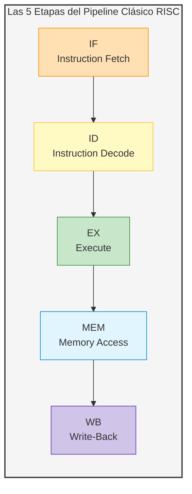
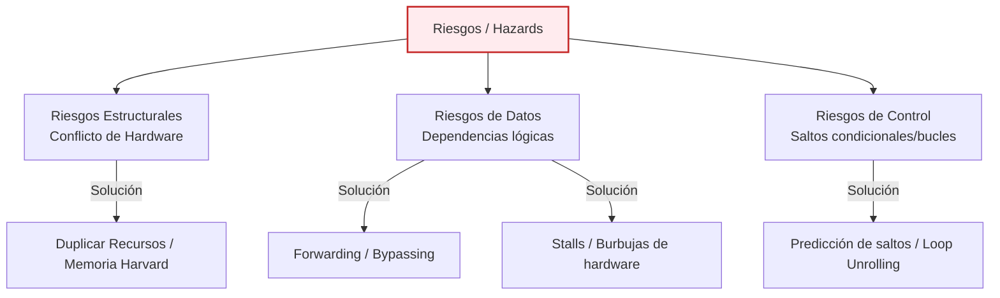
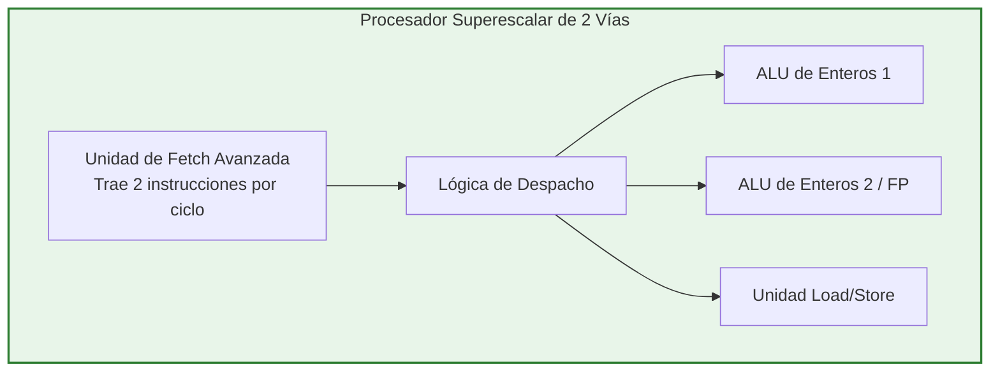
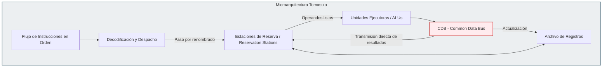
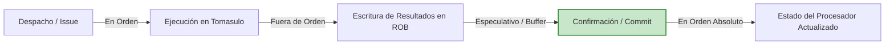

# Guía de Estudio: Microarquitectura de Procesadores (Pipeline Escalar y Superescalar RISC)

*Materia: Organización del Computador II*

## 1. El Pipeline Escalar RISC: La Línea de Montaje

La idea fundamental detrás del **Pipeline (segmentación)** es importar el concepto de una línea de montaje industrial al diseño del procesador. En lugar de tener un único circuito analógico masivo que ejecute una instrucción completa de principio a fin de manera secuencial, el procesador se segmenta en múltiples unidades funcionales con tareas específicas y simplificadas.



### A. Las 5 Etapas del Ciclo de Instrucción

1. **IF (Instruction Fetch):** Se busca la instrucción apuntada por el Program Counter (PC) en la memoria de instrucciones y se almacena en el registro de instrucción. Al mismo tiempo, se incrementa el PC para apuntar a la siguiente dirección.
    
2. **ID (Instruction Decode):** Se decodifica la instrucción binaria para entender qué operación realizar. Se leen los operandos desde el archivo de registros de la CPU.
    
3. **EX (Execute):** La Unidad Aritmético Lógica (ALU) realiza la operación aritmética, lógica, el cálculo de direcciones efectivas para accesos a memoria o el cálculo del destino de un salto.
    
4. **MEM (Memory Access):** Si la instrucción es de acceso a memoria (`LOAD` o `STORE`), se realiza la lectura o escritura correspondiente en la memoria de datos. Si no, esta etapa queda inactiva.
    
5. **WB (Write-Back):** El resultado de la operación (venga de la ALU o de la memoria de datos) se escribe físicamente en el registro de destino dentro del archivo de registros.
    

### B. Latencia vs. Throughput (Rendimiento)

Pensá esto con cuidado, porque es un concepto teórico que suele evaluarse:

- **Latencia:** Es el tiempo que tarda una única instrucción individual en completar todas sus etapas de principio a fin. **El pipeline aumenta la latencia por instrucción** debido al overhead físico de los registros de segmentación colocados entre cada etapa.
    
- **Throughput (Rendimiento):** Es la cantidad de instrucciones completadas por unidad de tiempo. **El pipeline mejora drásticamente el throughput**. Una vez que el pipeline se llena, en condiciones ideales, se completa exactamente una instrucción en cada ciclo de reloj.
    

El tiempo de ejecución promedio por instrucción se modela teóricamente así:

$$\text{Tiempo por instrucción con pipeline} = \frac{\text{Tiempo sin pipeline}}{\text{Cantidad de etapas}}$$

## 2. La Ecuación de Rendimiento y los Riesgos (Hazards)

El rendimiento real de un procesador segmentado no alcanza el ideal debido a los **riesgos (hazards)**, que son situaciones físicas u lógicas que impiden que la siguiente instrucción se ejecute en el ciclo de reloj previsto, forzando la inserción de burbujas de espera (*stalls*).

La ecuación fundamental del rendimiento del procesador se define como:

$$CPI_{\text{real}} = CPI_{\text{ideal}} + Stalls_{\text{estructurales}} + Stalls_{\text{datos}} + Stalls_{\text{control}}$$

En un pipeline escalar clásico, el $CPI_{\text{ideal}} = 1$. El objetivo de la microarquitectura es reducir el término de los *stalls* a su mínima expresión.



## 3. Clasificación de Riesgos y sus Soluciones

### A. Riesgos Estructurales

Ocurren cuando dos instrucciones que están en diferentes etapas del pipeline intentan utilizar el mismo recurso físico al mismo tiempo.

- *Ejemplo clásico:* Si el procesador tuviera una única memoria unificada para instrucciones y datos, la etapa **IF** de la instrucción $N+3$ intentará leer de la memoria al mismo tiempo que la etapa **MEM** de la instrucción $N$ intenta leer o escribir un dato.
    
- *Soluciones:*
    
    1. **Duplicar recursos:** Diseñar el procesador bajo la **Arquitectura Harvard**, la cual separa físicamente la memoria caché L1 en caché de instrucciones y caché de datos.
        
    2. **Puertos de lectura/escritura múltiples:** Diseñar el archivo de registros de forma tal que permita lecturas simultáneas (etapa ID) y escrituras simultáneas (etapa WB) sin conflictos.
        

### B. Riesgos de Datos

Se presentan cuando el flujo lógico del programa requiere que una instrucción acceda a un dato antes de que una instrucción previa termine de calcularlo y guardarlo. El caso más común en pipelines escalares es el **RAW (Read After Write)** o dependencia de datos verdadera.

```
Instrucción 1 (i):  ADD R1, R2, R3    ; R1 se escribe en la etapa WB (Ciclo 5)
Instrucción 2 (j):  SUB R4, R1, R5    ; R1 se lee en la etapa ID (Ciclo 3) -> ¡Peligro!
```

#### Soluciones para Riesgos de Datos:

1. **Stall (Burbuja de hardware):** La unidad de detección de riesgos frena la etapa de decodificación de la instrucción $j$ hasta que la instrucción $i$ complete su escritura, retrasando todo el pipeline.
    
2. **Forwarding (Bypassing / Cortocircuito):** Mirá la lógica física: el resultado de la ALU de la instrucción $i$ ya está disponible al finalizar su etapa **EX** (Ciclo 3). No hay necesidad real de esperar a que se escriba físicamente en el registro en el Ciclo 5. El hardware de *forwarding* conecta la salida del registro de la etapa EX/MEM (o MEM/WB) directamente a la entrada de la ALU de la etapa ID/EX en el ciclo siguiente, anulando el stall.
    

```
Instrucción i (ADD): [IF] -> [ID] -> [EX] --(Camino de Forwarding)---+
                                                                     |
Instrucción j (SUB):         [IF] -> [ID] ------------------------> [EX] (Toma el dato directo)
```

- *Limitación del Forwarding:* Si la instrucción anterior es un `LOAD` desde memoria (por ejemplo, `L.D R1, 0(R2)`), el dato recién estará disponible físicamente al finalizar la etapa **MEM**. Si la instrucción inmediatamente siguiente requiere ese registro, el procesador se ve obligado a insertar obligatoriamente **un ciclo de stall**, incluso utilizando forwarding.
    

### C. Riesgos de Control (Branch Hazards)

Ocurren cuando el procesador se topa con un salto condicional (`BNE`, `BEQ`, `JMP`). Hasta que la instrucción de salto no se decodifique y ejecute, el hardware de Fetch (IF) no sabe de qué dirección de memoria traer la siguiente instrucción.

#### Técnicas de Mitigación de Saltos:

- **Predicción Estática:** El procesador asume una política fija. Por ejemplo:
    
    - *Assume Not Taken (Asumir que no se toma):* Se sigue trayendo de memoria de forma secuencial. Si el salto finalmente se toma, se deben purgar (*flush*) las instrucciones cargadas incorrectamente del pipeline.
        
    - *Assume Taken (Asumir que se toma):* Se calcula el salto de inmediato y se trae la instrucción destino.
        
- **Predicción Dinámica:** El hardware utiliza tablas históricas (**Branch Target Buffer (BTB)** y predictores de 1 o 2 bits) en tiempo de ejecución para recordar si un salto en una dirección de memoria específica fue tomado o no en las últimas ejecuciones. Esto es sumamente eficiente en bucles (*loops*).
    

#### Solución por Software: Planificación Estática y Loop Unrolling

El compilador puede reordenar las instrucciones para evitar stalls o bien aplicar **Loop Unrolling (Desenrollado de Bucles)**:

- Consiste en replicar el cuerpo de un bucle para reducir la cantidad de evaluaciones de salto e incrementar la independencia de las instrucciones.
    
- *Ejemplo:*
    

```
// Código Original
for (int i = 1000; i > 0; i--) {
    a[i] = a[i] + 5;
}
```

Se puede desenrollar de a 4 iteraciones por ciclo. Al hacerlo, eliminamos el costo del salto en 3 de cada 4 iteraciones y permitimos que el compilador programe las instrucciones de manera que la latencia del `LOAD` se oculte ejecutando otras sumas independientes antes, maximizando el uso del pipeline.

## 4. El Salto a la Microarquitectura Superescalar

Un procesador escalar clásico tiene un límite físico insuperable: su $CPI$ ideal nunca puede ser menor a $1$. Para seguir escalando el rendimiento sin aumentar desmedidamente la frecuencia de reloj, nació el **diseño superescalar**.



- **Definición:** Un procesador superescalar cuenta con múltiples pipelines en paralelo y es capaz de buscar, decodificar, despachar y ejecutar múltiples instrucciones de forma simultánea en el mismo ciclo de reloj (por ejemplo, un procesador de 4 vías o *4-issue*).
    
- **El nuevo desafío:** Al procesar múltiples instrucciones en paralelo, las dependencias de datos se vuelven dramáticas. Dos instrucciones despachadas al mismo tiempo pueden chocar de formas que un pipeline escalar nunca vería.
    

## 5. Control Dinámico y Ejecución Fuera de Orden: Algoritmo de Tomasulo

En procesadores avanzados, el orden estático del compilador no es suficiente para evitar los stalls producidos por accesos lentos a memoria (como fallos en caché). Se necesita que el hardware tome el control de la planificación en tiempo de ejecución mediante la **Ejecución Fuera de Orden (Out-of-Order Execution - OoO)**.

### El Algoritmo de Tomasulo

Desarrollado por Robert Tomasulo para IBM, es el algoritmo por excelencia para realizar planificación dinámica en hardware. Permite que las instrucciones comiencen a ejecutarse apenas sus operandos estén listos, sin importar el orden original del programa escrito por el programador.



### A. Eliminación de Dependencias Falsas mediante Renombrado de Registros

En ejecuciones concurrentes y fuera de orden, aparecen dos tipos de riesgos de datos falsos causados por la escasez de nombres de registros lógicos en la arquitectura (antidependencias):

- **WAR (Write After Read):** La instrucción $j$ intenta escribir en un registro antes de que la instrucción anterior $i$ lo lea.
    
- **WAW (Write After Write):** La instrucción $j$ escribe en un registro antes de que la instrucción anterior $i$ escriba en él, dejando un resultado final inconsistente en el registro de la CPU.
    

**Tomasulo elimina por completo las dependencias WAR y WAW usando Renombrado de Registros.**

- El procesador mapea los registros lógicos (como `R1` o `F2`) a registros físicos internos temporales llamados **Estaciones de Reserva (Reservation Stations - RS)**.
    
- Cuando una instrucción se despacha, si su operando no está listo en el archivo de registros de la CPU, se le asigna la identificación de la Estación de Reserva que está calculando ese dato en ese momento. Así, el registro original de la CPU queda liberado para ser escrito por otras instrucciones posteriores independientes.
    

### B. El Common Data Bus (CDB)

El CDB es un bus de datos interno de alta velocidad que conecta directamente las salidas de todas las unidades funcionales (ALUs) con todas las Estaciones de Reserva y el archivo de registros.

- **Mecánica de transmisión:** Cuando una ALU termina un cálculo, transmite el resultado por el CDB junto con el identificador de su Estación de Reserva.
    
- **Captura de datos en vuelo:** Todas las Estaciones de Reserva que estaban esperando ese dato específico "escuchan" el CDB, capturan el valor en el aire y, si ya tienen todos sus operandos listos, inician su ejecución inmediatamente en el ciclo siguiente, sin pasar nunca por el archivo de registros.
    

## 6. Ejecución Especulativa y el Reorder Buffer (ROB)

Si bien la ejecución fuera de orden exprime al máximo la capacidad de cálculo del silicio, introduce un problema crítico de consistencia: **¿Qué pasa si ocurre una interrupción por hardware, una excepción de software o un fallo de predicción de salto en medio de la ejecución fuera de orden?** Si modificamos el estado visible del procesador de forma desordenada, no podríamos restaurar el sistema a un punto consistente.

Para resolver esto de manera impecable, los procesadores modernos implementan **Ejecución Especulativa con Confirmación en Orden (In-Order Commit)** usando una estructura de datos llamada **Reorder Buffer (ROB)**.



### El Reorder Buffer (ROB)

El ROB es una cola circular en hardware que almacena de forma temporal los resultados de todas las instrucciones que fueron ejecutadas fuera de orden de manera especulativa.

#### Las Tres Fases de una Instrucción con ROB:

1. **Ejecución:** La instrucción se procesa fuera de orden en las estaciones de reserva de Tomasulo.
    
2. **Escritura del Resultado (Write Result):** Cuando la instrucción termina, escribe su resultado en una entrada reservada para ella dentro del ROB, y libera su Estación de Reserva. Este resultado es puramente temporal y especulativo (no visible aún para el sistema operativo ni para otros procesos).
    
3. **Confirmación (Commit / Graduation):** El procesador analiza el frente de la cola circular del ROB. Las instrucciones solo se confirman (se escriben físicamente en el archivo de registros definitivo) **en el orden lógico estricto del programa original**.
    
    - Si la predicción de salto fue correcta, la instrucción se retira del ROB de manera segura.
        
    - **Manejo de Errores de Predicción:** Si se confirma que un salto condicional previo falló en su predicción, **se purga todo el ROB instantáneamente en un solo ciclo de reloj**. Todos los cálculos especulativos desordenados que estaban en el búfer del ROB se descartan por completo, evitando que pisen el estado real del procesador. Es como si nunca hubieran ocurrido.
        

## 7. Tabla Comparativa de Soluciones a las Dependencias

Esta tabla resume de manera analítica cómo reacciona cada arquitectura ante los diferentes tipos de dependencias de datos y de control:

|Tipo de Dependencia|Causa de Origen|Solución en Pipeline Escalar|Solución en Pipeline Superescalar con Tomasulo + ROB|
|---|---|---|---|
|**RAW (Read After Write)**|Dependencia de datos verdadera.|Forwarding + Stalls mínimos controlados por hardware o software.|Ejecución Fuera de Orden (OoO). Las instrucciones se frenan en las Reservation Stations hasta que su dato viaja por el CDB.|
|**WAR (Write After Read)**|Falsa dependencia / Antidependencia.|No genera riesgos significativos porque las lecturas y escrituras se ejecutan siempre en orden estricto de etapas.|**Renombrado de registros** en las Reservation Stations de Tomasulo.|
|**WAW (Write After Write)**|Falsa dependencia de salida.|No genera problemas en pipelines simples en orden.|**Renombrado de registros** y confirmación en orden estructurado en el **ROB**.|
|**Control (Branch)**|Instrucciones de salto condicionales.|Predicción estática y técnicas de software por compilador (*Loop unrolling*, delay slots).|**Predicción dinámica de saltos avanzada (BTB)** + **Ejecución Especulativa con descarte en ROB** ante fallos.|
|**Estructural**|Conflictos en recursos compartidos.|Separación de memorias (Harvard L1) y duplicación de puertos del archivo de registros.|Multiplicación de unidades funcionales redundantes (múltiples ALUs independientes).|