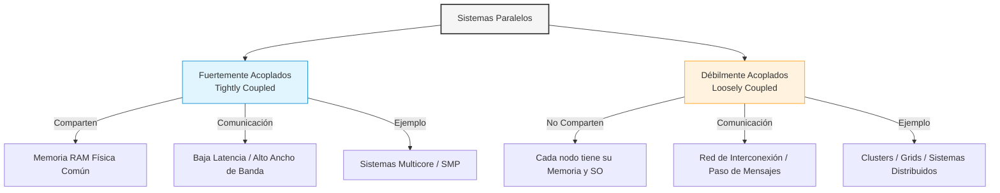
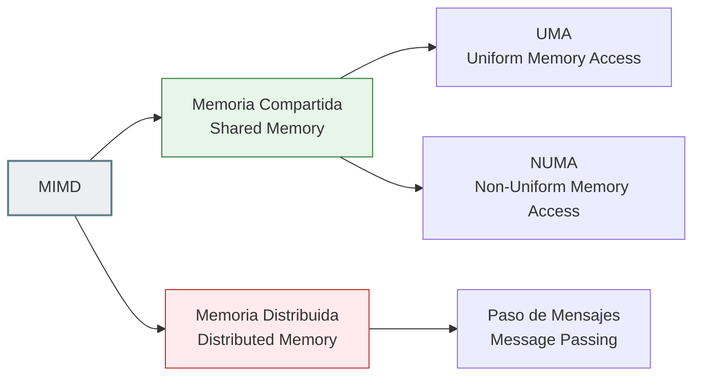

# Guía de Estudio: Arquitecturas Paralelas y Sistemas Multiprocesador

*Materia: Organización del Computador II*

## 1. El Límite del Núcleo Único y la Necesidad de Paralelismo

Hasta ahora analizamos cómo exprimir el rendimiento dentro de un solo chip mediante técnicas como el *pipeline* y la microarquitectura superescalar con ejecución fuera de orden (como el algoritmo de Tomasulo). Sin embargo, los diseñadores de hardware se chocaron de frente contra una triple pared física:

1. **El Muro de la Potencia (Power Wall):** Incrementar la frecuencia de reloj (los GHz) de forma indefinida genera una disipación de calor exponencialmente inmanejable.
    
2. **El Muro de la Memoria (Memory Wall):** La velocidad de la CPU crece mucho más rápido que la velocidad de acceso a la memoria RAM, haciendo que el procesador pase la mayor parte del tiempo esperando datos.
    
3. **Límites del ILP (Instruction-Level Parallelism):** Extraer paralelismo implícito de un único flujo secuencial de instrucciones tiene un retorno decreciente. Llega un punto en que el compilador y el hardware no pueden encontrar más instrucciones independientes para ejecutar en simultáneo.
    

**La Solución:** Pasar de explotar el paralelismo a nivel de instrucción (transparente al programador) a explotar el **Paralelismo a Nivel de Hilos (TLP - Thread-Level Parallelism)** y el **Paralelismo a Nivel de Procesadores**, donde el programador o el sistema operativo distribuyen explícitamente el trabajo en múltiples núcleos o computadoras autónomas.

## 2. Niveles de Acoplamiento: Tightly Coupled vs. Loosely Coupled

A nivel de sistemas paralelos, la primera gran clasificación se realiza según el grado de acoplamiento físico y de comunicación entre los procesadores.



### A. Sistemas Fuertemente Acoplados (Tightly Coupled)

En estos sistemas, los múltiples procesadores están físicamente muy cerca (generalmente en la misma placa o dentro del mismo chip de silicio) y comparten un espacio de memoria física común de alta velocidad.

- **Comunicación:** Se realiza escribiendo y leyendo variables en la memoria compartida. La latencia de comunicación es extremadamente baja y el ancho de banda es gigantesco.
    
- **Control de Concurrencia:** Requiere mecanismos estrictos de sincronización por hardware y software (como locks, semáforos o instrucciones atómicas tipo *test-and-set* o *compare-and-swap*) para evitar condiciones de carrera en la memoria RAM común.
    
- **Ejemplo clásico:** Los procesadores multinúcleo actuales de tu computadora o servidores SMP (Symmetric Multiprocessing).
    

### B. Sistemas Débilmente Acoplados (Loosely Coupled)

Consisten en múltiples computadoras autónomas independientes (nodos), cada una con su propio procesador, su propia memoria RAM privada y su propio sistema operativo completo.

- **Comunicación:** No existe memoria común. La comunicación se realiza estrictamente mediante el envío y recepción de paquetes de datos a través de una red de interconexión (como Ethernet de alta velocidad o redes dedicadas como InfiniBand) usando el modelo de **Paso de Mensajes (Message Passing)**.
    
- **Escalabilidad:** Son altamente escalables. Es mucho más sencillo y barato construir un supercomputador uniendo miles de computadoras comerciales en red que diseñar una placa madre gigante con mil procesadores compartiendo la misma RAM.
    
- **Ejemplo clásico:** Servidores en clusters, granjas de renderizado, arquitecturas de Grid Computing o sistemas distribuidos en la nube.
    

## 3. Arquitecturas MIMD: El Corazón del Multiprocesamiento

Siguiendo la Taxonomía de Flynn, los sistemas multiprocesador modernos caen bajo la categoría de **MIMD (Multiple Instruction, Multiple Data)**. Dentro de esta categoría, la clasificación más crítica para un diseñador de sistemas es cómo se estructura la memoria:



## 4. Taxonomía de Sistemas de Memoria Compartida: UMA vs. NUMA

Cuando múltiples procesadores comparten el mismo espacio de direcciones lógicas, el diseño del hardware determina si el acceso físico a esa memoria es uniforme o no.

### A. UMA (Uniform Memory Access)

En los sistemas UMA, todos los procesadores comparten la memoria física de manera centralizada a través de un bus común o una red de conmutación.

```
+---------------+   +---------------+
| Procesador P1 |   | Procesador P2 |
+---------------+   +---------------+
        |                   |
  ======+=========+=========+======  Bus del Sistema Común
                  |
        +-------------------+
        | Memoria RAM Única |
        +-------------------+
```

- **Característica Clave:** El tiempo que tarda cualquier procesador en acceder a cualquier celda de memoria RAM es exactamente el mismo (uniforme), sin importar qué procesador inicie la transacción ni a qué dirección de memoria apunte.
    
- **Limitación de Escala:** Dado que todos los accesos viajan por el mismo bus central o conmutador, este diseño sufre un cuello de botella severo a medida que agregamos CPUs. Generalmente, no escalan de forma eficiente más allá de $8$ o $16$ núcleos físicos.
    

### B. NUMA (Non-Uniform Memory Access)

Para romper la barrera de escalabilidad de UMA, los sistemas NUMA distribuyen físicamente la memoria RAM de manera que cada procesador (o grupo de núcleos) tenga un bloque de memoria físicamente pegado a él (memoria local), pero permitiendo que todos los procesadores accedan a la memoria de los otros nodos (memoria remota) de forma transparente a través de un bus de interconexión interna de alta velocidad.

```
Nodo 1:                             Nodo 2:
+-------------------------------+   +-------------------------------+
|  +----+       +------------+  |   |  +----+       +------------+  |
|  | P1 | <===> | Mem. Local |  |   |  | P2 | <===> | Mem. Local |  |
|  +----+       +------------+  |   |  +----+       +------------+  |
+-------------------------------+   +-------------------------------+
        ^                                   ^
        |                                   |
        +========[ Red de Interconexión ]===+
```

- **Característica Clave:** El tiempo de acceso a la memoria no es uniforme:
    
    - Si el procesador `P1` accede a su **memoria local**, la latencia es mínima (acceso ultra rápido directo al controlador de memoria del propio chip).
        
    - Si el procesador `P1` necesita acceder a datos guardados físicamente en el Nodo 2 (**memoria remota**), la petición debe viajar a través de la red de interconexión interna (como Intel UPI o AMD Infinity Fabric), lo que introduce una latencia significativamente mayor.
        
- **Impacto en el Software:** El sistema operativo y el programador deben estar "al tanto" de la topología NUMA (*NUMA-aware*) para ubicar los hilos de ejecución en el mismo nodo físico donde están almacenados sus datos de trabajo, previniendo la degradación del rendimiento por accesos remotos constantes.
    

## 5. Multiprocesadores Basados en Bus y el Desafío de la Coherencia

En arquitecturas de memoria compartida basadas en bus (típico diseño UMA), existen tres configuraciones físicas clásicas que evolucionaron para manejar el tráfico del bus del sistema:

### A. Sin Caché (Uniprocesador con Bus Único)

Todos los procesadores acceden directamente a la memoria común a través de un único bus de datos y direcciones en cada instrucción.

- **Problema:** El bus se satura instantáneamente. Incluso con dos procesadores, la interferencia por la disputa del bus ralentiza masivamente la ejecución global.
    

### B. Con Caché Privada

Para evitar que cada instrucción tenga que viajar por el bus hasta la RAM, se añade una memoria caché L1/L2 privada para cada procesador. La CPU resuelve la mayoría de las lecturas y escrituras dentro de su propia caché local.

- **Problema Crítico: Coherencia de Caché.** Pensá este escenario: El procesador 1 lee la variable $X$ (cuyo valor es $10$) de la RAM y la guarda en su caché. El procesador 2 hace lo mismo. Luego, el procesador 1 modifica la variable $X$ poniéndole un valor de $20$.
    
    - La caché del procesador 2 ahora tiene un dato viejo (obsoleto) de $X = 10$.
        
    - Si el procesador 2 intenta leer $X$, leerá un dato corrupto, rompiendo la consistencia del programa.
        

```
                      +---------------+
                      |  Memoria RAM  | -> [ X = 10 ] (Valor Viejo en RAM)
                      +---------------+
                              |
                     =========+========= Bus del Sistema
                              |
               +--------------+--------------+
               |                             |
       +---------------+             +---------------+
       |   Caché P1    |             |   Caché P2    |
       |   [ X = 20 ]  |             |   [ X = 10 ]  | -> ¡Inconsistencia!
       +---------------+             +---------------+
       | Procesador P1 |             | Procesador P2 |
       +---------------+             +---------------+
```

#### Mecanismos de Solución: Protocolos de Snooping (Snoopy Protocols)

Para solucionar la incoherencia en sistemas basados en bus, los controladores de caché implementan técnicas de "escucha activa" o *Snooping*:

- Cada controlador de caché monitorea constantemente el bus común para observar qué transacciones de lectura o escritura están realizando los demás procesadores.
    
- **Política Write-Through (Escritura Directa):** Cuando el procesador 1 escribe en su caché, el cambio se escribe inmediatamente en la memoria RAM común a través del bus. El controlador del procesador 2, que estaba escuchando el bus, detecta la escritura en la dirección de la variable $X$ e inmediatamente **invalida** la copia de $X$ en su propia caché. La próxima vez que el procesador 2 quiera leer $X$, sufrirá un *miss* de caché y se verá obligado a buscar el nuevo valor de la RAM.
    
- **Política Write-Back (Escritura Diferida con MESI):** Para evitar saturar el bus escribiendo en la RAM en cada instrucción, se usan protocolos de estados avanzados como **MESI** (Modified, Exclusive, Shared, Invalid). Los procesadores se avisan de manera directa sobre la propiedad de las líneas de caché antes de escribir en ellas, reduciendo drásticamente el tráfico del bus.
    

### C. Con Caché Privada y Memorias Privadas Locales

Es un paso intermedio donde cada placa de CPU tiene una pequeña porción de memoria RAM local que no es compartida con el resto del sistema, reduciendo aún más el tráfico del bus común al mantener variables privadas del sistema operativo y pilas locales fuera del bus central.

## 6. MIMD de Memoria Distribuida (Multicomputadores)

A gran escala (por ejemplo, supercomputadoras de miles de nodos), es imposible mantener un espacio de memoria compartido lógicamente sin que la latencia del control de coherencia de caché destruya el rendimiento global. Por esta razón, se pasa al modelo de **Memoria Distribuida Pura**.

### ¿Por Qué distribuir físicamente la memoria entre los nodos?

1. **Escalabilidad de Ancho de Banda:** Al distribuir la memoria, cada nodo tiene su propio canal de acceso de memoria independiente. Agregar más nodos incrementa linealmente el ancho de banda global de acceso a memoria del sistema entero.
    
2. **Reducción de Latencia Local:** El procesador accede a su memoria adyacente a velocidades de bus locales, sin lidiar con los retardos de una red de interconexión global para la mayoría de sus operaciones de cálculo diarias.
    
3. **Aislamiento de Fallas:** Si un nodo sufre un fallo físico de memoria o de procesador, el resto de los nodos autónomos puede seguir funcionando y ejecutando su porción del software sin caer en un fallo generalizado del sistema.
    

### La Desventaja: Complejidad del Software

En este modelo, el hardware es sumamente sencillo de fabricar y escalar, pero **toda la complejidad se traslada al programador y al compilador**:

- No podés usar hilos clásicos de memoria compartida (como Pthreads) para que colaboren entre diferentes nodos de forma nativa.
    
- Tenés que estructurar tu software usando librerías de paso de mensajes explícitas (como **MPI - Message Passing Interface**).
    
- Si el Nodo 1 necesita un dato calculado por el Nodo 2, el programador debe escribir de forma explícita una instrucción de envío (`MPI_Send`) en el código del Nodo 2 y una instrucción de recepción (`MPI_Recv`) en el código del Nodo 1.
    
- La eficiencia del sistema depende de minimizar la necesidad de comunicación entre nodos, ya que el viaje de datos por la red de interconexión es miles de veces más lento que el acceso local a la RAM.
    

## 7. Tabla Comparativa de Modelos Multiprocesador

Esta tabla te resume de forma muy analítica los conceptos clave explicados en el documento de estudio:

|Característica|UMA (Uniform Memory Access)|NUMA (Non-Uniform Memory Access)|Memoria Distribuida (Multicomputadores)|
|---|---|---|---|
|**Espacio de Direcciones**|**Único y compartido** de forma global y homogénea.|**Único y compartido** de forma lógica, pero distribuido físicamente.|**Múltiples espacios privados** e independientes por cada nodo.|
|**Latencia de Acceso**|Constante y uniforme para cualquier dirección de memoria.|Variable (rápido si es memoria local, lento si es remota).|Constante para memoria local. El acceso remoto directo no existe (requiere red).|
|**Soporte de Coherencia de Caché**|Soportado estrictamente por hardware (Snooping / Directorio).|Soportado por hardware (ccNUMA) de forma compleja y costosa.|No requiere coherencia de caché por hardware (las memorias están aisladas).|
|**Método de Comunicación**|Lectura/Escritura directa en variables de la memoria compartida.|Lectura/Escritura en variables (el hardware resuelve el ruteo remoto).|**Paso de Mensajes explícito** mediante software (ej: MPI).|
|**Escalabilidad Física**|**Baja** (Suele saturarse el bus central entre 8 y 16 núcleos).|**Media-Alta** (Permite escalar a cientos de núcleos físicos).|**Masiva** (Permite escalar a miles de computadoras conectadas en red).|
|**Costo y Complejidad de Diseño**|Bajo a nivel de hardware, pero limitado en escalabilidad.|Muy alto a nivel de diseño de hardware y de enrutadores de bus.|Muy bajo a nivel de hardware, pero sumamente complejo a nivel de software.|