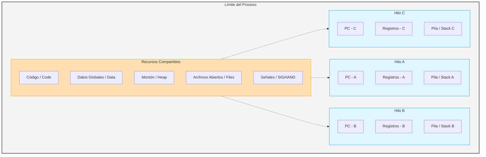
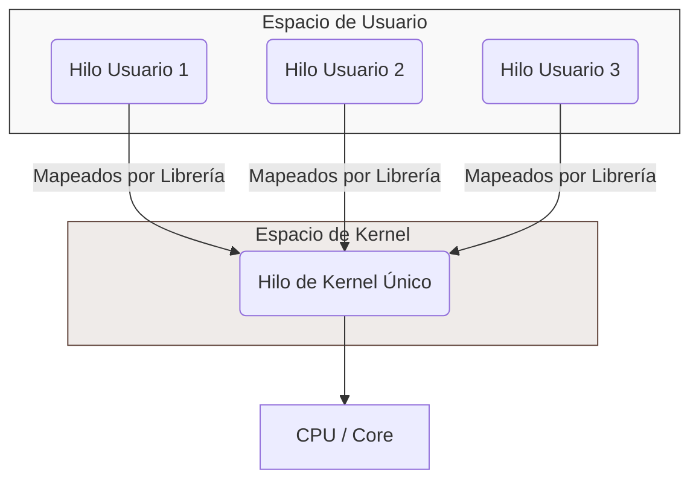
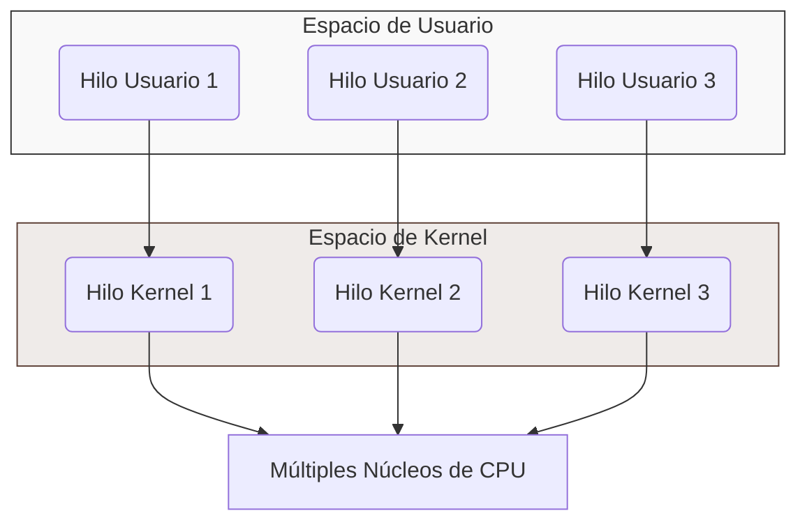
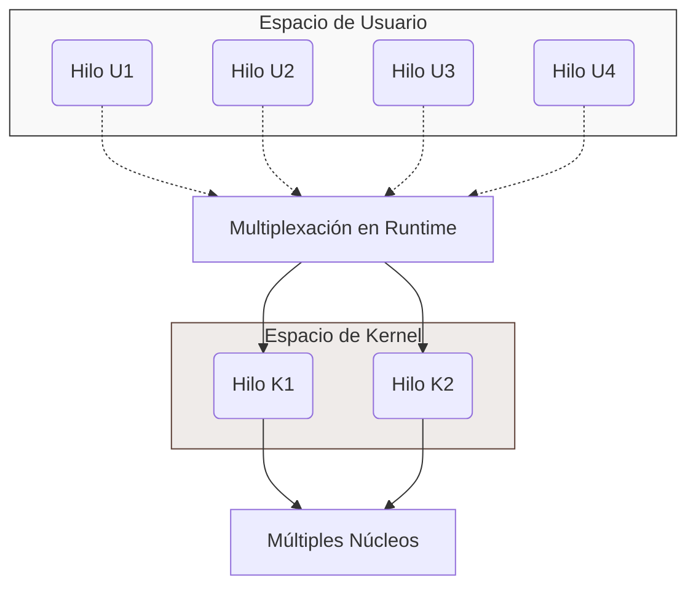
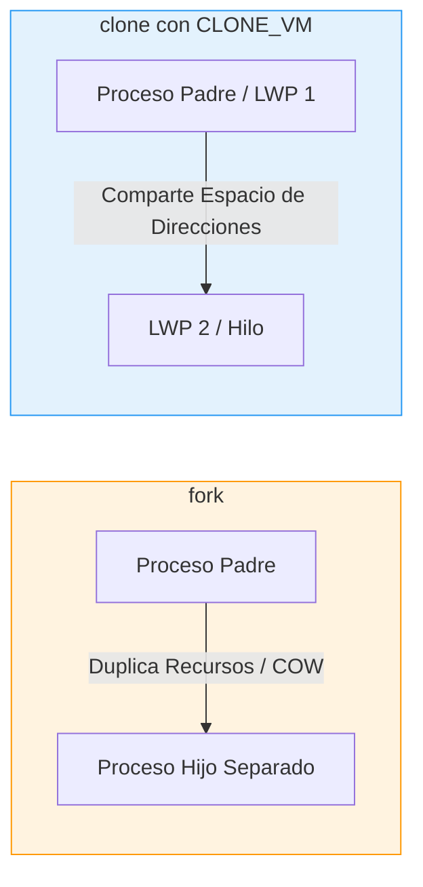

# Guía de Estudio: Programación Multicore, Modelos de Multithreading y Gestión de Hilos

*Materia: Organización del Computador II*

## 1. Procesos vs. Hilos: El Modelo de Ejecución

Para entender los sistemas modernos, primero tenés que comprender la diferencia fundamental en la forma en que el sistema operativo (SO) organiza la ejecución de un programa en memoria.

### A. Proceso Tradicional (Monohilo / "Single-threaded Process")

Un proceso tradicional es una instancia de un programa en ejecución que opera de manera secuencial.

- Posee **un único flujo de ejecución** gobernado por un solo Contador de Programa (PC).
    
- Si el proceso se bloquea (por ejemplo, esperando una operación de Entrada/Salida como leer el disco o recibir datos de la red), **todo el proceso se detiene**. No puede realizar ninguna otra tarea en paralelo mientras tanto.
    
- Cuenta con su propio espacio de direcciones aislado, registros, pila (*stack*) y montón (*heap*).
    

### B. Proceso Multihilo ("Multithreaded Process")

Un hilo (*thread*) es la unidad más pequeña de ejecución que el planificador (*scheduler*) del sistema operativo puede mandar a la CPU. En este modelo, un único proceso puede albergar múltiples hilos de ejecución que corren de manera concurrente o paralela.

#### Recursos Compartidos vs. Privados dentro de un Proceso:



- **¿Qué comparten todos los hilos del mismo proceso?**
    
    - **Espacio de Direcciones:** Específicamente el segmento de código (`.text`), datos estáticos/globales (`.data` y `.bss`), y el montón (`heap`) donde se reserva memoria dinámica.
        
    - **Recursos del Sistema:** La tabla de descriptores de archivos abiertos (*file descriptors*), los manejadores de señales (*signal handlers*), el directorio de trabajo actual (`cwd`), y la información del usuario/dueño del proceso.
        
- **¿Qué tiene cada hilo de forma PRIVADA e independiente?**
    
    - **Contador de Programa (PC):** Indica qué instrucción física está ejecutando ese hilo específico.
        
    - **Conjunto de Registros:** El estado actual de los registros de la CPU para ese hilo (evita que un hilo pise los cálculos intermedios de otro durante un cambio de contexto).
        
    - **Pila (Stack):** Un espacio reservado e independiente para almacenar las variables locales de las funciones que invoca ese hilo y registrar las direcciones de retorno de sus llamadas.
        

## 2. Ventajas Clave del Multithreading

El uso de múltiples hilos en lugar de múltiples procesos tradicionales ofrece cuatro grandes beneficios de diseño:

1. **Capacidad de Respuesta (Responsiveness):** Permite que una aplicación siga interactuando con el usuario (hilo de interfaz gráfica) mientras realiza cálculos pesados o espera datos en segundo plano (hilo de trabajo).
    
2. **Compartición de Recursos (Resource Sharing):** Los hilos comparten la memoria del proceso de forma nativa. Crear comunicación entre procesos (IPC) requiere mecanismos complejos del sistema (como tuberías, sockets o memoria compartida explícita). En hilos, basta con escribir en una variable global o pasar un puntero del montón.
    
3. **Economía y Eficiencia:** * Crear un hilo nuevo es drásticamente más rápido y consume menos memoria que crear un proceso clon (`fork()`), ya que no es necesario duplicar tablas de páginas ni inicializar un espacio de direcciones de memoria virtual entero.
    
    - El **cambio de contexto** (*context switch*) entre hilos del mismo proceso es mucho más ágil porque no requiere invalidar las cachés de traducción de direcciones (TLB - Translation Lookaside Buffer).
        
4. **Escalabilidad en Arquitecturas Multicore:** En sistemas con múltiples núcleos físicos, el SO puede distribuir los diferentes hilos de un mismo proceso en distintos núcleos de ejecución reales, logrando paralelismo real y reduciendo drásticamente el tiempo de procesamiento total.
    

## 3. Modelos de Multithreading: Usuario vs. Kernel

Los hilos pueden existir en dos niveles diferentes:

- **Hilos de Usuario:** Soportados directamente por la aplicación mediante librerías, sin que el kernel del sistema operativo tenga conocimiento de su existencia.
    
- **Hilos de Kernel:** Administrados y planificados directamente por el núcleo del sistema operativo.
    

La relación matemática que define cómo se mapean los hilos de usuario en los hilos de kernel determina las capacidades de ejecución paralela del sistema:

### A. Modelo Muchos a Uno ($N:1$ - "Many-to-One")

Muchos hilos de usuario se mapean a un único hilo de kernel. Toda la administración y el cambio de contexto ocurre en el espacio de usuario de manera ultrarrápida.



- **Desventaja Crítica:** Si un solo hilo de usuario realiza una llamada al sistema bloqueante (E/S), **todo el proceso se bloquea** porque el único hilo de kernel asociado se duerme.
    
- **Paralelismo:** Nulo. Aunque tengas una CPU de $32$ núcleos, solo un núcleo va a ejecutar este proceso a la vez, ya que el planificador del kernel solo ve un único hilo de ejecución.
    
- **Estado Actual:** Obsoleto en sistemas operativos de propósito general modernos.
    

### B. Modelo Uno a Uno ($1:1$ - "One-to-One")

Cada hilo de usuario se asocia directamente a un hilo de kernel independiente.



- **Ventajas:** Ofrece paralelismo real. Si un hilo se bloquea en una llamada al sistema, los demás hilos de usuario pueden seguir ejecutándose en otros núcleos de forma independiente.
    
- **Desventaja:** Crear un hilo de usuario implica crear un hilo de kernel. Como el kernel tiene recursos limitados, existe un tope en la cantidad de hilos que una aplicación puede instanciar razonablemente sin degradar el rendimiento global del sistema operativo.
    
- **Estado Actual:** Es el **estándar actual** de la industria (utilizado nativamente por Linux mediante la librería NPTL y por Windows).
    

### C. Modelo Muchos a Muchos ($M:N$ - "Many-to-Many")

Mapea $M$ hilos de usuario a un conjunto de $N$ hilos de kernel, donde por lo general $M > N$.



- **Funcionamiento:** Los desarrolladores pueden crear tantos hilos de usuario como necesiten sin preocuparse por los límites del sistema. El entorno de ejecución (*runtime*) del lenguaje multiplexa dinámicamente estos hilos sobre un grupo optimizado de hilos de kernel.
    
- **Estado Actual:** Es la base de sistemas modernos de hilos livianos o fibras (*Fibers*), muy común en lenguajes como Go (con sus *Goroutines*) o en el modelo de hilos virtuales de Java moderno.
    

## 4. Implementación de Hilos en Linux: El Enfoque LWP y la llamada `clone()`

A diferencia de otros sistemas operativos que tienen estructuras de datos completamente distintas para representar procesos e hilos, **Linux trata a ambos bajo un mismo concepto unificado**.

### Concepto de LWP (Light Weight Process)

En el kernel de Linux, no existe una entidad llamada "hilo". Cada flujo de ejecución se representa simplemente como una tarea independiente mediante una estructura `task_struct`.

- Un hilo en Linux es modelado simplemente como un **Proceso Ligero (LWP)**.
    
- La diferencia radica exclusivamente en qué recursos comparte esta nueva tarea con su tarea creadora (padre).
    

### La Llamada al Sistema `clone()`

Para crear un nuevo hilo de ejecución, Linux no utiliza la llamada tradicional `fork()`. En su lugar, utiliza la llamada del sistema altamente parametrizable llamada **`clone()`**.

La firma de la función nos da una idea de su flexibilidad:

```
int clone(int (*fn)(void *), void *stack, int flags, void *arg, ...);
```

El comportamiento de `clone()` varía drásticamente según los bits de configuración pasados en el parámetro **`flags`**:

|Bandera (Flag)|Significado Técnico|Comportamiento al activarla (Modo Hilo)|
|---|---|---|
|**`CLONE_VM`**|*Virtual Memory*|La nueva tarea comparte exactamente el **mismo espacio de direcciones** de memoria virtual que el padre. Es decir, comparten el montón, datos estáticos y código. Cambios de memoria de uno se ven inmediatamente en el otro.|
|**`CLONE_FS`**|*File System*|Comparte la información relativa al sistema de archivos del sistema operativo, tales como el directorio raíz y el directorio de trabajo actual (`cwd`).|
|**`CLONE_FILES`**|*Files Open*|Comparte la tabla de **archivos abiertos** (descriptores de archivos). Si un hilo abre un puerto socket o lee un archivo de texto, el otro hilo puede usar ese mismo descriptor directamente.|
|**`CLONE_SIGHAND`**|*Signal Handlers*|Comparte los mismos manejadores y manejos de señales. Si un hilo define cómo reaccionar ante una señal del sistema, la regla aplica para todos.|

### Analogía y Contraste de Llamadas en Linux



- **`fork()`:** Crea un proceso hijo completamente nuevo. Se duplica el espacio de memoria del padre. En Linux se optimiza usando la técnica **Copy-On-Write (COW)** (Copia en Escritura), lo que significa que el espacio físico se duplica recién cuando alguna de las dos tareas intente modificar una página de memoria, pero siguen siendo lógicamente espacios de memoria aislados. No se comparte memoria para escribir.
    
- **`clone()` con flags compartidos (como `CLONE_VM`):** Crea un hilo (LWP). No duplica la memoria virtual, ambas tareas apuntan físicamente al mismo mapa de memoria.
    

## 5. Librerías Estándar de Programación de Hilos

Existen tres estándares principales en la ingeniería de software para controlar la ejecución multihilo:

### 1. Pthreads (POSIX Threads)

Es el estándar de la API de hilos definido por la especificación IEEE POSIX 1003.1c.

- **Naturaleza:** Puede estar implementado tanto a nivel de usuario como a nivel de kernel (dependiendo enteramente del sistema operativo). En Linux contemporáneo, se implementa mediante la librería **NPTL** (Native POSIX Thread Library), la cual trabaja directamente sobre llamadas `clone()` mapeando hilos 1:1 con el kernel.
    
- **Lenguajes:** C y C++.
    

### 2. Windows Threads

Es la API nativa provista de forma exclusiva por los sistemas operativos Microsoft Windows.

- **Naturaleza:** Es una API de nivel de kernel que implementa un modelo estricto de hilos 1:1.
    
- **Lenguajes:** C, C++ y lenguajes soportados por el framework .NET.
    

### 3. Java Threads

Dado que la máquina virtual de Java (JVM) se ejecuta sobre diferentes sistemas operativos, el soporte de hilos se abstrae mediante su propia API nativa.

- **Naturaleza:** Tradicionalmente, la JVM mapeaba sus hilos de usuario directamente a los hilos nativos provistos por el sistema operativo anfitrión (modelo $1:1$). Sin embargo, las versiones recientes de Java (Proyecto Loom) reintrodujeron soporte nativo para hilos virtuales muy livianos de espacio de usuario multiplexados bajo un modelo $M:N$.
    

## 6. Desafíos Técnicos de la Programación Multihilo

Desarrollar software que corra sobre arquitecturas multicore no es trivial; la concurrencia introduce riesgos lógicos complejos que no existen en programas monohilo secuenciales:

- **Condiciones de Carrera (Race Conditions):** Ocurren cuando múltiples hilos intentan leer y escribir sobre una misma posición de memoria de manera simultánea sin sincronización, haciendo que el resultado final dependa del orden exacto de planificación física del hardware.
    
- **Secciones Críticas:** Porciones de código que acceden a recursos compartidos no atómicos y que deben ejecutarse bajo un principio de **exclusión mutua** (usando semáforos o Mutex) para garantizar la consistencia de los datos.
    
- **Deadlocks (Bloqueos Mutuos):** Se da cuando dos o más hilos están bloqueados indefinidamente esperando recursos que se poseen mutuamente de manera cruzada:
    
    - *Ejemplo:* El Hilo 1 retiene el Mutex A y espera el Mutex B. El Hilo 2 retiene el Mutex B y espera el Mutex A. Ninguno de los dos puede avanzar.
        
- **Balance de Carga y División de Datos:** El desarrollador debe diseñar algoritmos que distribuyan el trabajo de manera uniforme entre los núcleos de la CPU, evitando situaciones donde un solo núcleo trabaja al 100% mientras los demás quedan inactivos.