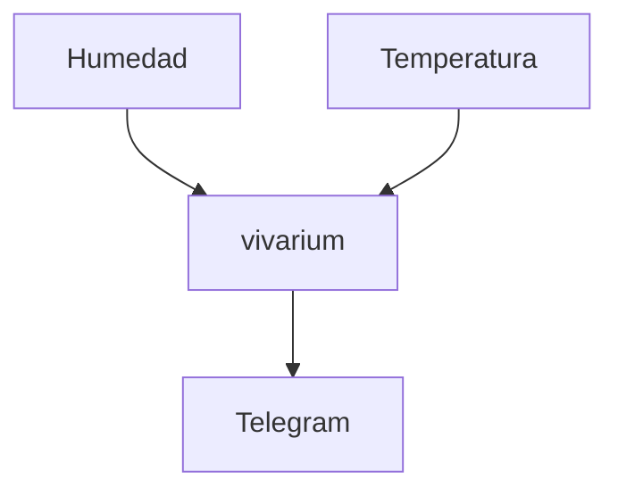

# Apuntes de Reunión (27/08/2026)

## 16:37:13
- nombre y apellido en las presentaciones
- no puede haber ≠ entre lo que dice la ppt y la exposición
- no terminar la ppt de forma informal
- consistencia al formular las ideas
	- verbos en infinitivo
	- oraciones con sujeto y predicado
	- etc
- no agregar notas al pie en una ppt
- propuestas visuales suman en las presentaciones
- ordenar el discurso oral en relación con la ppt
- palabras blancas y fondo oscuro = poca legibilidad
- mucho texto, malo
- el segundo criterio de aceptación (por la vía triste) podría tener en cuenta qué pasa si no está disponible la API de Telegram
- Poner el logo de la UNGS
- Evitar enumerar cosas, usar bullets
- mencionar qué problema resuelve el proyecto, suma
- plantillas predeterminadas, no
- la palabra "automáticamente" no dice nada
- Está bueno que aparezcan los dataset, los escenarios, para cada criterio de aceptación
- para que quede clara la extensibilidad, está bueno poner ejemplos

## 16:37:25
### Sirve
- el nombre
- biblioteca y datos
	- de acá salen los registros
- umbral de humedad
- notificación por telegram
- los dibujos

### No sirve
- el titulo de la ppt solo vivarium. El proyecto > materia
- Dirección de la lectura de izq a derecha y al exponer se hizo al revés
- el criterio de aceptación es en sí la descripción de la funcionalidad
- condiciones
- la tipografía del logo no es muy legible

### Indeciso
- riego o no riego en vez de cond. óptimas o no óptimas
- cond. óptimas ok. No óptimas es medio raro
- cerrar con un gracias o muchas gracias para cerrar la ppt
- el id de la planta ESPECIE #1
- Definir las cond. óptimas
- ~~la notificación~~ Al detectar debe ser lo extensible, no los distintos medios de notificar
- Quiero enterarme o *saber* cuando una planta necesita regarse, en vez de notificar. Depende
- Definir las condiciones. Las condiciones deben permitir trabajar con la extensión
- el criterio debe ser debe **estar dentro del umbral**
- Pasar de true a false y false a true es lo mismo.

### Criterio de la revisión 2
- al comenzar, recordar cuál era el proyecto y la user story funcional, ya sea oralmente o con una diapo dedicada
- se tienen que utilizar elementos visuales para poder describir cosas
- Se buscan los siguientes diagramas:
	- notación UML.
	- un diagrama que explique el funcionamiento de la user story. Se debe contar cómo se va a hacer todo. Hay que explicar el diagrama
	- no más de 5 cajas por diagrama. Puede haber 6 cajas.
	- puede haber mas de un diagrama
	- los diagramas no deben estar sobre cargados
	- ojo con el uso de los colores. Tienen un sentido.
	- Debe haber un sentido de lectura en el diagrama. No debe haber espacios en blanco, ni sobre carga de texto
- pautas
	- Diagrama de clases sobre la US funcional de cómo se va a implementar
	- No hace falta poner todo el detalle
- Puede haber lenguaje técnico sobre el diseño
- Tools: draw.io , cacoo , websequence diagram
- missing semester of your computer science education -> MIT
- Link al diagramas, No
	- quieren la imagen

## Consulta después de clase
- canal de telegram
	- poner el canal y dejarlo ahí
	- es un bot de telegram

- repo aparte
- cómo se recibe info en el sistema
	- no hace falta especificar el protocolo
	- hacer polling como solución
	    - es ineficiente
- vivarium **observa** a los sensores
	- podemos poner un límite de alertas
	- Que la genere una única vez o todo el tiempo para evitar el timer
	- si vuelve a salir del umbral se debe generar otra
	- se debe volver a notificar cuando volver a notificar
- Criterio de ~~notifica~~ aceptación por la negativa
	- Si se cae un sensor: no vale del todo porque debe funcionar sin sensores
	- si algun sensor envía algo inválido
	    - se puede enviar otra notificación en caso de un valor inesperado por parte del sensor
	- se busca la falla más genérica que podamos tener