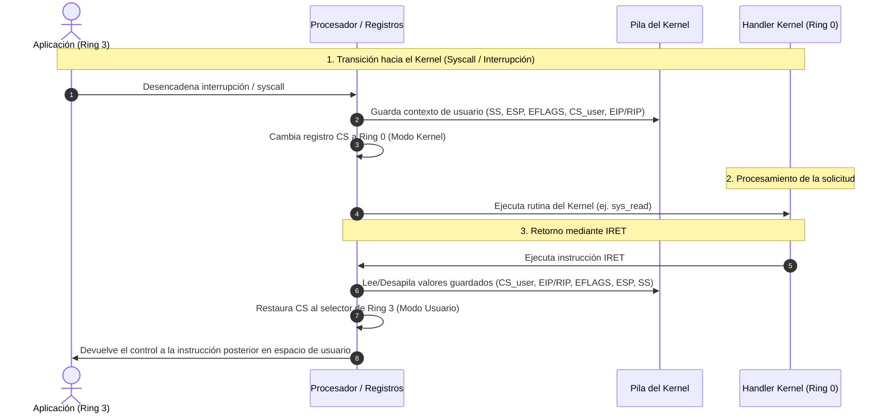

# El kernel

- actúa como intermediario entre el hardware y el software
- su principales responsabilidades son:

	1. gestionar eficientemente los recursos del sistema (cpu, memoria, almacenamiento, etc.)
	2. administrar múltiples procesos simultáneamente
	3. controlar el acceso a memoria y a dispositivos
	4. proporcionar mecanismos de comunicación y sincronización entre distintos procesos

- el kernel permite que múltiples procesos **compartan recursos**

# Niveles de privilegios

- los niveles de privilegios **garantizan** seguridad y aislamiento entre el sistema operativo y las aplicaciones
- las tareas **críticas** solo pueden ejecutarse en los niveles con **mayores privilegios**

	- ejemplos de tareas críticas:
		- modificar registros en el procesador
		- acceder directamente a memoria
		- interactuar con hardware

- la arquitectura x86 ofrece **cuatro anillos** pero los sistemas operativos contemporáneos utilizan **dos**

	- **Ring 0 (kernel mode):** tiene control **total** del hardware y puede ejecutar instrucciones privilegiadas. En este nivel residen el propio kernel y los drivers
	- **Ring 3 (user mode):** es el nivel **menos privilegiado**. No tiene acceso al hardware. En este nivel residen las aplicaciones de usuario más comunes.
	- Los anillos 1 y 2 fueron diseñados para drivers y servicios pero raramente son usados
	- Usar 2 anillos en vez de 4 es más simple y seguro

- el registro `CS (code segment)` le indica al CPU el modo actual, kernel o user

## Instrucción IRET

- `IRET (Interrupt Return)` es un instrucción privilegiada que solo puede ser ejecutada en kernel mode
- sirve para transicionar del kernel mode al user mode
- esta instrucción **asegura** que una aplicación **no pueda** volver al kernel mode por sí sola

