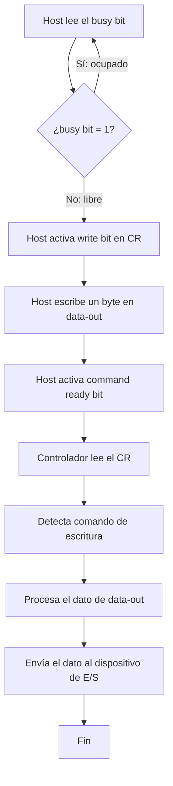
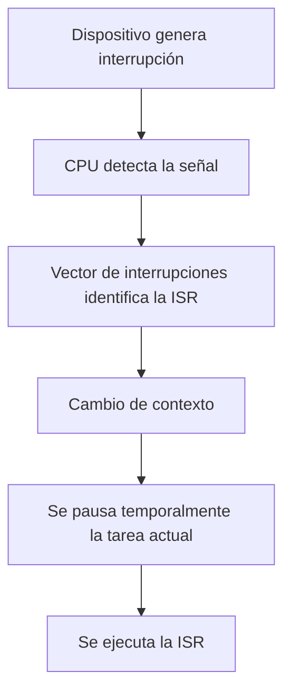
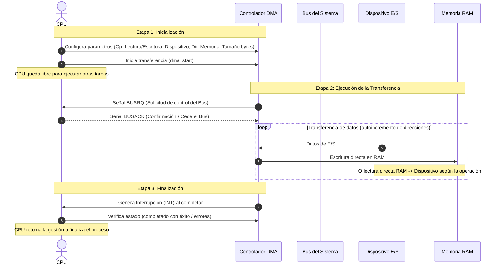

# Modos de acceso a E/S

## 1. E/S Programada

- la CPU controla directamente la transferencia de datos entre la memoria y los dispositivos de E/S
- la CPU verifica **continuamente** el estado del dispositivo mediante *polling*, es decir, **espera** a que el dispositivo esté listo para la transferencia
	- durante la espera activa, la CPU no puede realizar otras tareas
	- esto implica un manejo ineficiente de los recursos del sistema
- durate el polling, la CPU espera activamente (un bucle) utilizando ciclos de CPU revisando que el dispositvo esté preparado para la transferencia

| Ventajas                                          | Desventajas                                                                                                                |
| ------------------------------------------------- | -------------------------------------------------------------------------------------------------------------------------- |
| la CPU controla la operacion                      | es ineficiente porque los ciclos de CPU que se utilizan esperando podrían emplearse para otra tarea                        |
| no se necesita de hardware adicional              | la CPU queda bloqueada hasta que la operacion se complete                                                                  |
| facil de entender y depurar                       | si hay múltiples dispositivos de E/S cada dispositivo requiere un proceso de polling independiente y podría saturar la CPU |
| es ideal para sistemas embebidos o de tiempo real | si el dispositivo es lento se produce cuello de botella                                                                    |

- dispositivos con microcontroladores como Arduino o Raspberry PI Pico utilizan esta técnica para interactuar con sensores y actuadores
	- en estos casos las operaciones de E/S son simples y existe mínima sobrecarga sobre la CPU

## 2. E/S Por interrupciones

- la CPU puede ejecutar otras tareas mientras espera que un dispositivo de E/S esté listo
- cuando el dispositivo está preparado para la transferencia de datos le envía una señal de interrupcion a la CPU. La CPU al recibir la señal 
	- pausa temporalmente lo que está haciendo
	- ejecuta la rutina de servicio de interrupcion (ISR) para manejar la operacion de E/S
	- una vez completada la ISR, retorna a la tarea anterior

- es similar al polling porque la CPU gestiona la transferencia de datos pero su diferencia radica en que **el dispositivo indica cuándo está listo**
	- esto evita que la cpu quede bloqueada esperando
- un teclado de computadora se maneja con este modo
	- cada vez que el usuario presiona una tecla, el controlador de teclado genera una interrupcion que activa la ISR correspondiente
	- la CPU pausa la tarea actual
	- ejecuta la rutina para leer la tecla
	- luego continua con la tarea original

| Ventajas                                                                                                  | Desventajas                                                                                                                |
| --------------------------------------------------------------------------------------------------------- | -------------------------------------------------------------------------------------------------------------------------- |
| son mas eficientes que el metodo anterior                                                                 | tiene una implementacion mas compleja                                                                                      |
| puede realizar otras tareas mientras espera la señal de interrupcion                                      | requiere soporte de hardware para gestionar las interrupciones                                                             |
| la CPU no queda bloquea en un bucle de espera                                                             | require implementar rutinas de servicio de interrupcion                                                                    |
| este enfoque es amigable con múltiples dispositivos ya que cada dispositivo genera su propia interrupcion | la CPU puede pasar mas tiempo manejando interrupciones que ejecutando tareas útiles, esto se conoce como *interrupt storm* |
| este metodo es más rápido y eficiente que el anterior                                                     | si hay demasiadas interrupciones simultáneas la CPU puede verse sobrecargada                                               |

- **no siempre** es adecuada para dispositivos rápidos como servers RAID con SSD de baja latencia
	- en estos casos, se recomienda **una combinación** de *polling* e interrupciones

## 3. E/S Mediante Acceso Directo a Memoria (DMA)

- es el metodo más eficiente para manejar transferencias de datos entre dispositivos de E/S y la memoria principal
- permite que el dispositivo transfiera datos directamente a la memoria sin la intervención continua de la CPU
	- un controlador se encarga de gestionar las transferencias
	- el controlador libera a la CPU de realizar otras tareas durante el proceso
	- el controlador configura los parámetros de la transferencia
	- el controlador supervisa el proceso hasta que se completa
- este metodo es beneficioso en dispositivos con **alto ancho de banda** o que manejan grandes volúmenes de datos, como discos duros y SSD, trajetas de red de alta velocidad o tarjetas gráficas, donde las operaciones de transferencia son frecuentes y voluminosas

| Ventajas                                                                                                | Desventajas                                                                                                                 |
| ------------------------------------------------------------------------------------------------------- | --------------------------------------------------------------------------------------------------------------------------- |
| disminuye el trabajo de la CPU                                                                          | su implementacion requiere hardware especial. Esto implica un coste en el diseño y la implementacion                        |
| permite que la CPU pueda ejecutar otras tareas mientras el controlador de DMA gestiona la transferencia | la configuracion de un controlador DMA es compleja                                                                          |
| se reduce la latencia y mejora la tasa de transferencia                                                 | puede haber problemas de arbitraje cuando multiples dispositivos intentan acceder a la memoria mediante DMA simultáneamente |
| se optimiza el rendimiento global del sistema                                                           | algunos dispositivos no son compatibles con DMA                                                                             |
