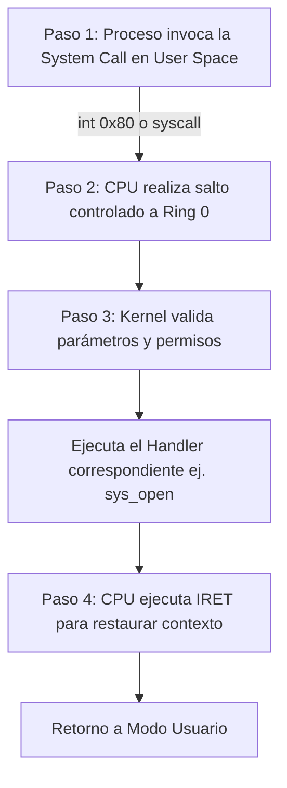
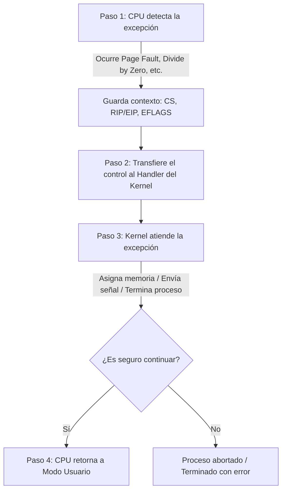
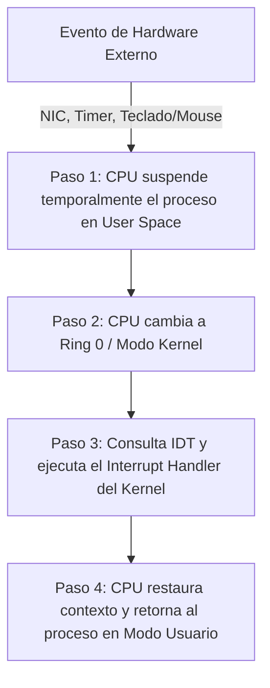
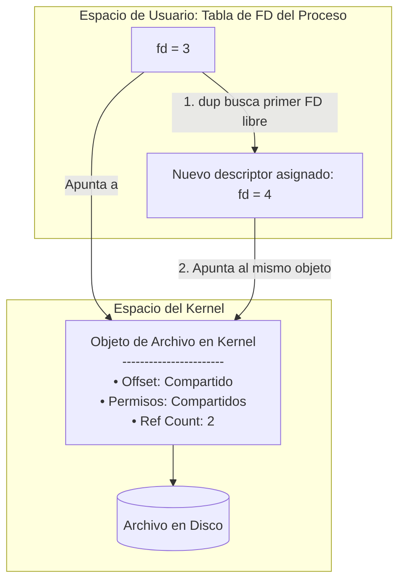
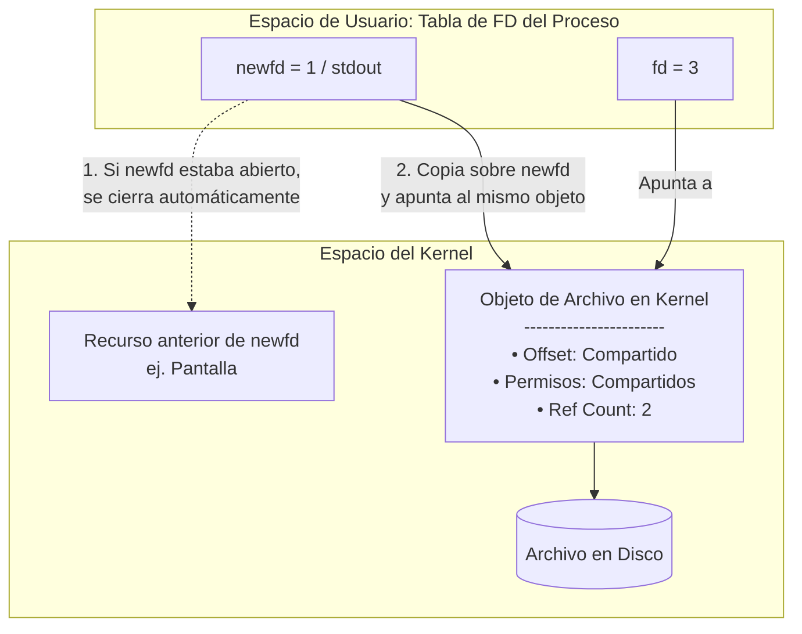

# User y Kernel Mode

## Kernel Mode

- es el entorno más privilegiado
- puede ejecutar **cualquier instrucción**
- puede acceder a **cualquier** dirección de memoria
- puede interactuar con el hardware **con libertad**
- un error en este entorno puede comprometer todo el sistema

## User mode

- es un entorno restringido donde **se bloquean** las instrucciones privilegiadas
- cuando una aplicación intenta ejecutar una instrucción en modo kernel, el CPU genera una excepción y el sistema operativo termina o penaliza el proceso
- las aplicaciones tienen que pedirle al kernel, mediante `system calls`, acceso a recursos

# Componentes entre el User y el Kernel

## User Apps

- son los programas comunes que un usuario ejecuta en su día a día
- estas aplicaciones se ejecutan en el **user space**, una sección de la memoria RAM dedicada a aplicaciones de usuario

## User Libraries

- las aplicaciones **no invocan** al kernel directamente sino que utilizan user libraries como `glibc` para linux
- funciones de las user libraries:
	- **Abstracción:** el programador utiliza funciones propias del lenguaje que esté utilizando
	- **Traducción en la librería:** la librería `glibc` empaqueta los parámetros y traduce esas funciones a `system calls` concretas como `sys_open, sys_write,` etc.
	- **Transición a kernel mode:** la librería ejecuta una instrucción especial de la CPU que transfiere el control al kernel
	- **Resolución dentro del kernel:** cada system call tiene un número asociado. Este número le indica al procesador qué rutina o `handler` ejecutar

		- el kernel tiene una tabla interna (`syscall table`) que mapea cada system call con una rutina
		- esta tabla es inaccesible desde el user space

	- **Retorno al user space:** se completa la operación y la aplicación nuevamente está en user mode

## Frontera entre el User y el Kernel

- una user app no tiene los privilegios necesarios para acceder a recursos como archivos, sockets o memoria. Para ello **deben** usar las system calls

- si un usuario quisiera escribir "Hello" con código C, sucede lo siguiente:
	1. `fwrite("hello", 5, 1, f)` -> la función `fwrite` es propia de C
	2. Internamente `fwrite()` llama a `write()`, una función propia de la librería `glibc`
	3. internamente `write()` llama a la sys_call `sys_write()`

## sys_call_table

- la tabla contiene **punteros** a funciones internas del kernel
- cada índice corresponde al número de system call y apunta a la rutina que se debe realizar

## Transiciones de user mode a kernel mode

- existen **tres** causas para cambiar de user mode a kernel mode
	- system calls
	- excepciones síncronas
	- interrupciones asíncronas o externas

### System Calls

- cuando un programa en user mode necesita un servicio del kernel, utiliza una system call
- el usuario nunca elige a qué código saltar
- una system call es un **mecanismo** mediante el cual un programa de usuario le solicita al kernel que realice una acción específica
- estas llamadas permiten interactuar con el sistema operativo y obtener servicios esenciales 
- el sistema operativo valida la solicitud, realiza la operación y devuelve el resultado al programa

## Excepciones síncronas

- ocurre cuando el código en ejecución provoca una condición que debe ser atendida inmediatamente por el kernel
- las excepciones son generadas por el CPU
- ejemplos:
	- page fault
	- acceder a un archivo que no existe
	- dividir por cero
	- etc.

## Interrupciones Asíncronas o Externas

- son generadas por elementos **externos** al flujo de ejecución del programa
- ejemplos:
	- fallas de hardware
	- caida de internet
	- etc.

## Descriptor de archivo

- se trata de un **número no negativo** (n >= 0) que el kernel asigna sobre un recurso
- un proceso puede realizar acciones como `read(), wirte(), close(),` etc. sobre cada recurso de forma controlada por el kernel

	- cada proceso tiene su propia tabla
	- el kernel crea la tabla al iniciarse el proceso
	- cada índice en la tabla apunta a un recurso
		- Un recurso puede ser un archivo, un socket, un pipe, etc.

## Asignación y tabla de descriptores

- el kernel asigna el descriptor a nivel de proceso, no de archivo
	- por lo tanto, cada proceso tiene su propia tabla de descriptores
	- el descriptor solo es válido para el proceso que llamó a `open()`
- los siguientes valores de descriptores **están reservados:**

	- 0 -> entrada estándar -> `stdin`
	- 1 -> salida estándar -> `stdout`
	- 2 -> error estándar -> `stderr`
	- los valores mayores a 2 (> 2) no tienen nombres fijos. Depende de lo que el proceso haya abierto o requiera y en qué orden

- el descriptor de archivo `fd = 3` no necesariamente es el mismo para el proceso A que para el proceso B

## `dup()` Y `dup2()`

- cuando un proceso abre un archivo, el kernel crea una estructura para almacenar la siguiente información:

	1. **Offset de lectura y escritura:** posición actual dentro del archivo donde se va a leer o escribir el siguiente byte
	2. **Permisos de acceso:** determina si el descriptor puede leer, escribir o ambos
	3. **Contador de referencias:** indica cuántos descriptores (posiblemente de distintos procesos) apuntan al mismo objeto del kernel

- Cuando usamos `dup(fd)` el sistema hace lo siguiente:

	1. busca el primer descriptor **libre** del proceso
		- que un descriptor esté libre implica que no tiene un recurso asignado
	2. crea un nuevo descriptor que **apunta** al mismo objeto del kernel que fd
	3. el offset y los permisos se comparten

- `dup2(fd, newfd)` copia fd sobre un descriptor específico newfd

	1. si newfd estaba en uso, primero se cierra automáticamente
	2. luego, newfd apunta la mismo objeto que fd
	3. offset y permisos se comparten

## Funciones básicas de E/S en UNIX

- las operaciones de entrada y salida en sistemas UNIX se realizan mediante system calls para poder interactuar con archivos, dispositivos y otros recursos
- estas system calls permiten: 

	- realizar operaciones de lectura y escritura
	- manipular la posición de lectura y escritura
	- cerrar descriptores

## Categorías de System Calls más comunes:

|**Categoría de System Call**|**Funciones Principales**|
|---|---|
|**Gestión de archivos**|`open()`, `read()`, `write()`, `close()`, `lseek()`|
|**Gestión de procesos**|`fork()`, `exec()`, `wait()`|
|**Gestión de dispositivos**|`ioctl()`|
|**Redes**|`socket()`, `bind()`, `listen()`, `accept()`|
|**Memoria**|`mmap()`, `brk()`|

| **Función / System Call** | **Descripción**                                                                                       | **Valor de Retorno**                                                                                                                |
| ------------------------- | ----------------------------------------------------------------------------------------------------- | ----------------------------------------------------------------------------------------------------------------------------------- |
| **`open()`**              | Abre un archivo o dispositivo (lo crea si no existe y se indica `O_CREAT`).                           | • Entero positivo (descriptor asignado) si tiene éxito.         • `-1` si ocurre un error (guarda valor en `errno`). |
| **`read()`**              | Lee datos de un archivo hacia un búfer y ajusta el desplazamiento (*offset*).                         | • Bytes leídos si tiene éxito.         • `0` al llegar a EOF.         • `-1` si hay error.            |
| **`write()`**             | Escribe datos desde un búfer hacia el archivo.                                                        | • Bytes escritos si tiene éxito.         • `-1` si ocurre un error.                                                  |
| **`lseek()`**             | Mueve el puntero de lectura/escritura a una posición específica (permite crear *holes*).              | Nueva posición del puntero (offset en bytes) o `-1` si falla.                                                                       |
| **`close()`**             | Cierra el descriptor, sincroniza cambios pendientes y libera recursos.                                | • `0` si tiene éxito.         • `-1` si hay error.                                                                   |
| **`ioctl()`**             | Realiza operaciones de control específicas no cubiertas por `read`/`write` estándar.                  | Varía según el comando ejecutado o `-1` en caso de error.                                                                           |
| **`dup()`**               | Duplica el descriptor hacia el índice libre más bajo disponible (comparte offset y flags).            | Nuevo descriptor duplicado o `-1` si falla.                                                                                         |
| **`dup2()`**              | Duplica `fd` sobre un descriptor de destino específico `newfd` (lo cierra primero si estaba abierto). | El valor de `newfd` si tiene éxito o `-1` si hay error.                                                                             |
| **`fcntl()`**             | Modifica atributos de un descriptor (modos de acceso, flags, bloqueos/locks).                         | Varía según el comando o `-1` si hay error.                                                                                         |

## Ciclo de vida de un descriptor

1. **Apertura:** el kernel crea una nueva entrada en la tabla de archivos abiertos y asocia el descriptor
2. **Operaciones:** modifican el desplazamiento y afectan la estructura de la tabla
3. **Cierre:** el kernel decrementa el contador de referencias. Si el contador llega a cero, libera el descriptor

> No todos los dispositivos siguen el ciclo completo. El ciclo depende del tipo de dispositivo y de cómo se gestiona en el kernel
