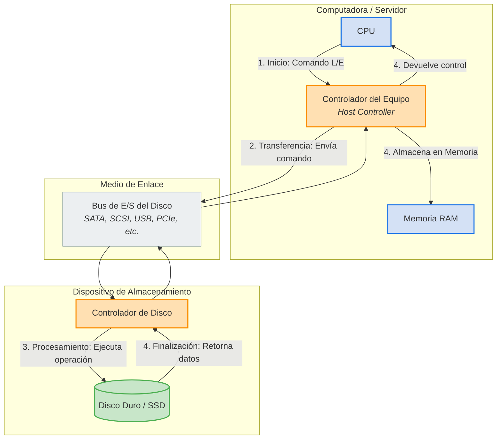

# Estructuras de Almacenamiento

## Caracterización

1. **DAS:** Direct Attach Storage o Almacenamiento directamente adjunto
2. **NAS:** Network Attach Storage o Almacenamiento conectado en la red
3. **SAN:** Storage Area Network o Redes de Área de Almacenamiento

## 1. Tipos de dispositivos de almacenamiento masivo

### Discos Duros HDD

- utilizan tecnología magnetica para almacenar datos en platos giratorios
- tienen un bajo coste por GB
- alta capacidad de almacenamiento
- gran durabilidad a largo plazo
- mayor latencia y menor velocidad de acceso
- sensibilidad a impactos físicos
- consumo de energia relativamente alto
- usado para:
	- almacenamiento masivo de datos no criticos (copias de seguridad o archivos multimedia)
	- entornos donde el costo es más importante que el rendimiento

### Unidades de estado sólido SDD

- emplean memoria flash sin partes moviles
- ofrecen baja latencia y una alta velocidad de acceso
- son resistentes a impactos físicos
- consumen menos energia que los HDD
- tiene un mayor costo por GB
- tienen una limitacion en ciclos de escritura
- usado para:
	- sistemas operativos y aplicaciones que requiera alto rendimienot
	- almacenamiento en caché y datos críticos

### Cintas magnéticas

- usadas para almacenamiento a largo plazo y copias de seguridad
- bajo costo por unidad de almacenamiento
- alta durabilidad

## 2. Almacenamiento en red

### 2.1 Almacenamiento Directamente Adjunto (DAS)

- consiste en dispositivos de almacenamiento conectados directamente a una computadora o servidor mediante interfaces de entrada/salida locales, sin una red intermedia
- es el método mas simple y economico debido a su configuracion directa y baja latencia
- existen dos tipos de conexiones
	- conexiones internas
		- **SATA (Serial ATA):**
		- **SCSI (Small Computer System Interface):**
	- conexiones externas:
		- **USB (Universal Serial Port):**
		- **Thunderbolt:**
		- **FireWire:**
		- **Fibre Channel (FC):**

#### Funcionamiento de la conexión directa

1. Inicio de Comunicación (CPU al Controlador): La CPU inicia la transacción enviando un comando de lectura o escritura al controlador del equipo (host controller).
2. Transferencia de Datos (Controlador a Bus): El controlador del equipo toma el comando y lo transmite al disco utilizando el bus de entrada/salida (E/S) local (como SATA, SCSI, USB o PCIe).
3. Procesamiento (Controlador de Disco): El controlador del disco recibe la señal, accede a la ubicación física específica en los platos o celdas de memoria, y ejecuta la operación requerida.
4. Finalización (Retorno de Datos): Una vez completada la operación física, los datos leídos (o la confirmación de escritura) viajan de regreso por el bus para ser transferidos directamente a la memoria RAM y a la CPU para su uso inmediato.

##### Ventajas

- rendimiento rapido
- bajo costo inicial
- configuracion sencilla
- alta velocidad de operaciones de escritura y lectura

##### Desventajas

- capacidad de expansion limitada a los puertos disponibles
- no facilita el intercambio de datos entre sistemas
- no ofrece redundancia ni proteccion automatica de datos

### 2.2 Almacenamiento Conectado en Red (NAS)

- permite que multiples sistemas accedan a un almacenamiento centralizado a traves de una red (generalmente LAN)
- el NAS actúa como un servidor de archivos dedicados
- proporciona acceso mediante protocolos de red
- esta compuesto por una combinacion de hardware y software que gestiona el almacenamiento y facilida el acceso a traves de la red
- una configuracion típica incluye:
	- una matriz de discos con soporte para RAID
	- un procesador y memoria para gestionar las solicitudes de archivos
	- una interfaz de red para permitir la comunicacion con los clientes

#### Ventajas

- permite compartir archivos facilmente entre multiples usuarios y sistemas
- admite acceso simultaneo a archivos con mecanismos de bloqueo para evitar conflictos
- proporciona redundancia y respaldo mediante configuraciones RAID

#### Desventajas

- el rendimiento depende del ancho de banda y la latencia de la red
- la configuracion inicial puede ser compleja en redes grandes
- tiene un menor rendimiento que DAS debido a la sobrecarga de la red

### 2.3 Red de Área de Almacenamiento (SAN)

- es una red privada de alta velocidad que conecta servidores y dispositivos mediante protocolos de red especializados
- las SAN operan a nivel de bloques de datos
- permite una mayor flexibilidad y rendimiento
- un diseño tipico de una SAN incluye:
	- un switch LAN
	- una matriz de almacenamiento
	- controladores que gestionan el acceso a los datos

#### Ventajas

- alto rendimiento y baja latencia debido a la conexion directa entre servidores y almacenamiento
- flexibilidad para escalar el almacenamiento segun las necesidades y capacidad para compartir almacenamiento entre multiples servidores

#### Desventajas

- alto costo de implementacion y mantenimiento
- requiere personal especializado

### 2.4 Almacenamiento en la Nube

- es un modelo en el que los datos se almacenan en centros de datos remotos y se accede a ellos mediante una red
- las soluciones de almacenamiento en la nube son gestionadas por proveedores como Amazon S3, Google Cloud Storage, Microsoft One Drive, Dropbox, etc.
- Se accede mediante APIs específicas

#### Ventajas

- escalabilidad ilimitada
- pago por uso
- respaldo automatico
- redundancia geografica
- acceso desde cualquier ubicacion

#### Desventajas

- dependencia de la conectividad a internet
- problemas de latencia
- costos ocultos asociados al trafico de datos y almacenamiento extendido

### 3. Estructura de los Discos Duros (HDD)

- Platos (Platters): Son discos circulares rígidos cubiertos con una fina capa de material magnético. Cada plato tiene dos superficies (superior e inferior) donde se almacenan los datos. 
- Cabezales (Heads): Son los dispositivos que leen y escriben datos en las superficies de los platos. Cada superficie tiene su propio cabezal, montado en un brazo actuador. 
- Brazo actuador (Actuator Arm): Mueve los cabezales sobre la superficie de los platos para acceder a diferentes pistas. 
- Eje (Spindle): Es el motor que hace girar los platos a altas velocidades, generalmente entre 5400 y 15000 RPM (revoluciones por minuto). 
- Sector y Pista (Sector and Track): Los datos se organizan en pistas concéntricas en cada superficie del plato. Cada pista se divide en sectores, que son las unidades más pequeñas de almacenamiento (típicamente 512 bytes o 4 KB). 
- Cilindro (Cylinder): Es un conjunto de pistas alineadas verticalmente en múltiples platos. Cuando el brazo actuador se mueve, todos los cabezales se mueven al mismo tiempo, accediendo a la misma pista en cada superficie.

### Operaciones de E/S en Discos Duros

- **Tiempo de búsqueda (Seek Time):** Es el tiempo que tarda el brazo actuador en mover los cabezales desde su posición actual hasta la pista deseada. Este tiempo depende de la distancia física que debe recorrer el brazo.En muchos sistemas, el tiempo de búsqueda es proporcional a la raíz cuadrada de la distancia, debido a la aceleración y desaceleración del brazo actuador.
	- Fórmula del Tiempo de Búsqueda: La relación entre el tiempo de búsqueda (t) y la distancia (LL) se puede expresar como: 
$$
t=k\sqrt{ L }
$$
- Donde
	- $t$: Tiempo de búsqueda
	- $L$: Distancia entre cilindros
	- $k$: Constante de proporcionalidad

- Pasos para calcular la distancia:
	- Calcular $k$ usando el tiemp de búsqueda completo $t_{total}$ y distancia total $L_{total}$ del disco
	- Calcular la distancia parcial $L_{parcial}$ usando $k$ y el tiempo dado $t_{parcial}$.

- **Latencia rotacional (Rotational Latency):** Es el tiempo que tarda el sector deseado en girar hasta la posición del cabezal. Depende de la velocidad de rotación del disco (RPM).
- Fórmula de la latencia rotacional promedio:
$$
\frac{1}{2}\times \frac{60}{\text{RPM}}
$$

- **Tiempo de transferencia (Transfer Time):** es el tiempo necesario para leer o escribir datos en el sector. Depende del tamaño de los datos y la velocidad de transferencia del disco.
