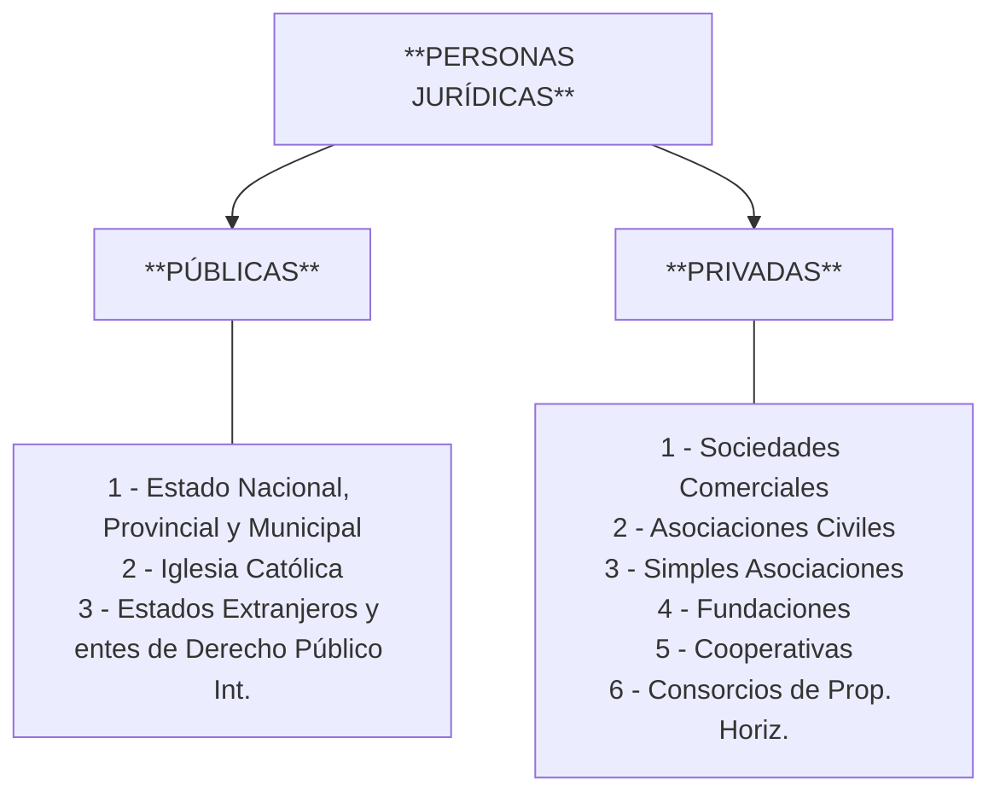

# Unidad 2: Sujetos del Derecho, Atributos y Teoría de los Hechos y Actos Jurídicos

#tipos-de-persona #atributos-de-las-personas #persona-publica #persona-privada #persona-juridica #hechos-juridicos #actos-juridicos

## 1. El Ámbito de Estudio del Derecho Civil

De acuerdo con la sistematización de la materia, los ejes temáticos que componen el estudio del Derecho Civil y que estructuran nuestras relaciones jurídicas son:

1. **Teoría de los Hechos y Actos Jurídicos:** El estudio de los acontecimientos y celebraciones humanas con trascendencia legal.
    
2. **Obligaciones:** El vínculo jurídico entre un acreedor y un deudor.
    
3. **Contratos:** Los acuerdos de voluntades destinados a crear, regular, modificar o extinguir relaciones jurídicas patrimoniales.
    
4. **Derechos Reales (mencionados en notas como "deberes reales"):** El poder jurídico de estructura legal que una persona ejerce directamente sobre una cosa (relación sujeto-cosa).
    
5. **Familia:** Relaciones jurídicas basadas en el parentesco, el matrimonio y la filiación.
    
6. **Sucesiones:** La transmisión de los bienes y derechos de una persona tras su muerte.
    
7. **Derecho Institucional Privado:** Regulación de las bases institucionales del derecho privado.

## 2. El Concepto de Persona y su Clasificación

En el ámbito jurídico, se define como **Persona** a todo ente apto y capaz de adquirir derechos y contraer obligaciones. Nuestro ordenamiento distingue dos clases:

### A. Persona Humana (Física o Natural)

- **Inicio de la existencia:** Comienza desde la **concepción** (momento de la fecundación, ya sea dentro o fuera del seno materno, garantizando su protección desde ese instante según el CCCN).
    
- **Fin de la existencia:** Se produce con la **muerte** de la persona (muerte natural o biológica).
    
    - *Consecuencias del fin de la existencia:* Se extinguen de pleno derecho sus atributos de la personalidad inherentes a la condición humana y se abre el proceso sucesorio para la transmisión y reparto de su patrimonio entre sus herederos.

### B. Persona Jurídica

- **Inicio de la existencia:** Comienza a partir de su **constitución** mediante un acto jurídico de voluntades (contrato social, estatuto o declaración unilateral), requiriendo en los casos previstos por la ley la autorización estatal para funcionar.
    
- **Naturaleza jurídica:** Son entes de existencia ideal que no poseen rasgos biológicos humanos, pero a los cuales el ordenamiento les otorga personalidad jurídica propia e independiente de la de sus miembros para el cumplimiento de su objeto social.

## 3. Atributos de la Persona Humana

Los atributos de la personalidad son aquellas cualidades o características intrínsecas, necesarias e inviolables que individualizan a la persona dentro de la sociedad y el ordenamiento jurídico:

### 1. Nombre

Es el medio técnico-jurídico de identificación e individualización de la persona en la sociedad. Está compuesto por:

- **Pre-nombre (o nombre de pila):** Identifica al individuo dentro de su familia.
    
- **Apellido:** Identifica al individuo en su linaje familiar.
    
- *Elementos de identidad relacionados:*
    
    - **Sobrenombre (alias):** Carece de valor jurídico formal, pero sirve en el plano fáctico para el reconocimiento social.
        
    - **Seudónimo:** Nombre artístico o comercial que la persona elige para desempeñar una actividad específica. Goza de protección jurídica una vez que adquiere notoriedad.

### 2. Domicilio

Es el asiento jurídico de la persona; el lugar que la ley fija para ubicarla geográficamente y dirigirle las notificaciones legales. Existen distintas especies:

- **Domicilio General:**
    
    - **Domicilio Real:** El lugar donde la persona reside habitualmente de manera efectiva (donde vive).
        
    - **Domicilio Legal:** El lugar donde la ley presume, sin admitir prueba en contrario, que una persona reside de manera permanente para el ejercicio de sus derechos y cumplimiento de sus obligaciones (por ejemplo, los funcionarios públicos en el lugar de sus funciones o los militares en su destino).
        
- **Domicilio Especial:** Aquel constituido de común acuerdo por las partes para una relación jurídica u ocasión contractual específica (por ejemplo, para fijar notificaciones de un contrato de alquiler).
    
    - *Casos específicos:* El **domicilio conyugal** (asiento del hogar familiar de los cónyuges) y el **domicilio laboral** (lugar efectivo de prestación de tareas o establecimiento del empleador).

### 3. Estado Civil

Es la posición o situación jurídica que ocupa la persona humana en relación con su familia (soltero/a, casado/a, divorciado/a, viudo/a) y que determina una serie de derechos y deberes recíprocos.

### 4. Capacidad

Es la aptitud psicofísica que posee la persona para ser titular de derechos y deberes jurídicos, y para ejercerlos por sí misma. Se divide en:

- **Capacidad de Derecho (o de goce):** La aptitud para ser titular de derechos y deberes jurídicos. Toda persona humana la posee por el solo hecho de existir; no existen personas con incapacidad de derecho absoluta.
    
    - *Ejemplo:* Como persona humana, soy apto para adquirir la titularidad de un bien inmueble (adquirir un hogar).
        
- **Capacidad de Ejercicio (o de hecho):** La aptitud de la persona humana para ejercer por sí misma sus propios derechos y celebrar actos jurídicos válidos. Puede encontrarse limitada por la ley para proteger al sujeto (por ejemplo, por razones de inmadurez o salud mental).
    
    - *Ejemplo:* Como menor de edad, carezco de la capacidad de ejercicio para realizar por mí mismo la compraventa formal de un inmueble (adquirir el hogar sin representación de mis padres o tutores).

### 5. Patrimonio

Es la universalidad jurídica de bienes materiales (cosas), inmateriales (derechos) y deudas (obligaciones) con valor económico pertenecientes a una persona. Funciona como la garantía común de los acreedores.

## 4. Estructura y Funcionamiento de la Persona Jurídica

Las personas jurídicas cuentan con su propia organización, atributos y dinámicas de disolución:
### A. Clasificación de las Personas Jurídicas

### B. Atributos de la Persona Jurídica

- **Nombre:** Identifica al ente en el tráfico mercantil. Debe contener un aditamento indicador del tipo jurídico adoptado (por ejemplo, "Sociedad Anónima" o "S.A.") para brindar transparencia. Puede consistir en una **razón social** (que incluye el nombre de uno o más socios) o un **nombre de fantasía** (como *"Arcos Dorados"*). Si la entidad se encuentra en proceso de extinción, debe adicionarse la leyenda *"en liquidación"*. Debe ser novedoso y distintivo respecto de otras marcas o nombres preexistentes.
    
- **Patrimonio:** Es de carácter propio, independiente y diferenciado del patrimonio personal de los socios o miembros que la integran. Las deudas de la persona jurídica se cancelan con su propio patrimonio, sin que por regla general se extienda la responsabilidad a los bienes personales de sus integrantes.

### C. Reorganizaciones Societarias

Las personas jurídicas pueden experimentar transformaciones estructurales durante su existencia:

1. **Transformación:** Ocurre cuando una sociedad adopta un tipo jurídico distinto al que tenía originalmente (por ejemplo, pasar de ser una S.R.L. a una S.A.), sin disolverse ni perder su personalidad jurídica.
    
2. **Fusión:** Se produce cuando dos o más sociedades se disuelven sin liquidarse para constituir una nueva sociedad; o cuando una de ellas incorpora a otra u otras que se disuelven sin liquidarse (fusión por absorción).
    
3. **Escisión:** Ocurre cuando una sociedad, sin disolverse, destina parte de su patrimonio para fusionarse con sociedades existentes o para participar con ella en la creación de una nueva sociedad.

### D. Disolución (Fin de la Existencia)

La persona jurídica finaliza su ciclo existencial a través del proceso de disolución y posterior liquidación. Las causales de disolución incluyen:

- **Quiebra:** Declaración judicial por estado de cesación de pagos que imposibilita hacer frente a las obligaciones contraídas.
    
- **Decisión voluntaria de los miembros:** Acuerdo asambleario de los socios que deciden dar por finalizada la actividad.
    
- **Fusión:** Cuando la sociedad es absorbida o se integra a un nuevo ente disolviéndose sin liquidarse.
    
- **Cumplimiento o finalización del objeto:** Cuando se logra el fin preciso para el cual fue constituida.
    
- **Vencimiento del plazo:** Expiración del término de duración fijado en el contrato constitutivo o estatuto.

## 5. Teoría de los Hechos y Actos Jurídicos

La relación de causalidad jurídica se fundamenta en la distinción entre acontecimientos de la realidad y aquellos con relevancia legal:

### A. Diferencias Conceptuales

- **Hecho:** Cualquier acontecimiento, suceso o manifestación que ocurre en el mundo exterior (ej. caerse una hoja de un árbol).
    
- **Hecho Jurídico:** Todo acontecimiento que, conforme al ordenamiento jurídico, produce el nacimiento, modificación o extinción de relaciones o situaciones jurídicas (ej. la muerte de una persona, que extingue sus atributos y abre la sucesión).
    
- **Acto Jurídico:** Es el acto humano, **voluntario y lícito**, que tiene por fin inmediato la adquisición, modificación o extinción de relaciones o situaciones jurídicas (ej. la celebración de un contrato de software).

### B. Clasificación de los Hechos Jurídicos

1. **Hechos Naturales (o de la naturaleza):** Acontecimientos producidos sin la intervención del hombre, pero que acarrean efectos legales (ej. un rayo que destruye una propiedad asegurada, el paso del tiempo que genera la prescripción de un derecho).
    
2. **Hechos Humanos (o actos):** Producidos de manera directa o indirecta por el obrar humano. Se subdividen en:
    
    - **Involuntarios:** Realizados sin cumplir con las condiciones internas de la voluntad. No producen responsabilidad para su autor por regla general (salvo cuestiones de equidad).
        
    - **Voluntarios:** Realizados con pleno cumplimiento de sus condiciones internas y externas.

### C. Condiciones de los Actos Voluntarios

Para que un acto humano sea considerado legalmente voluntario, debe reunir concurrentemente tres condiciones internas y una condición externa:

#### 1. Condiciones Internas

- **Discernimiento:** Aptitud mental de carácter general que permite al sujeto comprender el significado, alcance y consecuencias de sus actos.
    
    - *Obstáculos que anulan el discernimiento (según la bibliografía del curso):* La inmadurez (no poseer la edad mínima requerida por ley), la demencia/enfermedad mental judicialmente declarada, o cualquier accidente/estado transitorio que prive al sujeto del uso de su razón (como el estado de inconsciencia).
        
- **Intención:** El propósito concreto y deliberado del sujeto de realizar ese acto específico. Se ve afectada por el **error** o el **dolo** (engaño).
    
- **Libertad:** La posibilidad física y moral de autodeterminarse a obrar o no obrar, sin presiones o coacciones externas. Se ve afectada por la **violencia física o moral** (fuerza o intimidación).

#### 2. Condición Externa

- **Manifestación de la voluntad:** Es la exteriorización efectiva del pensamiento y de la decisión interna a través de la palabra escrita, oral, signos inequívocos o comportamientos materiales.

### D. Elementos Esenciales del Acto Jurídico

Todo acto jurídico requiere obligatoriamente para su validez la concurrencia de cuatro elementos constitutivos:

1. **Sujeto:** El sujeto de derecho (persona humana o jurídica) que celebra el acto y manifiesta su consentimiento. Debe gozar de capacidad legal para obrar.
    
2. **Objeto:** La materia, hecho o bien sobre el cual recae el acto jurídico. Debe ser lícito, material y jurídicamente posible, no contrario a la moral, las buenas costumbres o el orden público.
    
3. **Causa (Causa Fin):** El propósito o finalidad jurídica inmediata perseguida por las partes al celebrar el acto, debiendo ser lícita y real.
    
4. **Forma:** El conjunto de solemnidades y requisitos externos que la ley impone para la celebración y validez del acto jurídico (por ejemplo, que sea redactado por escrito, en instrumento público o mediante escritura pública en el caso de la compra de inmuebles).
