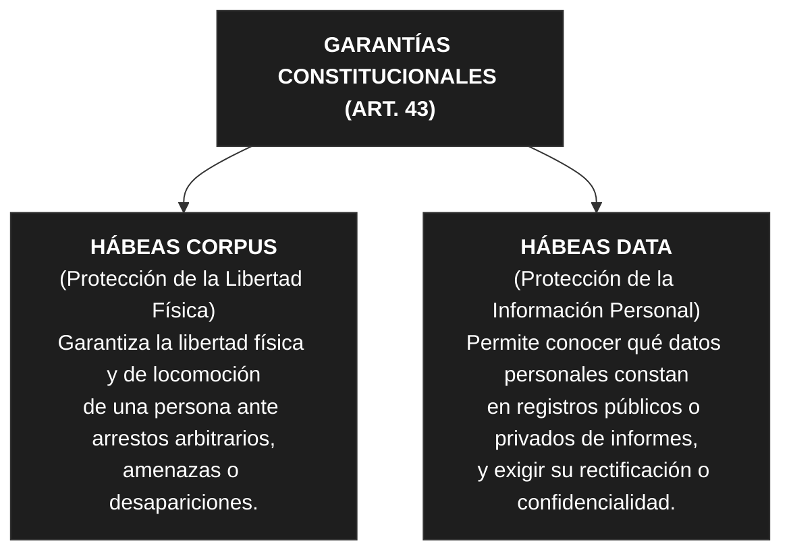

# Unidad 4: Protección de Datos Personales y Acción de Habeas Data

#articulo-43 #ley-25326 #medida-cautelar #amparo #habeas-data #habeas-corpus

## 1. El Marco Constitucional: Artículo 43 de la Constitución Nacional

La protección de los datos personales en la República Argentina tiene rango constitucional. El artículo 43 de la Constitución Nacional (incorporado en la reforma de 1994) regula las acciones rápidas y expeditivas para la defensa de los derechos fundamentales:

### A. Primer Párrafo: La Acción de Amparo

- **Definición:** Es una acción judicial sumarísima (rápida y urgente) que puede interponerse contra todo acto u omisión de autoridades públicas o particulares que, en forma actual o inminente, lesione, restrinja, altere o amenace, con arbitrariedad o ilegalidad manifiesta, derechos y garantías reconocidos por la Constitución, un tratado o una ley.

### B. Segundo Párrafo: Legitimación Activa Ampliada

Determina quiénes están facultados para interponer la acción de amparo ante derechos de incidencia colectiva (como la protección del medio ambiente, del consumidor o contra la discriminación):

1. El sujeto directamente **afectado**.
    
1. El **Defensor del Pueblo** (órgano unipersonal e independiente instituido por la Constitución).
    
1. Las **asociaciones** debidamente registradas que propendan a esos fines de interés público.

### C. Tercer Párrafo: La Acción de Habeas Data (y su distinción con el Habeas Corpus)

El tercer párrafo introduce formalmente la garantía constitucional para defender la autodeterminación informativa de las personas.

- **Texto Constitucional del Habeas Data:** *"Toda persona podrá interponer esta acción para tomar conocimiento de los datos a ella referidos y de su finalidad, que consten en registros o bancos de datos públicos, o los privados destinados a proveer informes, y en caso de falsedad o discriminación, para exigir la supresión, rectificación, confidencialidad o actualización de aquéllos."*
    
- **Garantía de Secreto Periodístico:** El mismo párrafo aclara explícitamente que esta acción no podrá afectar el secreto de las fuentes de información periodística (garantía de libertad de prensa).

## 2. Ley de Protección de Datos Personales (Ley 25.326)

Sancionada en el año 2000, esta ley reglamenta la acción constitucional de Habeas Data y fija los límites y obligaciones para el tratamiento de la información de las personas.

### A. Clasificación de los Datos

- **Datos Personales:** Información de cualquier tipo referida a personas físicas o de existencia ideal (personas jurídicas) determinadas o determinables (ej. DNI, domicilio, teléfono, historia laboral).
    
- **Datos Sensibles (Art. 2):** Datos personales que revelan origen racial y étnico, opiniones políticas, convicciones religiosas, filosóficas o morales, afiliación sindical e información referente a la salud o a la vida sexual.
    
    - **Regla estricta:** **Nadie puede ser obligado a proporcionar datos sensibles**. Su tratamiento está prohibido por regla general, salvo por razones de interés general autorizadas por ley o cuando formen parte de la actividad interna de asociaciones (religiosas, políticas, sindicales) respecto de sus propios miembros.

### B. Principios Generales de la Calidad de los Datos (Art. 4)

Para que el almacenamiento y tratamiento de datos sea lícito, debe responder a los siguientes estándares:

1. **Certeza, Adecuación y Pertinencia:** Los datos deben ser ciertos, adecuados, pertinentes y no excesivos en relación con el ámbito y la finalidad para la que se obtuvieron.
    
1. **Principio de Finalidad:** Los datos no pueden ser utilizados para propósitos distintos o incompatibles con aquellos que motivaron su recolección.
    
1. **Medios de Recolección Lícitos:** Se prohíbe la recolección de datos por medios fraudulentos, desleales o de forma contraria a las normas de la ley.
    
1. **Exactitud y Actualización:** Deben ser exactos y actualizarse permanentemente en caso de ser necesario.
    
1. **Temporalidad:** Los datos deben ser destruidos o archivados de forma anónima cuando hayan dejado de ser necesarios o pertinentes para los fines para los cuales fueron recolectados.

## 3. El Consentimiento para el Tratamiento de Datos (Art. 5)

La regla general de la ley establece que **el tratamiento de datos personales es ilícito si el titular no prestó su consentimiento libre, expreso e informado**, el cual debe constar por escrito o por otro medio equiparable.

### Excepciones al Consentimiento (Casos en que NO se requiere)

La ley prevé taxativamente los supuestos donde se pueden tratar datos sin necesidad de pedir el consentimiento del titular:

1. **Fuentes de acceso público irrestricto:** Cuando los datos se obtienen de guías, registros públicos o padrones libres.
    
1. **Poderes del Estado:** Cuando son recabados para el ejercicio de funciones constitucionales de los órganos estatales o por una obligación legal.
    
1. **Listados básicos limitados:** Listados que se limiten exclusivamente a datos identificatorios mínimos de la persona (**DNI, CUIT/CUIL, nombre, domicilio, ocupación y fecha de nacimiento**).
    
1. **Relación profesional:** Cuando los datos deriven de una relación contractual, científica o profesional del titular y sean necesarios para su desarrollo o cumplimiento.
    
1. **Entidades Financieras / Crediticias:** Operaciones que realicen las entidades financieras y de informes crediticios (ej. Veraz, Banco Central), bajo el marco de la regulación de los servicios de solvencia económica.

## 4. El Deber de Información en la Recolección (Art. 6)

Cuando se le soliciten datos personales a un ciudadano, se le debe informar previa, expresa y claramente:

1. **Finalidad:** Para qué se van a usar los datos y quiénes serán sus destinatarios o usuarios.
    
1. **Existencia del archivo:** La existencia del registro, archivo o base de datos correspondiente, indicando la identidad y el domicilio del responsable de la base.
    
1. **Carácter de la respuesta:** Si es de carácter obligatorio o puramente opcional/facultativo responder a las preguntas planteadas.
    
1. **Consecuencias de la negativa:** Qué consecuencias tiene no entregar los datos o entregarlos de forma inexacta.
    
1. **Derechos del titular:** La facultad y los medios para ejercer sus derechos de acceso, rectificación, actualización y supresión de sus datos.

## 5. Derechos de los Titulares de Datos

La ley dota a los individuos de un conjunto de derechos exigibles frente a los administradores de las bases de datos:

- **Derecho de Información (Art. 13) -** ***El "Booleano"***: Es el derecho de la persona a consultar de forma previa al Organismo de Control para saber **si en una base de datos existen o no** registros asociados a su persona. Su respuesta es un sí o un no (verdadero/falso).
    
- **Derecho de Acceso (Art. 14) -** ***El Contenido***: Es el derecho a exigir que se le exhiba y entregue **la totalidad de la información detallada** que el archivo posee sobre ella, incluyendo la finalidad del almacenamiento y el origen de los datos.
    
    - *Nota legal:* Este derecho se puede ejercer de forma gratuita en intervalos no menores a **seis meses**, salvo que se acredite un interés legítimo que justifique una consulta más temprana.
    
- **Derecho de Rectificación, Actualización o Supresión (Art. 16):** El titular tiene derecho a exigir que se modifiquen los datos que sean falsos, inexactos o desactualizados, o bien que se eliminen (supriman) aquellos datos que no cumplan con las exigencias legales de calidad.
    
    - *Plazo legal de respuesta:* El responsable de la base de datos tiene **5 días hábiles** para realizar la modificación o eliminación de los datos de forma gratuita.

## 6. Registro Nacional de Bases de Datos y Organismo de Control

Para garantizar la efectividad de la ley, el ordenamiento exige el control estatal sobre los archivos de datos:

- **Inscripción Obligatoria (Art. 21):** Todo archivo, registro, base o banco de datos público, o privado destinado a proporcionar informes (comerciales, crediticios, publicitarios), debe obligatoriamente inscribirse en el Registro que administra el Organismo de Control.
    
- **El Organismo de Control:** Es la autoridad estatal encargada de fiscalizar el cumplimiento de la Ley 25.326, aplicar sanciones administrativas (apercibimientos, multas, clausuras o suspensiones de las bases de datos) y resolver las denuncias de los particulares.
